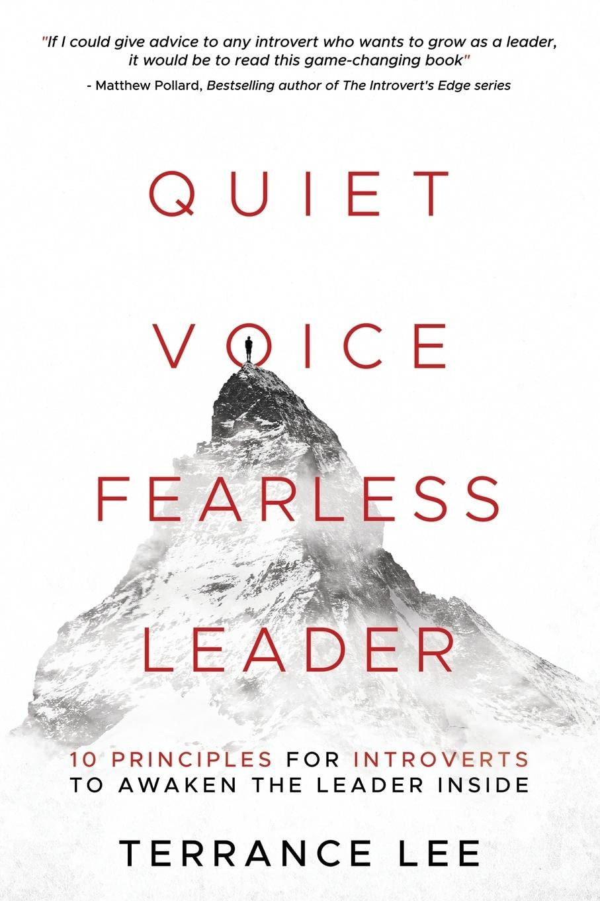

+++
title = "Quiet Voice Fearless Leader: A Comprehensive Review"
Date = 2023-06-03
author = "Nick Miethe"
categories = ["Books", "Review"]
topics = ["Education", "Leadership", "Consulting"]
tags = ["Leadership", "Book Review", "Management", "Consulting", "Self-help", "Introversion"]
series = ["Book Reviews Leadership"]
series_order = 1
+++

## Introduction

Greetings, readers! Today, I'm kicking off a new series with a review of a book that may be a game-changer for those of us who identify as introverts. ["*Quiet Voice Fearless Leader*"](https://www.amazon.com/Quiet-Voice-Fearless-Leader-Principles/dp/1737000717?crid=2F62A6RE76C56&keywords=Quiet+Voice+Fearless+Leader&qid=1685991208&sprefix=quiet+voice+fearless+leader%2Caps%2C95&sr=8-1&linkCode=ll1&tag=miethe-20&linkId=85c789ac8597a05ef6b922aa570ceff6&language=en_US&ref_=as_li_ss_tl) is authored by *Terrance Darryl Lee*, also known as '*The Introvert Leader*'.

In today's fast-paced and connected world, it's common to associate leadership with extroverted traits like being outgoing and charismatic. But what if I told you there's a leadership style suited for introverts that's just as effective? Enter "*Quiet Voice Fearless Leader*", a book that challenges the status quo of leadership and offers a new perspective.

This book provides a unique perspective on leadership that is particularly relevant for introverts, but holds value for anyone interested in refining their leadership abilities. So, let's dive into the book and explore its major themes.

## Synopsis and Key Points

["*Quiet Voice Fearless Leader*"](https://www.amazon.com/Quiet-Voice-Fearless-Leader-Principles/dp/1737000717?crid=2F62A6RE76C56&keywords=Quiet+Voice+Fearless+Leader&qid=1685991208&sprefix=quiet+voice+fearless+leader%2Caps%2C95&sr=8-1&linkCode=ll1&tag=miethe-20&linkId=85c789ac8597a05ef6b922aa570ceff6&language=en_US&ref_=as_li_ss_tl) is a journey through Terrance Lee's life, from a young age where a traumatic experience caused anxiety around public-speaking, to his entry into the corporate world where he was thrust into leadership roles. Terrance's story takes us from his first engineering job out of college, where he had to step up to fill his mentor's shoes, through his progression into leadership roles in several Fortune 500 companies in the defense industry, including as a manager of 20 engineers. As he navigated these roles, Terrance began to appreciate and capitalize on the unique strengths that introverts can bring to leadership positions.

The book is divided into 10 key principles, each discussing a different aspect of leadership and how introverts can approach them. These principles range from embracing your introverted qualities to learning how to communicate effectively, despite not being the loudest voice in the room. The use of personal stories by Terrance provides a relatable context for each principle, allowing readers to better understand and apply these principles in their own lives.

Here are some of the main takeaways from the book:

1. **Leadership can be embraced by anyone, regardless of personality type.** Terrance's experiences demonstrate that introverts, despite often being stereotyped as shy or weak, can become effective and inspiring leaders by tapping into their own unique potential.
2. **Introverts have unique strengths that can benefit leadership roles.** Terrance explores how traits often associated with introversion, such as listening skills, attention to detail, and thoughtful communication, can be leveraged in leadership.
3. **Personal experiences and stories can illuminate leadership principles.** Terrance's personal anecdotes serve as a powerful teaching tool throughout the book, providing real-world context to the principles he discusses.

## Review and Rating

As an introvert myself, I found "Quiet Voice Fearless Leader" to be a truly enlightening read. Terrance's journey from an introverted individual to a confident leader is not only inspiring but also practical, as it provides a roadmap for introverts looking to develop their leadership skills.

The book is well-written and easy to read, with each principle being clearly presented and supported by engaging and relatable stories from Terrance's life. This format makes the content easy to digest and apply in real-world situations.

The book is not only beneficial for introverts but also for extroverts and managers. It offers valuable insights into the strengths of introverted individuals, helping to challenge common stereotypes and promote understanding across different personality types.

I would rate this book a solid **4.5** out of 5. Its engaging storytelling, practical advice, and unique perspective make it a valuable read for anyone interested in leadership.

## Alternative Reads

If "Quiet Voice Fearless Leader" piques your interest, here are some additional reads you might consider:

* "[Thinking Out Loud](https://www.amazon.com/Thinking-Out-Loud-Keeping-Nothing-ebook/dp/B09L7ZRY9P?&linkCode=ll1&tag=miethe-20&linkId=fe386c6594ec84a2e16586744bd8fe97&language=en_US&ref_=as_li_ss_tl)" by *Tapan Ghosh* - a collection of poems and stories that cover a wide range of emotions and experiences, using simple language and profound insights to explore the various facets of life, such as love, betrayal, happiness, sadness, and others.
* ["How Successful People Think: Change Your Thinking, Change Your Life"](https://www.amazon.com/How-Successful-People-Think-Thinking/dp/9350098768?_encoding=UTF8&qid=1685991052&sr=1-1&linkCode=ll1&tag=miethe-20&linkId=cf286d53dd93fd24c5c7f649309aaee6&language=en_US&ref_=as_li_ss_tl) by *John C. Maxwell*
* ["Expect to Win"](https://www.amazon.com/Expect-Win-Strategies-Thriving-Workplace/dp/0452295904?_encoding=UTF8&qid=1685991092&sr=8-1&linkCode=ll1&tag=miethe-20&linkId=0058b365c2e5c26a341cc3a6b6ad7d1a&language=en_US&ref_=as_li_ss_tl) by *Carla A. Harris* - a motivational guide that aims to help readers succeed in their careers and personal lives. The author uses her own experiences as a senior leader on Wall Street to share strategies for thriving in the workplace
* ["The Leadership Gap: What Gets Between You and Your Greatness"](https://www.amazon.com/Leadership-Gap-What-Between-Greatness/dp/1101981350?_encoding=UTF8&qid=1685991126&sr=8-1&linkCode=ll1&tag=miethe-20&linkId=397e3eb743ee46c22713b33db3e461ce&language=en_US&ref_=as_li_ss_tl) by *Lolly Daskal* - identifies seven leadership archetypes and the unique strengths and pitfalls each one carries.
* "[Winning: The Unforgiving Race to Greatness](https://amzn.to/3qnAgU5)" by *Tim S. Grover* - a guide that shares the mental and physical habits needed to win in life.

## Conclusion

"Quiet Voice Fearless Leader" is more than just a book—it's a manifesto for introverts and a guide for anyone looking to understand leadership in a new light. Terrance Lee's many anecdotes and the advice he's garnered through those experiences makes for an engaging read with excellent direction. Whether you're an introvert or extroverted, a current or prospective leader, or just a student of human psychology, this is a great read for you.

That's it until next time!
