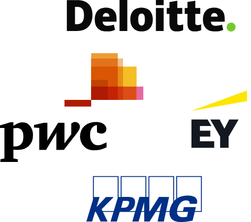

+++
title = "Consulting Careers: Phenominal Cosmic Expertise, Ity Bity Experience"
date = 2023-08-27
summary = "Discover the exciting field of consulting and learn about the roles, education, skills, and career paths for tech/IT and management consultants."
tags = ["Tech Consulting", "Management Consulting", "Career Path"]
topics = ["Career Development", "Consulting", "Business", "Leadership"]
categories = ["Careers", "Introduction", "Guide"]
+++

## Introduction

Hey there, [MeatyBytes.io](/) enthusiasts! Nick Miethe here—your go-to for everything OpenShift, Platform Engineering, and today, the world of consulting. We're doing something a little different today. I've been working on this for quite awhile, so bear with me as it's a MUCH longer post than usual!


Before we get started, a little background context: I am a tech consultant at IBM Consulting, following the acquisition of my prior employer, BoxBoat. My role is as an Associate Partner and Executive/Principal Solution Architect. I've previously held roles both in consulting and within the industry, but always around software and devops.


Let's get into it!

### Synopsis

Consulting careers often lure the highest-performers with the promise of diverse work, high-impact projects, and opportunities for rapid advancement. From tech/IT to management consulting, the field offers roles that are as dynamic as they are demanding.


Where else can you enter the workforce an instant "expert", and eventually exit the industry a renowned rockstar? Plus with the experience to match!


But what does it really mean to be a consultant, and why are these roles so highly valued in the industry? This article will provide you with a broad overview of consulting careers, including educational requirements, essential skill sets, potential career paths, and valuable resources to help you learn more about this exciting and rewarding profession.

In this post, we will:

1. **Examine the Roles**: Understand the various roles in consulting, focusing on tech/IT consultants and management consultants.
2. **Education Essentials**: Discuss the education prerequisites and skills needed to kickstart a consulting career.
3. **Industry Insights**: Provide an overview of the current consulting landscape, to help you make an informed decision.
4. **Plot Your Career Path**: Walk you through a typical career progression, from junior consultant to partner and beyond!

So grab your favorite cup of coffee, and let's unravel the world of consulting together!

## What do Consultants Do?

Consultants are problem-solvers. They are external experts hired to evaluate a company's challenges, devise solutions, and implement improvements in various areas, from organizational structure and business strategy to system migration and cloud modernization. There are numerous specialties in consulting; in fact, nearly every industry can be (and probably is) consulted on!

However, certain factors tend to increase the prevalence of consulting in a specific market vs others. Some of these factors are as follows:

* **Skill Set Rarity:** Highly specialized skills can be much easier, and cheaper, to hire as consultants vs trying to recruit or train in-house.
* **Project Duration/Scope:** Short-term projects with well-defined objectives are better suited for consultancy, vs temp hires.
* **Risk/Liability Mitigation:** Consultants can absorb some of the risks associated with a project. If a project fails, the onus may partially be on the consultancy firm, which may offer some level of liability shielding for the business.
* **Cost Factor:** Consultants can be more cost-effective in the long run, considering the total cost to hire and retain full-time employees - ie benefits, training/onboarding, recruiting costs, etc.
* **Business Focus:** Consultants allow businesses to focus on their core operations by taking on peripheral, but essential, tasks - audits, executive transitions, re-org, infrastructure migrations, etc.
* **Flexibility/Scalability:** Seasonal or intermittent increases of expert resources are much easier and cheaper with consultants than in-house - holiday logistics & supply chain, audits, M&A, etc.

### Consulting - When YOU are the Product

Coming from the software world, I personally found the best explanation to be a comparison between a traditional software company and a consulting company (technical or otherwise), or specifically between their products. The former sells software, whereas the latter sells its people (their time and expertise, that is).

Of course, people are important in any industry, as they are the creators and sellers of assets. However, in consulting, people *are* the assets!

Consultants often work on a project basis, often within a specific industry and/or focus area of expertise. They may have tangible deliverables, especially within IT Consulting, but these are generally tangential to the experience and knowledge that they provide a client.

### ...But Not Only You

With that said, a common argument I've heard against consulting is in regards to the less experienced analysts and engineers on the front lines. A typical trope shows a new grad consultant, with a masquerade of expertise, informing a conference room full of veteran industry leaders on how they should run their company.

Hence the title of the post!

It's amusing, but also a fair concern. However, the true value of consulting isn't generally within the individuals; rather, it's the combined "hive-mind" of expertise in various domains of the entire firm. That analyst or associate in the conference room is just the firm's representative, and is a direct link for the hiring company to that wealth of expertise and knowledge.

### Until it Truly is YOU

That said, as people build their careers as consultants, many will begin to develop eminence in their field. This personal brand is crucial, both for the individual to grow their career further, as well as for their firm to sell. Regardless of if that given individual is directly working on an engagement, their expertise backing those on the ground is the driving force for all related deals.

Perhaps ironically, the "expert" consultants working with clients generally aren't yet truly experts themselves. But if they stick with it long enough, eventually they will develop a degree of expertise that future consultants can wrap themselves in, creating a circle of self-fulfilling growth.

## Consulting - Tech/IT vs Management

With that understanding of Consulting as a whole, let's dig into the focus of this post.

Today, we will be focusing on 2 of the top types of consulting: *Technology/IT* & *Management*. While different in their focus, **Tech/IT Consultants** and **Management Consultants** share the common goal of driving value for their clients, often through business transformation.

Tech consultants work with organizations to improve their use of technology, often focusing on areas like software, systems integration, and IT infrastructure. Management consultants, on the other hand, focus on organizational strategy, operations, and business processes.

As a tech consultant myself, most of my experience falls within that realm. Therefore, I will focus on my experience in tech/IT consulting. However, I will also cover the basics of Management consulting as a comparison, being the most prevalent and flashy part of the industry.

### Tech Consultants

Tech & IT consultants specialize in technology and digital solutions. They assist businesses in leveraging technology to drive growth and improvement, whether it be advising on best practices with existing technologies and processes, discovering new technologies to adopt, or even implementing & integrating these technologies.

Tech/IT consultants also develop tech strategies, solve technical issues, and help companies keep up with the rapidly evolving tech environment. This could involve recommending specific software or hardware, developing custom solutions, or even implementing entire platform modernization journeys.

At the end of the day, tech consultants serve a similar purpose to any other consultant, in that they are assisting businesses in some degree of transformation - their tools just happen to be on the tech/IT side!

#### IT/Tech - Types of Consultants

Just like in any other industry, the type of tasks an IT consulting firm focuses on can vary. There are several overall categories of Tech/IT consulting that you will typically find:

* **Strategy:**
  * **Sub-types:** IT Strategy, Business Strategy, Digital Transformation, Innovation Consulting
  * **Description:** Involves developing and implementing strategic plans to leverage technology and achieve business objectives. Strategy consultants may work on projects such as [IT visioning](/posts/openshift/architecture/solution-arch/sa-vision/), business case development, and transformation roadmap creation.
* **Architecture:**
  * **Sub-types:** Enterprise Architecture, Solution Architecture, Technical Architecture (Software, Hardware, Network, etc), Information Architecture
  * **Description:** Focuses on designing and planning technology solutions that align with a client's business objectives. Architecture consultants may work on projects such as IT architecture assessments, designing [technical solutions](/topics/solution-architecture/), and creating architecture roadmaps.
* **Development & Operations:**
  * **Sub-types:** Software Development, Dev Methodologies (Agile/Waterfall), DevOps, Cloud/Distributed/Mainframe, IT Service Management (ITSM)
  * **Description:** Involves designing, building, and operating technology solutions that support a client's business operations. Development and operations consultants may work on projects such as software development, cloud migration, and IT service management. May also include support, system administration, automation, project management, and even staff augmentation.
* **Security & Compliance:**
  * **Sub-types:** Software Supply Chain, Cybersecurity, Information Security, Risk Management, Compliance, Governance
  * **Description:** Focuses on ensuring the security and compliance of a client's technology systems. Security and compliance consultants may work on projects such as risk & compliance assessments, security audits, and cyber risk mitigation.

In some cases, IT Consulting firms will also perform work as *System Integrators*:

* **System Integration (SI):**
  * **Sub-types:** Enterprise Integration, Solution Integration, Technical Integration, Data Integration
  * **Description:** Involves integrating technology systems to support a client's business operations. System integration consultants may work on projects such as integrating enterprise software, integrating data systems, and testing and deploying technology solutions.


For those interested in more information on Solution Architecture, check out my numerous posts on [Architecture](/posts/openshift/architecture/).


#### IT/Tech - Employers/Firms

Tech consultants are often either employed by IT consulting firms or work as independent contractors. Some firms, such as [**Accenture**](https://www.accenture.com/us-en) and [**IBM Consulting**](https://www.ibm.com/consulting), offer all of the above categories of Tech/IT Consulting services. However, smaller firms may specialize in one or two categories, such as strategy and architecture, or development and operations.

Depending on market size and level of competition, some boutique firms or vendors may even solely offer services in specific sub-categories. This might be due to depth vs breadth of expertise, a large captive market, etc.

Firms might also focus on specific niche technologies across all categories, which was the case of my employer, **BoxBoat**, prior to acquisition by **IBM Consulting**, focusing on containerization, Kubernetes, and general cloud-native transformation.

Another pattern is found with software vendors, especially which develop open source software, and their integration/consulting services arms which act as System Integrators (SI). These provide an additional source of revenue from a company's expertise, and/or allows capitalizing on development of otherwise free software.

For example, [TestifySec](https://www.testifysec.com/), an OSS company started by my previous colleagues, offers services & support in their specific niche of **Security & Compliance Consulting** - *Software Supply Chain Security*.

In fact, this has traditionally been a very popular operating model of open source software (OSS) companies, such as Red Hat, offering support and consulting services for their free software.


While Red Hat sells (infamously, as of late) licensed versions of their OSS, their contributions are subsidized with support, training, and services. This is evident in Red Hat's sales/account teams being (somewhat uniquely for their size) combined between software/services.


They can additionally be  arms of major vendors or other consulting firms.

#### IT/Tech - Vendors & Spin-Offs

As mentioned above, SI arms of software/infrastructure vendors are a major source of Tech/IT Consulting services. While largely focused on enabling sales of their parent corporation's software or hardware, these integrators also often find themselves well positioned to undertake larger transformations. However, the scope of expertise of these consulting groups can often be limited, and there is an obvious bias towards the parent company's own technologies.

For example, architects and consultants from Microsoft generally aren't positioned to help a customer with a multi-cloud engagement outside of Azure (and possibly on-prem) ecosystems. **Red Hat**, while being experts with all things **OpenShift**, **RHEL**, and **Ansible** (among many others), similarly draws a hard line for any technologies outside of their purview.

To counter this, some vendors have spun-off their consulting arms into "vendor-neutral" groups. IBM is a prime example being split into **IBM Technology** (*IBM-T*, the software side) and **IBM Consulting** (*IBM-C*), as well as their spin-off of **Kyndryl** in 2020. Both Kyndryl and IBM-C offer consulting services across the industry, with the former providing traditional IT infrastructure services and the latter offering nearly all types of consulting, including Tech/IT.

This has allowed IBM Consulting to extend beyond IBM-specific technologies. It leverages world-class expertise in OpenShift and other IBM products, but also extends the same degree of quality and know-how to other platforms and technologies. This vendor-neutral expertise, paired with IBM's Business Transformation Services consultants, such as SAP or corporate strategy,  ensures a well-rounded package and one-stop shop of consulting services.

### Management Consultants

Management consultants primarily deal with the strategic and organizational aspects of a company. They could be hired to assist with a corporate restructuring, develop a new business strategy, or even improve a company's marketing efforts.

Management consultants assist organizations in improving their performance by analyzing existing business problems and developing plans for improvement. They may advise managers on everything from operational processes to human resources, financial management, and corporate strategy. They are also often found consulting for stakeholders in some of the senior-most roles in a company, as these are the ones generally concerned with the typical issues being addressed.

#### Mgmt - Employers/Firms

Like tech consulting, there are numerous firms in the industry which provide Management Consulting. These firms tend to fall into a generally accepted classification, or tier list.

Just like the original Big 4 accounting firms (Deloitte, PwC, EY, & KPMG) and FAANG (Facebook/Meta, Apple, Amazon, Netflix, &Google) for top tech stocks, consulting has *MBB* - **McKinsey, Bain, & BCG**.

In general, consulting tiers are primarily focused on project size, recruiting prestige, and cost, rather than headcount or revenue. Beyond the *MBB* tier, you often find 3 additional tiers: Tier 2, Tier 3 (Big 4), and Boutique. I won't get into the details of each tier in this post, but you can read a good overview from [MConsulting Prep](https://mconsultingprep.com/top-management-consulting-ranking).

However, despite what some like to think, consulting tiers aren't necessarily the same as those for Law and Business schools. That is, Tier 3 isn't subjectively worse than Tier 2 (by most accounts, they have the most revenue in the industry!). Rather, it is simply a categorization. For example, some Boutique firms can be even more prestigious than MBB in their respective niche.

## The Value of Consultants in Industry

Consultants bring a fresh perspective to business problems. Their expertise in various fields allows them to provide unique and innovative solutions that an organization may not have considered. They also ideally offer an unbiased point of view, which can be valuable in decision-making processes. The caveat here is in Tech Consulting, when hiring consultants from a vendor.

Additionally, consultants save companies time and resources. They can fast-track the process of problem-solving and implementing new strategies or technologies, freeing up the company's resources to focus on their core business. This goes back to the classic question in tech between build vs buy.

## Education and skill sets for Consulting Careers

Consultants typically hold a bachelor's degree in their field of expertise. Tech consultants might have degrees in computer science, information systems, or a related field. Management consultants often have degrees in business, economics, or sometimes in the industry they specialize in.

Additionally, many consultants also hold a master’s degree, such as an MBA, or a specialized master's in their field. This advanced education can provide a broader understanding of business strategy and management, making their profiles more attractive to potential employers. We'll see below how an advanced degree will also often result in a higher starting position.

There is also an extremely lucrative market for professional degrees such as DOs/MDs, JDs, and other PhDs and post-doctoral work.

### Necessary Skills

Education is crucial for consulting, unlike some industries, but it is still just one piece of the puzzle. Effective consultants possess a robust set of skills:

* **Problem-solving skills:** Consultants need to be able to analyze complex situations and develop practical solutions.
* **Communication skills:** Consultants must communicate their findings and recommendations clearly and persuasively.
* **Leadership skills:** Consultants often need to lead teams, manage projects, and influence stakeholders.
* **Analytical skills:** Consultants need strong analytical skills to interpret data and make evidence-based recommendations.
* **Adaptability:** The consulting field is dynamic, and consultants must be able to adapt to new industries, clients, or challenges quickly. Ideally, a consultant will have at least surface knowledge about every topic a client ever asks them about, digging deeper as necessary after a call.

Consultants need a mix of hard and soft skills. They must be experts in their field, but they should also be able to communicate with stakeholders (sometimes C-suites!) and have a strong understanding of business strategy. While less of an issue in Management consulting, this strategic mix is particularly difficult to find in tech consulting.


That said, those capable of applying the right combination of technical and people skills can find great success in the industry!


## Career Paths for Consultants

Consulting is a broad field, and there are many career paths a consultant can take. While it is often seen as a springboard into management in various industries, consulting has its own lucrative career track within. Consulting also tends to be quite hierarchical, following fairly typical patterns across the industry, including across Management and IT/Tech consulting.

A primary difference in some IT/Technical consulting firms is that professionals must eventually decide to remain as individual technical contributors, such as **Senior Engineers** focusing solely on technical direction, or move into leadership/Go-to-Market roles like **Engineering Manager** or **AP**.

#### Example Management Consulting Career Path


graph TD;
    A[Analyst] --> B[Associate];
    B --> C[Consultant];
    C --> D[Engagement Manager];
    D --> E[Principal/Associate Partner];
    E --> F[Partner];


#### Example IT/Tech Consulting Career Path


graph TD
    A[Junior/Associate Engineer] --> B[DevOps Engineer];
    A --> C[Solution Architect];
    B --> D[Sr. Engineer/Architect];
    C --> D[Sr. Engineer/Architect];
    B --> H[Engineering Manager];
    C --> H[Engineering Manager];
    D --> G[Staff Engineer/Architect];
    G --> E[Principal/Executive Engineer/Architect];
    H --> I[Sr. Manager];
    I --> F[AP/Director];
    F --> J[Partner];
    E --> K[Distinguished Engineer];


### Entry Levels

Consultants usually begin their career out of college as an **Analyst** or **Associate**, working on the front lines of their project in a "trial by fire". This is also where you find similar **Junior/Associate** *X* roles in Tech consulting, such as *Associate DevOps Engineer* (IBM) or *Jr. Software Development Engineer* (Amazon), though most software companies have moved to using the *1* or *I* suffix, ie *SDE 1* (Microsoft).

While a potentially stressful time period, there are few equivalent opportunities to gain as much professional experience in as short a timeline elsewhere on the job market. So if this is you, then keep pushing and it will pay off in spades!

#### Mgmt - Entry

* **Roles:** Associate, Analyst, Business Analyst
* **Years of Experience:** 0-2
* **Responsibilities:** Gathering data, conducting research, and preparing presentations. Working closely with associates and consultants to support project needs.

#### IT/Tech - Entry

* **Roles:** [Junior/Associate] x [Engineer/Architect] or using [1/2] suffix
* **Years of Experience:** 0-2
* **Responsibilities:** Coding, testing, bug fixing, and supporting senior engineers. Also designing individual application or system components.

### Experienced

After gaining a couple years of experience, one can expect to move up to a **Consultant** (or **Associate** at **McKinsey**) position. Alternatively, MBA and other Advanced Degree graduates, as well as experienced industry hires, can start their career at this level. Often in Tech consulting, this is when the prefix (**Jr./Associate**) is dropped.

#### Mgmt - Experienced

* **Roles:** Consultant, Associate, sometimes Sr. *X*
* **Years of Experience:** 2-4 (or Adv. Degree)
* **Responsibilities:** Client interaction, leading problem-solving, developing models, and engaging in internal initiatives.

#### IT/Tech - Experienced

* **Roles:** Software/DevOps Engineer Consultant or Solution Architect
* **Years of Experience:** 2-5
* **Responsibilities:** Developing, deploying, maintaining software, automating processes, and collaboration with cross-functional teams.

### Mid-Level

This is when consultants begin to enter into project and people management, as well as start acting as a Subject Matter Expert (SME) in a specific topic. Roles often include **Manager** or **Managing Consultant** at this level in Management Consulting, and **Sr. Engineer/Architect** in Tech Consulting.

This is a crucial role across both consulting types, often leading project/engagement modules or even smaller projects in their entirety, managing staff, and handling the day-to-day client interactions. This is also a common exit point for many in Consulting, as the scope begins growing beyond individual contributor. It is also usually where Tech Consulting roles begin to branch between Individual Contributor (IC) and Leadership.

#### Mgmt - Mid-Level

* **Roles:** Engagement Manager, Manager, Managing Consultant
* **Years of Experience:** 4-6
* **Responsibilities:** Leading project modules, client relationship building, team development, and contributing to practice development.

#### IT/Tech - Mid-Level

* **Roles:** Sr. Engineer/Architect, Engineering Manager
* **Years of Experience:** 5-8
* **Responsibilities:** Leading technical projects, mentoring junior engineers, contributing to overall architecture decisions.

### Senior

This is a consultant who has demonstrated strong performance and potential for leadership, typically serving as a team leader or project manager. In many companies, this is the first people manager role. Consultants at this level will often lead projects in their entirety, even working across or managing multiple smaller projects. They might lead the technical direction of their given tech area, or for a specific set of engagements.

#### Mgmt - Senior

* **Roles:** Associate Principal, Sr. Manager, Sr. Managing Consulting
* **Years of Experience:** 8-12
* **Responsibilities:** Leading client interactions, working with executive leadership, acting as SME in given subjects, managing project teams and delivery.

#### IT/Tech - Senior

* **Roles:** Sr./Lead/Staff Architect/Engineer, Sr. Manager
* **Years of Experience:** 8-12
* **Responsibilities:** Designing technical solutions, working with stakeholders, ensuring alignment with business objectives.

### Principal

This is another crucial point in the career of a consultant, as it is the final role before becoming an Executive. Similarly, this is another common exit point for consultants, both due to the difficulty of getting a promotion as well as the opportunities available in other industries. Consultants in this role often hold the title of Associate Partner (AP), Principal, or Director, and will often exit for Director or VP roles in other industries, as well as Founders of start-ups.

Principals/APs are the "neck" of a consulting firm, turning the head (Partners) and carrying instructions down to the body (workforce) - courtesy of my current manager! They often run business units and practices, managing teams of managers or experts. They also will manage several engagements, even multiple clients, either focusing on a vertical (sector) or horizontal (technology/market).

#### Mgmt - Principal

* **Roles:** Principal, Associate Partner, Director
* **Years of Experience:** 10+
* **Responsibilities:** Leads numerous client engagements or partial leadership of a very large engagement, leads various teams or owns specific practice, manages multiple client relationships.

#### IT/Tech - Principal

* **Roles:** Principal Engineer/Architect, Director
* **Years of Experience:** 10+
* **Responsibilities:** Leads technical direction for a product or subject area, manages teams of managers or experts, influences Go-to-Market direction and corporate strategy of their own business units.

### Executive

This is the tip of the spear, entering into Executive leadership of consulting. These roles can vary from **Partner** and **Director** in Management Consulting to **Distinguished Engineer** and **Fellow** on the Technical side.

Partners and the like take ownership of organizations, client relationships, entire sectors or technologies, and so on. They may lead the largest of client engagements, and more senior Partners may manage the relationships with a firm's most valuable clients. Partners are responsible for the direction and strategy of the entire firm and everything within. This can also be a popular exit opportunity, as Partners in consulting routinely leave for SVP and C-suite roles in a variety of companies, as well as take their industry expertise and networks to start their own businesses.

#### Mgmt - Executive

* **Roles:** Partner, Director
* **Years of Experience:** 10+
* **Responsibilities:** Firm leadership, client relationship management, firm growth, and strategic planning.

#### IT/Tech - Executive

* **Roles:** Partner, Distinguished Engineer
* **Years of Experience:** 10+
* **Responsibilities:** Strategic leadership, team management, technical vision, and collaboration with other business units.

### Partner & Beyond

In many firms, reaching Partner is the beginning of a new career path, rising through the ranks of Executive leadership. For example, IBM Consulting has varying degrees of Partners (Partner, Senior Partner, Managing Partner), after which an Executive can become a VP, Senior VP (SVP), or C-Suite. Similarly on the Tech side, an IBM Consultant can become a Distinguished Engineer (Partner equivalent) and then an IBM Fellow (Sr. Partner). Fellows can also be VPs, depending on their area of expertise.

Additionally, many firms offer secondary roles for executives. For example, at IBM, a Partner might be a Practice lead, a Lead Account Partner (LAP), an Offering Lead, a Service Line lead (organization), Senior Location Executive (SLE - regional office lead), Geo lead, etc.

Each of these roles provide tremendous opportunities for advancement, sometimes even beyond the primary level. For example, managing a strategic geography or offering vs non-strategic could be the difference of 100x+ revenue targets at some firms. Therefore, it is important to remember, even if there aren't anymore roles to advance into, that doesn't mean your growth has finished!

")

")

## After Consulting

As discussed above, many consultants eventually make an exit from consulting and move into roles in their target market, generally in a leadership or strategy role. On the technical side, consultants often move into engineering leadership or technical direction, either leading teams or major transformations within large corporations.

Consultants can follow a variety of paths after honing their skills in a consulting firm. Some of these options include:

* **F500 Corporations:** Many consultants move to large corporations, where they bring their strategic and operational skills to in-house roles. These roles could be in strategy, operations, or product management.
* **Start-ups:** Consultants' problem-solving and strategic thinking skills are valuable in the dynamic world of start-ups, where they can help to establish new businesses or manage existing ones.
* **Freelance or Boutique Consulting:** Some consultants decide to strike out on their own, opening boutique consulting firms or working as freelancers.
* **Private Equity or Venture Capital:** Consultants with strong financial skills can transition into roles in private equity or venture capital firms, where they can leverage their strategic and financial expertise.

## Additional Resources & References


For even more reading recommendations, check out my [extensive business reading list](/site-resources/business-reading-list/), or one of my prior [book reviews](/posts/careers-and-education/books-and-podcasts/)!


* [Consultant Job Titles & What They Mean | My Consulting Offer](https://www.myconsultingoffer.org/cover-letter/consultant-job-titles/) - Titles at several of the largest firms
* [Solution Architect Roles & Salaries](https://www.levels.fyi/t/solution-architect?countryId=254&compare=Accenture%2CAmazon%2CSAS+Software%2CMicrosoft%2CGoogle) - Find the roles and salaries at most companies!

If you're considering a career in consulting, or would like to grow in your current role, here are a few resources to get you started:

* ["HBR's 10 Must Reads 2023"](https://www.amazon.com/dp/1647824559?coliid=I1E0R929XKPMP3&colid=GXD3ZNTLLAV&psc=1&linkCode=ll1&tag=miethe-20&linkId=c83e6c572e5724fc81909ef2eb33ee65&language=en_US&ref_=as_li_ss_tl) - Highly recommended collection of articles from HBR, along with all other HBR collections!
* ["The McKinsey Way"](https://www.amazon.com/McKinsey-Way-Ethan-M-Rasiel/dp/0070534489?crid=1M7O9QEHFA2VC&keywords=The+McKinsey+Way&qid=1693336424&s=books&sprefix=the+mckinsey+way%2Cstripbooks%2C104&sr=1-1&linkCode=ll1&tag=miethe-20&linkId=bd1322b6b1eb1f57324a49a74c91abcd&language=en_US&ref_=as_li_ss_tl) by Ethan Rasiel - An insider look at working at THE consulting firm, with practical advice for succeeding in the intense environment.
* ["Flawless Consulting"](https://www.amazon.com/Flawless-Consulting-Guide-Getting-Expertise/dp/1394177305?crid=BZV5UEMZ4DRD&keywords=Flawless+Consulting&qid=1693336491&s=books&sprefix=flawless+consulting%2Cstripbooks%2C127&sr=1-1&ufe=app_do%3Aamzn1.fos.006c50ae-5d4c-4777-9bc0-4513d670b6bc&linkCode=ll1&tag=miethe-20&linkId=2a282f2815fff134fbda787d1844b658&language=en_US&ref_=as_li_ss_tl) by Peter Block - A step-by-step outline of the consulting process, emphasizing the importance of developing and maintaining authentic relationships. A must read for anyone who affects change!
* ["Productize"](https://www.amazon.com/dp/1736929615?coliid=I39G44BFEZ732S&colid=1TF81PWBX0D31&psc=1&linkCode=ll1&tag=miethe-20&linkId=23446b81459ba1f68e6d5c9c7f2ebe81&language=en_US&ref_=as_li_ss_tl) by Eisha Armstrong - A critical book for companies undergoing (or who should be) a shift to a product-mindset. Especially valuable for consultants and other professional services, when the product isn't as obvious.
* ["The Back of the Napkin"](https://www.amazon.com/Back-Napkin-Expanded-Problems-Pictures/dp/1591842697?crid=35PVIBDO7CEWB&keywords=The+Back+of+the+Napkin&qid=1693336764&s=books&sprefix=the+back+of+the+napkin%2Cstripbooks%2C98&sr=1-1&linkCode=ll1&tag=miethe-20&linkId=1e67ac8a4203b50011b44068eac9e5d7&language=en_US&ref_=as_li_ss_tl) by Dan Roam - Advocates the power of visual thinking for working through complex problems and clearly communicating


If you're interested in checking out any of these books, consider trying out Audible from Amazon. With the below link, you can [start your Audible Premium Plus](https://www.amazon.com/dp/B00NB86OYE/?ref_=assoc_tag_ph_1485906643682&_encoding=UTF8&camp=1789&creative=9325&linkCode=pf4&tag=miethe-20&linkId=2b49e5e8cc45e7af6489654b37506bbe) trial and get **2 FREE audiobooks**, and if you decide to cancel by the end of your 30 day free trial, you still get to keep them!

[Try Audible Premium Plus and Get Up to Two Free Audiobooks](https://www.amazon.com/dp/B00NB86OYE/?ref_=assoc_tag_ph_1485906643682&_encoding=UTF8&camp=1789&creative=9325&linkCode=pf4&tag=miethe-20&linkId=2b49e5e8cc45e7af6489654b37506bbe)

