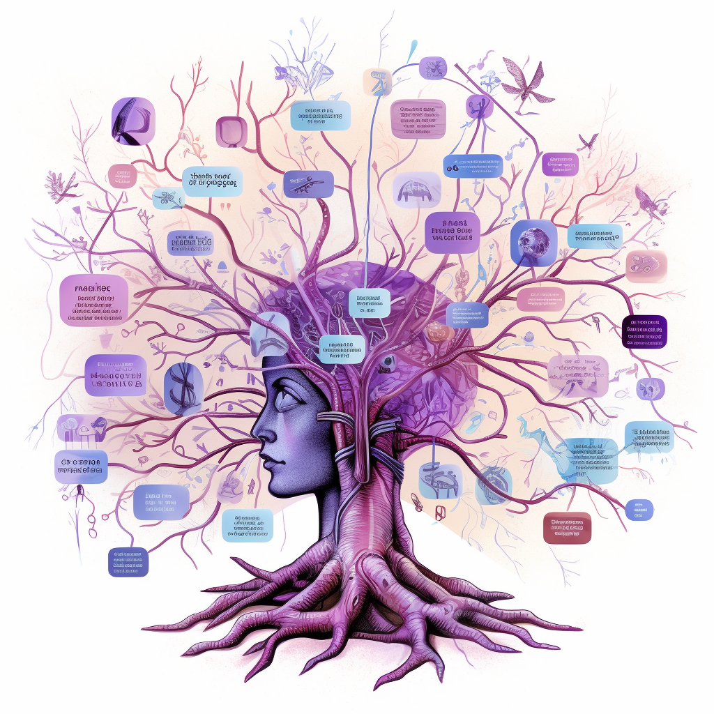

+++
title = "Living and Thriving with Adult ADHD: A Personal Journey"
date = 2023-05-15
topics = ["Life", "Careers", "Education"]
categories = ["Mental Health"]
tags = ["ADHD", "Mental Health", "Personal Growth"]
description = "A personal reflection on being diagnosed with ADHD as an adult, with insights on how it can impact professional and personal lives, and how to harness it for success."
author = "Nick Miethe"
+++

## Introduction

Adult ADHD is often misunderstood or overlooked. Many people, including myself, lived a large part of their lives not realizing they had ADHD. The stereotypical image of a hyperactive, underperforming child doesn't always translate into adulthood. In fact, many adults with ADHD are high performers in their fields but may struggle in other aspects of their lives.

In this article, I'll share my personal journey of being diagnosed with ADHD as an adult, and how it has both challenged and enhanced my personal and professional life.

## The Unexpected Diagnosis

I had always been a high performer, and hyperactivity was never a part of my life. It wasn't until I sought treatment for depression and chronic fatigue that ADHD was even considered.

Looking back, the signs were there - struggling in college, particularly in classes which required more intensive study or routine homework, plus having a plethora of hobbies and unfinished projects. But the most impactful symptoms were much less obvious - chronic depression and fatigue, constantly searching for new "sources of dopamine", etc.

A combination of these symptoms finally lead to my diagnosis and treatment, and the management of these symptoms has made the process worth the headaches (sometimes literally)!

## High-Performing Adults with ADHD

Despite the challenges, many adults with ADHD are high performers. They often have a unique perspective, creativity, and a hyper-focus that can lead to significant achievements.

However, ADHD can sometimes lead to feelings of being overwhelmed, especially when managing multiple projects or trying to meet high standards of performance. Adult-diagnosis of ADHD has previously been partly attributed to the progression of responsibility for adults.

For me, it became clear post-diagnosis that my ADHD had been a driving force behind my diverse hobbies and the success of my career at BoxBoat/IBM. Prior to treatment, I liked to boast that I could learn any new skill faster than anyone else that I knew. But sticking with it to gain true expertise was much more difficult. Fortunately, treatment has enabled me in my current position in life.

## ADHD and the Quest for Completion

Adults with ADHD often have a plethora of hobbies and a long list of unfinished projects. We can be passionate and focused on a new idea, but as soon as it becomes mundane or a newer, more exciting project comes along, it's easy to shift focus.

This can lead to frustration and self-criticism. But understanding that this is a part of how our brains work can help us accept it and find strategies to manage it, like breaking projects into smaller, manageable tasks.

## ADHD: A Different Perspective

ADHD is not a disability, but rather a different way of thinking and processing the world. It comes with its challenges, but also unique strengths. By understanding and accepting our ADHD, we can harness these strengths and thrive both personally and professionally.

## Conclusion

Being diagnosed with adult ADHD was a turning point in my life. It helped me understand myself better, accept my unique way of thinking, and find strategies to manage the challenges. It has not been an easy journey, but it has been a rewarding one.

If you think you might have ADHD, I encourage you to seek help. There are numerous resources and communities available to provide support and guidance.

I hope this personal journey through adult ADHD offers hope and understanding to others who might be experiencing similar challenges. Remember, there's no one-size-fits-all approach to managing ADHD. Everyone's journey is unique, and it's about finding what works best for you.

## References

1. [HowToADHD](https://howtoadhd.com/) - a favorite blog and YouTuber
2. [Adult ADHD: Symptoms, Statistics, Causes, Types and Treatments](https://www.additudemag.com/adhd-symptoms-in-adults/)
3. [How ADHD Affects Your Life](https://www.webmd.com/add-adhd/adhd-affects-your-life)
4. [Adult Attention-Deficit/Hyperactivity Disorder (ADHD) - Symptoms and Causes](https://www.mayoclinic.org/diseases-conditions/adult-adhd/symptoms-causes/syc-20350878)
5. [Attention deficit hyperactivity disorder adults: Comorbidities and adaptive impairments - ScienceDirect](https://www.sciencedirect.com/science/article/abs/pii/S0010440X9690022X)
6. [Strategies for Managing Adult ADHD](https://www.psychologytoday.com/us/blog/living-with-adult-adhd/202012/strategies-managing-adult-adhd)
7. [An ADHD diagnosis in adulthood comes with challenges and benefits](https://www.apa.org/monitor/2023/03/adult-adhd-diagnosis)
