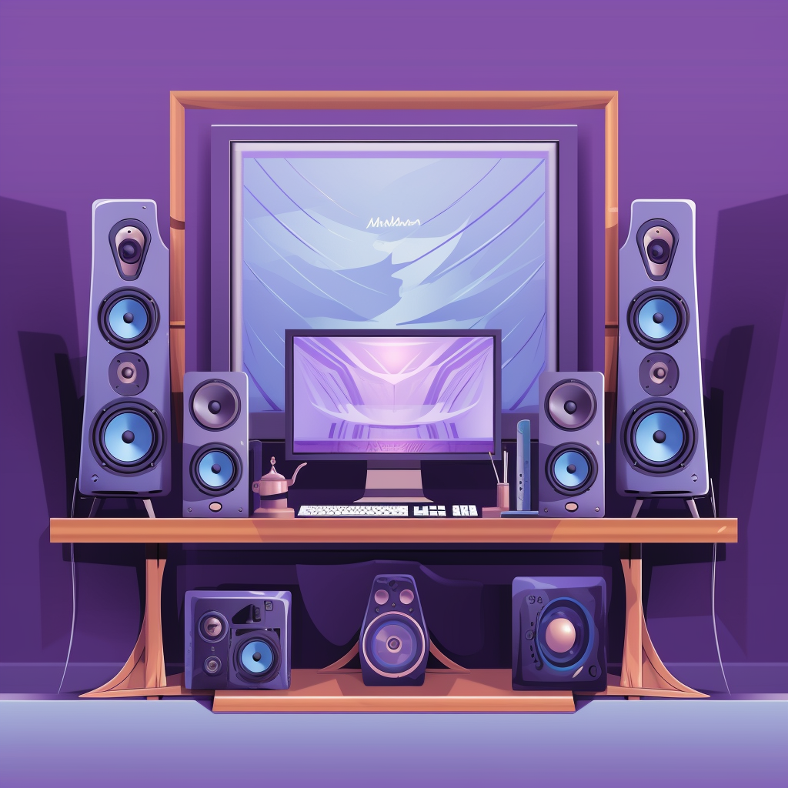

+++
title = "The Sound of Efficiency: Bookshelf Speakers for Your Desk"
date = 2023-05-05
tags = ["Bookshelf Speakers", "Home Office"]
categories = ["Audio"]
topics = ["Hobbies"]
series = ["Bookshelf Speakers"]
description = "An in-depth exploration of bookshelf speakers, their specifications, and their suitability for near-field desk environments."
author = "Nick Miethe"
+++

## Introduction

Welcome back, audio enthusiasts and gadget-lovers! Today, we're diving into the world of bookshelf speakers, particularly those which find their home in near-field environments, like your office desk. Why are bookshelf speakers ideal for your desk? What specifications should you consider when buying one? We'll cover all these and more in this comprehensive guide.

## Why Bookshelf Speakers for Your Desk?

Bookshelf speakers have been a staple in home audio systems for years, and for good reason. They're compact, versatile, and capable of delivering excellent sound quality - perfect for near-field listening, which is listening at a closer distance (like at your desk).

1. **Size**: Bookshelf speakers are compact enough to fit comfortably on your desk without sacrificing quality. They provide the perfect balance between size and performance, making them an excellent choice for desktop setups.
2. **Sound Quality**: Despite their size, bookshelf speakers deliver impressive sound quality. They provide a broad soundstage and excellent stereo imaging, which is perfect for near-field listening.
3. **Versatility**: Both active and passive bookshelf speakers are available, offering flexibility depending on your needs.


  


## Deciphering Speaker Specifications

Understanding the specifications of a speaker can be a daunting task. Let's break down the most common specifications and what they mean for real-world performance.

### Active vs. Passive

* **Active Speakers**: Have a built-in amplifier, so you don't need separate equipment. They're great for desktop setups. Example: [Audioengine A5+](https://www.amazon.com/Audioengine-A5-Powered-Speaker-Built/dp/B005OA3BSY?tag=meatybytes-20)
* **Passive Speakers**: Require a separate amplifier. They offer more flexibility and can deliver better sound quality, but they require more space. Example: [KEF Q150](https://www.amazon.com/KEF-Q150-Bookshelf-Speakers-Black/dp/B071P6KQZX?tag=meatybytes-20)

### Power: Wattage

The power output of a speaker is measured in Watts (W). Higher wattage generally means a speaker can produce louder sound.

* **Low Wattage (10-30W)**: Suitable for near-field listening at a desk. Example: [Edifier R1280DB](https://www.amazon.com/Edifier-R1280DB-Bluetooth-Speakers-Optical/dp/B0719C132V?tag=meatybytes-20) (Active Speaker)
* **Medium Wattage (30-100W)**: Ideal for larger rooms. Example: [Polk Audio T15](https://www.amazon.com/Polk-Audio-Bookshelf-Speakers-Audio/dp/B002RJLHB8?tag=meatybytes-20) (Passive Speaker)
* **High Wattage (100W+)**: Great for large rooms or outdoor spaces. Example: [Klipsch RP-600M](https://www.amazon.com/Klipsch-RP-600M-Reference-Premiere-Bookshelf/dp/B07GJ2ML7Z?tag=meatybytes-20) (Passive Speaker)

### Impedance: Ohms

Impedance is the resistance a speaker gives to the current supplied by an amplifier. It's measured in Ohms (Ω). A lower Ohm rating means less resistance, allowing more power from your amp to your speakers.

* **4 Ohms**: These speakers allow more power to flow through, but they require an amplifier that can handle the lower resistance. Example: [SVS Ultra](https://www.amazon.com/SVS-Ultra-Bookshelf-Speakers-Veneer/dp/B00WR1OP7Y?th=1&linkCode=ll1&tag=miethe-20&linkId=1c96e5c85ddf509d4e7ccd71c6a4569e&language=en_US&ref_=as_li_ss_tl) (Passive Speaker)
* **8 Ohms**: The standard for most home speakers. Easier to drive with most amplifiers. Example: [ELAC Debut 2.0 B6.2](https://www.amazon.com/ELAC-Debut-Bookshelf-Speakers-Black/dp/B07B4Q5587?th=1&linkCode=ll1&tag=miethe-20&linkId=c99661d0609fc83104c742856a849942&language=en_US&ref_=as_li_ss_tl) (Passive Speaker)

### Frequency Response: Hz

Frequency response refers to the range of frequencies a speaker can reproduce, measured in Hertz (Hz). A wider range means the speaker can produce more low (bass) and high (treble) sounds.


While a wide range is important, speakers lacking deep bass can be easily supplemented with an external sub-woofer!


* **Narrow Range (80Hz - 20kHz)**: Suitable for most music but might lack deep bass. Example: [Micca PB42X](https://www.amazon.com/Micca-PB42X-Powered-Bookshelf-Speakers/dp/B00NXAEPDC?th=1&linkCode=ll1&tag=miethe-20&linkId=1c7d3b3e77fd4fec445b49d059140418&language=en_US&ref_=as_li_ss_tl) (Active Speaker)
* **Wide Range (50Hz - 20kHz)**: Provides more robust bass. Example: [Sony SSCS5](https://www.amazon.com/Sony-SSCS5-3-Driver-Bookshelf-Speaker/dp/B00O8YLMVA?th=1&linkCode=ll1&tag=miethe-20&linkId=6a0984a9ce632481f737f7b05681ba08&language=en_US&ref_=as_li_ss_tl) (Passive Speaker)

### Sensitivity: dB

Sensitivity measures how loud a speaker will be for a given input power, measured in decibels (dB). Higher sensitivity means the speaker can provide louder sound with less power.

* **Low Sensitivity (85dB and below)**: Requires more power to achieve high volumes. Example: [Wharfedale Diamond 225](https://www.amazon.com/Wharfedale-Diamond-225-Bookshelf-Speakers/dp/B0141N69ZI?tag=meatybytes-20) (Passive Speaker)
* **High Sensitivity (86dB and above)**: Can reach high volumes even with less powerful amplifiers. Example: [Klipsch R-41M](https://www.amazon.com/Klipsch-R-41M-Powerful-Detailed-Bookshelf/dp/B07FKH3VPV?tag=meatybytes-20) (Passive Speaker)

### Driver Size and Material, and Number of Drivers

Drivers are the heart of the speaker, transforming electrical signals into sound. Their size, material, and the number of drivers in a speaker can significantly impact the sound quality.

* **Small Drivers (3-4 inches)**: Great for high frequencies and near-field listening. Example: [Audioengine A2+](https://www.amazon.com/Audioengine-A2-Powered-Speaker-System/dp/B00DQMJE7E?tag=meatybytes-20) (Active Speaker)
* **Large Drivers (5 inches and above)**: Better at producing low frequencies. Example: [DALI OBERON 1](https://www.amazon.com/JBL-Professional-Next-Generation-Powered-306PMKII/dp/B077N2GQXC?th=1&linkCode=ll1&tag=miethe-20&linkId=be3a8b1423c04a60fac744303133243a&language=en_US&ref_=as_li_ss_tl) (Passive Speaker)
* **Multiple Drivers**: Allow better separation of frequencies for a cleaner sound. Example: [Bowers & Wilkins 606](https://www.amazon.com/Bowers-Wilkins-606-Bookshelf-Speakers/dp/B07MGHYR3M?tag=meatybytes-20) (Passive Speaker)

### Enclosure Type

The enclosure of a speaker can influence its sound output. Common types are sealed, front-ported, and rear-ported.

* **Sealed**: Provides tight, accurate bass but might lack in volume. Example: [KEF LS50 Meta](https://www.amazon.com/KEF-LS50-Meta-Carbon-Black/dp/B08G1RB541?th=1&linkCode=ll1&tag=miethe-20&linkId=30734a499a07a3a9c6e72c9e66080e12&language=en_US&ref_=as_li_ss_tl) (Passive Speaker)
* **Front-ported**: Allows more bass to be emitted and is less dependent on room placement. Example: [JBL 306P MkII](https://www.amazon.com/JBL-Professional-Next-Generation-Powered-306PMKII/dp/B077N2GQXC?tag=meatybytes-20) (Active Speaker)
* **Rear-ported**: Can deliver deep bass but is more dependent on room placement. Example: [Q Acoustics 3020i](https://www.amazon.com/Q-Acoustics-Bookshelf-Speakers-Graphite/dp/B07C4WT392?th=1&linkCode=ll1&tag=miethe-20&linkId=2de4d092d63d588771856c7f16103a4f&language=en_US&ref_=as_li_ss_tl) (Passive Speaker)

## Conclusion

Bookshelf speakers are a great addition to any desk setup. Their compact size, impressive sound quality, and versatility make them an excellent choice for near-field listening. When choosing a bookshelf speaker, it's crucial to understand the specifications and how they impact the speaker's performance.

Remember, the best speaker for you depends on your specific needs and setup. Happy listening!

## References

1. [BudgetAudiophile](https://www.reddit.com/r/BudgetAudiophile/comments/m5fm2x/advice_required_desktop_speakers/)
2. [Speakers | Audiogon](https://www.audiogon.com/listings?category=speakers) - incredible place both to buy speakers and research hi-fi user reviews!
3. [Articles, Reviews and Measurements of Audio Products | Audio Science Review (ASR) Forum](https://www.audiosciencereview.com/forum/index.php?reviews/)
4. [Crutchfield: Speaker Buying Guide](https://www.crutchfield.com/S-m3jGrRB4GvY/learn/learningcenter/home/speakers_glossary.html)
5. [The Best Computer Speakers to put on your workdesk | Audio Advice](https://www.audioadvice.com/videos-reviews/best-computer-speakers)
