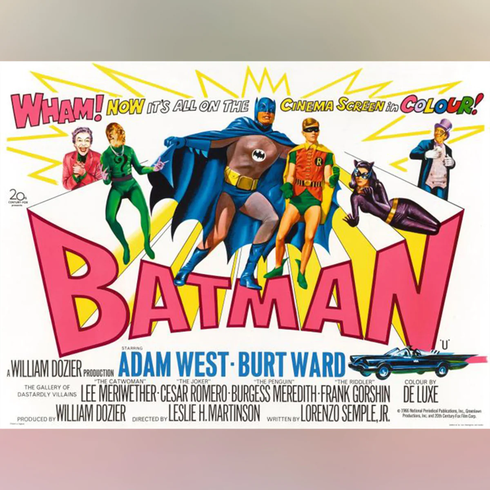
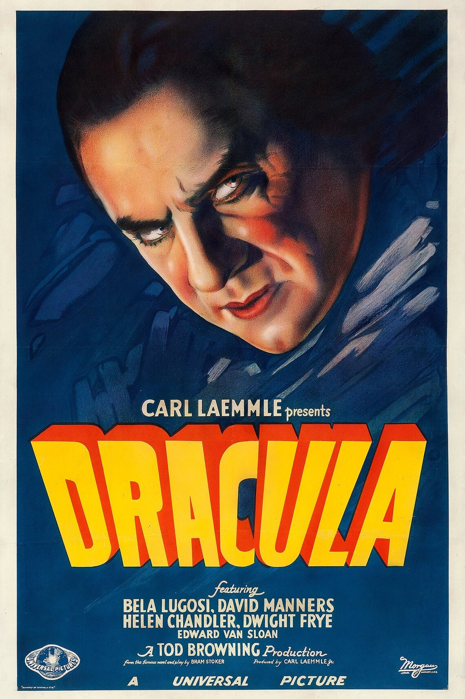
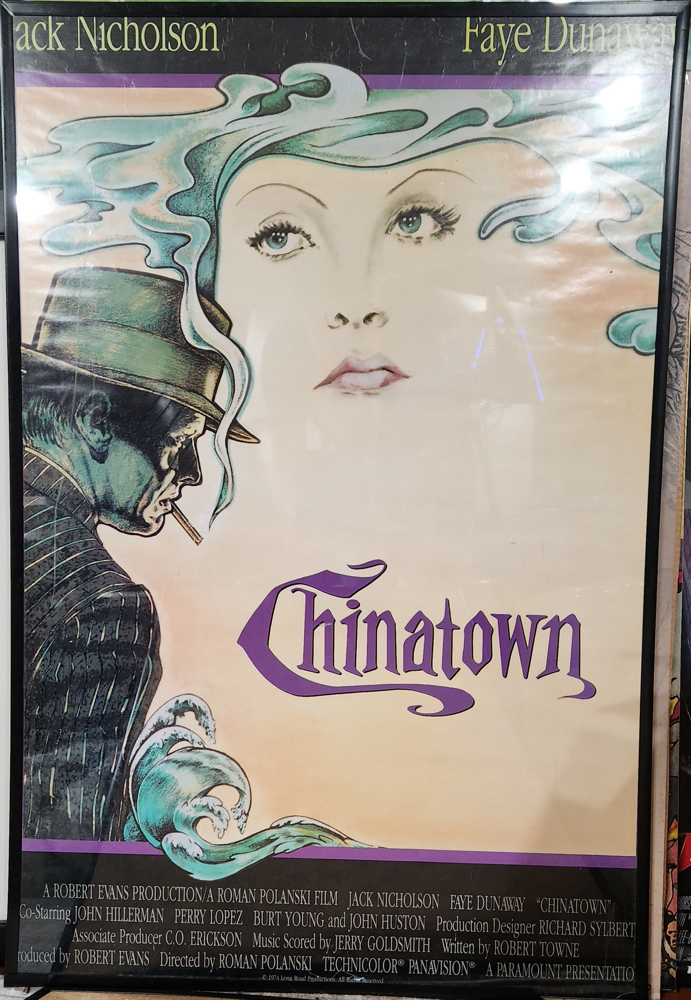

## The Art and Appeal of Movie Poster Collecting

Collecting movie posters is an intriguing hobby that combines the allure of cinema, art, and history. It's the intersection of cinematic love and admiration for visual artistry, where every poster tells a story not just about the movie it represents but also about the era in which it was created.

Having recently inherited my father's lifelong collection of movie posters, I've been reminiscing about the poster which lived above my computer desk throughout all of my youth - a UK variant of the original Batman movie from 1966. This poster, a comforting memory from my childhood, happens to be one of the [rarest posters around](https://atthemovies.uk/products/938-batman-1966?variant=32992907427920)! But what makes it so rare, and why do people like us find such joy in collecting movie posters? Let's explore this fascinating hobby.

### Understanding the Appeal of Movie Poster Collecting

The appeal of movie poster collecting is multi-faceted. For film enthusiasts, these posters represent a tangible connection to the movies they love. They are a visual celebration of the storytelling, characters, and artistry of cinema. Whether it's the thrill of the chase in acquiring a rare find or the pleasure of preserving a piece of movie history, collecting movie posters is a hobby that offers continuous engagement and satisfaction.

Moreover, movie posters are also works of art. They capture the essence of a film in a single, static image, often created by talented illustrators and graphic designers. Hence, they are also appreciated for their artistic value, adding to the aesthetic appeal of a living space or personal gallery.

### The Rarity and Value of Movie Posters

The rarity and value of a movie poster can depend on several factors:

1. **Age**: Older posters, especially those from the silent era or the golden age of Hollywood, are often harder to find and thus more valuable.
2. **Condition**: The poster's condition significantly affects its value. Posters in mint or near-mint condition are generally more sought after.
3. **Originality**: Original release posters, particularly those that were displayed in theaters, are typically more valuable than reprints or reproductions.
4. **Artistry**: Posters with unique or notable artwork, or those designed by recognized artists, may command higher prices.
5. **Movie Success**: Posters from highly successful or iconic films are often more desirable.
6. **Geographical Variants**: Certain versions of posters, such as international or regional variants, can be rarer and hence more valuable. My beloved Batman poster is a great example of this.

### Rarest and Most Valuable Movie Posters

The world of movie poster collecting has seen some truly rare and expensive pieces. Some of the most noteworthy include:

1. "Metropolis" (1927): This poster from the German expressionist science-fiction film is one of the most expensive ever sold, fetching over $1 million in auction.
2. "The Mummy" (1932): An original poster for this film sold at auction for nearly $500,000.
3. "King Kong" (1933): Known for its iconic artwork, an original poster of this film was sold for over $300,000.
4. "Dracula" (1931): A poster from this classic horror film fetched over $500,000 in auction.

### Getting Started with Movie Poster Collecting

Starting a movie poster collection can be as

simple as acquiring a poster from a movie you love. As you delve deeper into the hobby, you may want to consider these tips:

1. **Educate Yourself**: Learn about the history of movie posters, the different styles, sizes, and types that exist, and how to identify original posters versus reproductions. There are many resources and books available on this topic.
2. **Establish Your Focus**: Decide what kind of posters you want to collect. It could be posters from a certain era, a specific genre, a favorite director, or a particular artist.
3. **Check the Condition**: Always examine the condition of a poster before buying. Look for any damage, such as tears, folds, stains, or fading.
4. **Buy From Reputable Sources**: Purchase from respected dealers, auction houses, or established online platforms to ensure authenticity. You might also want to check out [PosterCollector](https://www.postercollector.co.uk/), a great online resource for movie poster collectors.

Remember, the most important part of collecting movie posters is the joy it brings you. Whether you're a movie buff, an art lover, or a history enthusiast, there's a movie poster out there that's sure to captivate your interest.

## Conclusion

Collecting movie posters is a fascinating hobby that allows us to celebrate our love for cinema and art while preserving pieces of history. It's an exciting journey filled with discovery, nostalgia, and sometimes, the thrill of finding a rare gem. As you delve into this hobby, remember that the value of a poster is not solely determined by its monetary worth, but also the joy and satisfaction it brings you.

## References for Additional Reading

1. [Collectors Guide to Movie Poster Books](https://postercollector.co.uk/guides/guide-to-movie-poster-books/)
2. [A Century of Movie Posters: From Silent to Art House](https://www.amazon.com/Century-Movie-Posters-Silent-House/dp/0764155997?&linkCode=ll1&tag=miethe-20&linkId=8cefb67a0d3c96a55fa83b6548b9d054&language=en_US&ref_=as_li_ss_tl) by Emily King
3. [Movieposters.com](https://www.movieposters.com/) - great site to find original and reproduction posters
4. [At The Movies Posters](https://atthemovies.uk/) - Original Vintage Film and Movie Posters
5. [Displate - metal posters](https://displate.com/)
