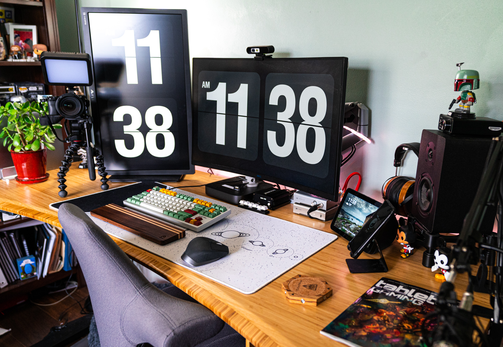

## Introduction

Hello there, fellow tech enthusiasts, and welcome back to another post on MeatyBytes.io. As many of you know, I'm Nick Miethe, a seasoned technologist and OpenShift expert with a myriad of hobbies, many of which center around my office desk.

Remote work isn't a new concept on its own, especially within the tech space; however, it is no secret that the Covid-19 pandemic pushed remote work as the new norm. Whether it be permanently or periodically in a hybrid-working model, [more people than ever](https://news.gallup.com/poll/318173/remote-workdays-doubled-during-pandemic.aspx) are finding themselves performing parts of their day job at home. And [research](https://hbr.org/2020/08/research-knowledge-workers-are-more-productive-from-home) is showing this to be [hugely beneficial](https://www.forbes.com/sites/joemckendrick/2021/05/30/remote-work-evolves-into-hybrid-work-and-productivity-rises-the-data-shows/?sh=2465386a4825) to productivity!


The average U.S. worker works 5.8 remote workdays per month, which is up by 2.4 since the start of the pandemic.


")

But working from home can be a challenge if you don't have the right setup. As we continue to adapt to the ever-changing landscape of work, the ability to create a functional and comfortable workspace at home has become increasingly important.

### Synopsis

Whether you're a coding wizard or just a tech-savvy individual looking to boost productivity, you've come to the right place. Today, we'll dive into setting up your optimal work from home environment that promotes efficiency and comfort.

We'll be sharing some of our favorite products along the way, with links to where you can purchase them for yourself (*full disclosure: some of which are affiliate links, so we'll earn a small commission if you choose to purchase through these links*).

In this post, we'll dive into the ins and outs of setting up your optimal work from home environment. We'll explore how to choose and set up the right space, the perfect desk and chair, and other necessities outside your chosen 4 walls. So, let's get started!

## Office Space

The environment in which you work can greatly influence your mood, productivity, and overall work quality. A dedicated workspace is therefore critical. Ideally, this should be a separate room used exclusively for work. However, if this isn't possible, a dedicated corner or area that's away from the usual household distractions will suffice.

Of course, you know yourself better than anyone. If you work best by switching things up every day, then do that! The greatest part of remote work is that you have the flexibility to work from **anywhere**, not just from home.

### Choosing the Room

Consider a quiet place with minimal foot traffic. Basements and spare bedrooms can make excellent office spaces. Being away from common areas like the kitchen or living room minimizes potential distractions and interruptions. That said, consider distance to important amenities like food/drink and a bathroom. Also, make sure the lighting is appropriate based on your preferences. If you have a window, consider if it will be a distraction or produce glare on your screen (see more on Lighting below).

### Decorations

The aesthetic of your workspace can contribute significantly to your mood and productivity. Surround yourself with things that inspire you, whether it's motivational quotes, art, or even plants. However, avoid cluttering your space. A clean, minimalist environment often encourages better focus. For the desk itself, consider a nice [desk pad](https://www.lttstore.com/products/cyber-stats-desk-pad) under your mouse and keyboard.


We'll get into decor for video streaming/meetings in a future post.


### Lighting

Good lighting is essential, both for your focus and for video conferencing. Natural light can help maintain a good circadian rhythm, making you more alert and productive. Position your desk near a window, if possible, but be conscious of distractions and glare. For video calls, a well-lit space presents you professionally. You might consider adding a quality desk lamp or even proper soft boxes for a constant, professional lighting setup.

If you personally prefer working in a dimmer environment, or like to change back and forth, I highly recommend a smart lighting solution from [Phillips Hue](https://amzn.to/3qSNHeU) or [Govee](https://amzn.to/3NkYMgG). I personally have Hue lights in my recessed can lights as well as in accent lamps throughout my office, all of which are controlled with an [Elgato Stream Deck](https://amzn.to/42OwS29). This allows me to change the lighting based on my mood, and switch over to my pre-defined video setup for meetings.

## Room Upgrades

Once you have your basic workspace in place, consider the following elements to truly tailor your office to your personal and professional needs.

### Soundproofing

In a noisy household, soundproofing your workspace can be beneficial. A simple throw rug on a hard floor is a major improvement for reducing echos, while also providing a cozier feel to the room. Acoustic panels on the walls can further reduce echo and background noise, improving the audio quality of your calls and providing a quieter work environment. Especially if you face a wall, and doubly so if in a corner, a set of simple [sound dampening](https://amzn.to/42Qgs9s) panels can make all the difference on your calls while even improving quality of a speaker setup.


See my posts on [bookshelf speakers]() for more info on a desk setup.


### Ergonomic Additions

To further enhance your comfort, consider adding footrests or monitor arms. They can improve your posture, reduce strain, and generally make your workday more comfortable. However, is important that they are used appropriately.

It is best for your feet to be planted on the floor, or on a footrest attached below your chair, for proper ergonomics, and only elevate them in front of you periodically. Ideally, everything you routinely use should be within arms reach, and you should be able to sit straight, looking forward (slightly down). Your elbows should be relaxed and close to your side, ideally with a 90° angle between you arm and forearm.

## Desk and Chair

### The Desk

A good desk is the foundation of your workspace. It should be spacious enough to accommodate your computer and any other essential work items. An adjustable standing desk can be a great investment for long-term health and productivity. Even if you don't plan to stand with it, the minute adjustments allow for tuning the height for the exact position needed to keep your elbows at 90°. I personally am a fan of the [Fully Jarvis](https://store.hermanmiller.com/standing-desks/jarvis-bamboo-standing-desk/2542428.html?lang=en_US). If you do use the desk to switch between sitting and standing, make sure you follow proper guidance on your ratio, as prolonged standing has been shown to be as [detrimental as sitting](https://www.sciencedirect.com/science/article/abs/pii/S0003687013002093)! The ideal sit-stand ratio [has been shown](https://www.sciencedirect.com/science/article/abs/pii/S0003687013002093) to be between 1:1 and 3:1, or standing 30 to 45 min every hour.

When choosing a desk, make sure it is both as wide and deep as your room allows. If possible, get one with a beveled and contoured front for more comfort. Consider adding slim drawers for storage of small items, such as chargers, flash drives, and anything else you like to keep on hand. Additionally, desktop grommets can be extremely useful, whether it be for cable passthrough, desktop outlets, or even for your monitor mounts. Lastly, proper cable management can make a world of difference when it comes to de-cluttering your office, and can be especially important if you do plan to use a stand-up desk!

### The Chair

Investing in a good chair is essential, especially for those long coding or design sessions. A well-designed ergonomic chair that supports your posture can help prevent back pain and other physical ailments associated with sitting for long periods.

There are [numerous studies](https://lifeformchairs.com/wp-content/uploads/2021/08/1-s2.0-S0003687021001289-main-1.pdf) on the types of chairs to best promote proper posture, blood flow, attention, and comfort. While comfort is critical, it doesn't necessarily equate to the popular definition of comfort. Rather than finding the plushest, most luxurious chair you can find, look for something that you can sit in for extended periods without a second thought. Remember, your desk chair isn't for napping!

#### Choosing a Chair

When choosing a chair, consider the popular adages/aphorisms *"The poor man pays twice"* and *"Spend more on what separates you from the ground"*. Most office workers spend more time in their desk chair than anywhere else, [even bed](https://lifeformchairs.com/wp-content/uploads/2021/08/1-s2.0-S0003687021001289-main-1.pdf). Those that work from home are likely to spend even more time in that chair, both from working longer hours and from the potential seamless transition into leisure time. They also generally have the freedom to choose their own chairs in those situations, which is both a blessing and a curse, depending on the [selection](https://www.ncbi.nlm.nih.gov/pmc/articles/PMC3552974/)! Therefore, it is crucial to invest in your chair, even if above all else in your space.

I have personally been using the [HAG Capisco](https://amzn.to/3qVQBj1) for several years, which I originally got from Fully with my desk. It is perfect paired with a standing desk, and the [optional footring](https://amzn.to/3NCsQWo) makes for a very comfortable, yet posture-friendly, footrest. The lack of armrests may seem off-putting at first, but even that single feature changed my life by preventing the resting of my elbows on the rests all day, completely resolving my Cubital Tunnel! Additionally, the chair (or stool) provides similar blood flow and attention benefits of active or dynamic chairs, without the muscoskeletal issues that accompany the "Exercise ball chairs".

## Desk Setup

Keep your workspace tidy and organized. Your computer monitor should be at eye level to avoid neck strain. Multiple monitors can also be helpful for multitasking. Keep your most-used items within reach, but try to limit the number of items on your desk to avoid clutter.

### Audio

If you like to use desk speakers and/or headphones, consider keeping the DAC within reach for easy adjusting of volume, as well as source and output. I personally use the [Schiit Bifrost 2](https://www.schiit.com/products/bifrost) for my audio setup. If your "office" is rather noisy, consider closed-back, or even noise canceling, headphones. I've used several generations of the [Sony WH-1000XM5](https://amzn.to/3CFT2J6) noise canceling headphones over the years, and they have all been amazing quality. Otherwise, I highly recommend open-back headphones. I will go further into that topic in a future post on headphones! Similarly, speakers are very useful when possible, for everything from meetings to hearing notifications throughout the day, without requiring heavy headphones on your head at all times. See more on my posts on [desk speakers]().

### Keyboard and Mouse

The choice of keyboard and mouse is a highly personal decision, particularly the deeper into the hobbies that you go. The options also change quite a bit depending on your specific use cases. Therefore, I won't go too deep today, but stay tuned for a future post on mechanical keyboards!

For now, the most important thing is to use something, *anything*, other than a laptop keyboard and mouse. There is nothing worse for your ergonomics and productivity than the cramped positioning necessary for a laptop for anything but occasional *lap* usage! The [Logitech MX Master 3S](https://amzn.to/3qUzZbK) is an excellent wireless mouse which has served me well for years. It is very comfortable in the hand and includes several additional buttons, including gesture control which is, IMO, a necessity for the Mac. For a keyboard, [Keychron](https://amzn.to/3Cz4ruv) makes excellent starter mechanical keyboards, as your learn your own personal preferences.

### Monitor(s)

As mentioned above, monitor arms are crucial for proper ergonomics plus allow for a much cleaner desk setup, whether you have 1 or 5 monitors. But it is critical that your primary monitor be positioned appropriately. See below for an example of proper positioning. In short, the monitor should be around an arm's length away when sitting up straight, with the top of the monitor at eye-level, and tilted up slightly.

Larger, curved monitors, like [Samsung's 49" Odyssey Neo G9](https://amzn.to/445U3WQ), can be excellent options for ergonomics, versus multiple flat screens that require fully turning your head consistently. [This stand](https://amzn.to/3qSV2vi) is excellent if you need to stack 2 monitors, or want to have 2 monitors both above a primary monitor below, while [this stand](https://amzn.to/3Ne4f8X) is the only option for the larger ultrawides.

")

!IMAGE-HERE! _Example Image: An organized desk setup with a monitor at eye level, mechanical keyboard, ergonomic mouse, and noise-canceling headphones._

## Conclusion

Setting up an optimal work from home environment involves careful consideration of several factors. The location and setup of your workspace, your desk and chair, and other necessities can all contribute to a productive work environment. The key is to tailor your workspace to your specific needs and job requirements.

By creating an environment that helps you stay focused and comfortable, you can increase your productivity and enjoy a better work-life balance. And going beyond the basics will make your home office a place where you can thrive! The tips above should serve as a great starting point, and I encourage you to experiment and find what works best for you. As your WFH journey continues, you will learn which rules you can break depending on your own needs. As you can see below, my current setup is probably less "proper" than it was 3 years ago, but it is tremendously more functional for me, personally.

Stay tuned for our future posts, where we dive deeper into specific aspects of your workspace, such as video lighting and desk organization. We'll also delve into how to set up a virtual workspace with OpenShift, which can drastically improve your work-from-home experience, especially for those involved in development and IT operations.

See you next time on [MeatyBytes.io](/)!

## Additional Resources

1. [Remote Work Evolves Into Hybrid Work And Productivity Rises, The Data Shows](https://www.forbes.com/sites/joemckendrick/2021/05/30/remote-work-evolves-into-hybrid-work-and-productivity-rises-the-data-shows/?sh=5ed2a1624825)
2. [The impact of sit–stand office workstations on worker discomfort and productivity: A review - ScienceDirect](https://www.sciencedirect.com/science/article/abs/pii/S0003687013002093)
3. [A biomechanical analysis of active vs static office chair designs](https://lifeformchairs.com/wp-content/uploads/2021/08/1-s2.0-S0003687021001289-main-1.pdf) - PDF
4. [The effectiveness of a chair intervention in the workplace to reduce musculoskeletal symptoms. A systematic review - PMC](https://www.ncbi.nlm.nih.gov/pmc/articles/PMC3552974/)
