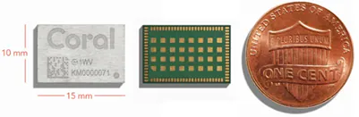

## Intro

Hello, MeatyBytes.io readers! It's Nick Miethe here, back with another deep dive into one of my passions. As you probably know, when I'm not busy spreading the good word of OpenShift or building the next piece of heirloom furniture for the house (or at maybe the garage), I'm probably tinkering with a new toy. Today is one of those days, where I get to marry two of my interests - **tech and home automation**. We're going to discuss an exciting product - the **Google Coral TPU** - and how it could revolutionize your smart home setup.

At first glance, it's a tiny chip, but it's a powerhouse of ML processing that can enhance various applications in a smart home setting. Imagine having your home security system not just detecting movements, but also recognizing familiar faces or identifying suspicious activities based on patterns it learned! This is just a taste of what Google Coral TPUs can achieve, along with improving energy efficiency and response times for your devices.

In this post, we'll talk about what Google Coral TPUs are (and aren't), their benefits, and how you can integrate them into your smart home; potentially, we'll even be using OpenShift to orchestrate the services in an upcoming post!

In this post, we'll explore the world of Tensor Processing Units (TPUs), specifically Google's Coral TPU, and how this powerful technology can be harnessed to supercharge your smart home. As we delve into this exciting topic, we'll also demystify some of the more technical aspects, like Tensor cores and TensorFlow, and why TPUs sometimes outperform GPUs in certain tasks. Plus, we'll check out some alternatives to Coral and other tech that you could use instead of TPUs.

So, if you've been looking to bring more intelligence and efficiency to your smart home, stay tuned. This post could be the key to unlocking a whole new level of smart home automation. Let's get started!

## What's a TPU and How Does It Work?

A **Tensor Processing Unit** (TPU) is a type of processor developed by Google specifically for accelerating machine learning tasks. They're called Tensor Processing Units because they're optimized for TensorFlow, Google's open-source machine learning framework, which represents data in tensors - essentially multi-dimensional arrays. This architecture, called a *domain-specific architecture*, makes a TPU a **Matrix Processor**.

A TPU is equipped with Tensor cores, special hardware designed to perform tensor operations very quickly. These cores accelerate linear algebra computations, which form the crux of machine learning algorithms. The TPU works by loading all data from memory intro its special matrices. Then, as calculations are performed, the results are passed directly to the next set of multipliers (rather than writing/reading from memory), removing the necessity for constant memory access during calculations.

The **Google Coral TPU** (Tensor Processing Unit) is a high-speed, high-efficiency machine learning (ML) accelerator. It's designed to help developers perform AI tasks more quickly and with lower power consumption, which can be a game-changer in a smart home setup.

## TPUs vs GPUs: A Battle of Specialization

*Graphics Processing Units* (GPUs) were originally created, as the name states, for graphical processing. These purpose-built processors are focused on usage in gaming and video-rendering; however, their unique architecture has made them extremely capable for a number of computationally-expensive tasks. For example, GPUs were heavily used for cryptocurrency *mining*, essentially performing massive calculations, until the major currencies moved towards other methods (Proof of Stake or requiring ASICs to mine efficiently).

The *arithmetic logic units* (ALUs) in these GPUs, along with the high memory capacities for video rendering, also makes them extremely capable for ML tasks. This is because a GPU's many thousand ALUs can perform thousands of parallel calculations, all while accessing data directly from its large cache of high-speed memory. However, this data access occurring thousands of times simultaneously, adding a significant time overhead for memory access.

While GPUs are often used in machine learning, TPUs are *ASICs* (application-specific integrated circuits) designed specifically for this purpose. This specialization makes them more efficient at executing tensor operations, thereby making them faster and more power-efficient for specific ML tasks. While a GPU must access memory thousands of time a second during calculations, a TPU is designed to only access memory at the beginning and end of a set of calculations, thereby greatly reducing computational time as well as energy from the constant reading/writing.

When should you use TPUs over GPUs? The answer largely depends on your specific workload. TPUs excel at large-scale ML tasks with a heavy focus on linear algebra computations. On the other hand, GPUs are more flexible and can handle a broader range of tasks, including graphics rendering and gaming, of course. Additionally, GPUs are generally *much* more cost-effective at the scale necessary for large ML tasks. Though for simpler tasks, such as image recognition or other at-home inferencing, TPUs are excellent performers.

## Alternatives to Google Coral TPU

While Google's Coral TPU is a robust option for machine learning acceleration, it's not the only player in the game. Nvidia's [Jetson](https://amzn.to/43zlBUG) series and Intel's [Movidius Neural Compute Stick](https://amzn.to/43TMhPK) (a VPU) are both viable alternatives, depending on your specific needs.

### Beyond TPUs: Exploring Alternative Technologies

It's also worth noting that TPUs aren't the only tech you can use for machine learning acceleration. *FPGAs* (Field-Programmable Gate Arrays) and *ASICs* (Application-Specific Integrated Circuits) are other options, each with their own strengths and trade-offs.

## Google Coral Product Line: A Breakdown

Google Coral offers a range of products, each best suited for different applications. They are best broken up into 3 specific groupings: Chips/Cards (to build your own from the ground up), SOMs (to add to an existing system), and Dev Boards (to setup an AIO solution, out-of-the-box). All 3 have their own distinct place in the wide-range of Coral customers. See below for an explanation of each, to help you choose the right solution.

### DIY

Google offers solderable, Surface-Mount (SMT) [AI Accelerator Modules](https://www.mouser.com/ProductDetail/Coral/G313-06329-00?qs=W%2FMpXkg%252BdQ5zuYI97qPDGQ%3D%3D) of their Edge TPU for people that need/want to design their own TPU carrier boards for highly-specific use-cases. These still provide the same 2 TOPS/Watt (Trillion Ops per second) for a total of 4 TOPS. The cards are able to be connected over PCIe2x1 or USB2. All of this power in a tiny 15mm x 10mm x 1.5mm form factor.

While these can be a cheap and extremely flexible route to integrating several Edge TPUs into your system, it also requires advanced soldering and electronics work. So, you would know if this was a good option for you!


If you're interested in going this route, [this post](https://tony-kim.medium.com/prototyping-with-the-google-coral-ml-tpu-accelerator-module-usb-2-0-high-speed-f0e19218cec2) walks through some of the steps for prototyping.


### SOMs

A more common route for integrating the power of a TPU into your system is by using a System-on-Module (SOM). These are essentially the result of placing the above AI Accelerator onto a carrier for a specific communication standard, with the size improvements that come from purpose-built hardware! These are available as [Half-Mini PCIe](https://www.mouser.com/ProductDetail/Coral/G650-04528-01?qs=XeJtXLiO41RDsI9w8m%252Bkgg%3D%3D) and [M.2](https://www.mouser.com/ProductDetail/Coral/G650-04527-01?qs=XeJtXLiO41SNhFZkjmCwDg%3D%3D) (A/E key), enabling their usage in your existing server or NUC.

This is generally the best $/performance/effort option of the 3, assuming you want to add one of these to an existing system. However, make sure you get the right form factor! You will often find Mini PCIe (mPCIe) slots on NUCs and other SFF PCs for a Wifi or Bluetooth card. You can also find adapter cards for PCIe x1 -> mPCIe, generally marketed for adding wifi cards ([like this one](https://amzn.to/3CpyxAw)), to install the Coral into any standard motherboard with an open PCIe slot.

### Dev Boards

Lastly are the Coral dev boards. These are full systems, or single-board computers (SBCs), ready to be used without the need for a dedicated host system. They include the Edge TPU in addition to a processor, memory, and connectivity - essentially a Raspberry Pi + a TPU! In fact, the current version of the Dev Board utilizes an A53 ARM Cortex, the same processor as the Pi 3B+!

The [Coral Dev Board](https://www.mouser.com/ProductDetail/Coral/G950-01455-01?qs=u16ybLDytRZzoDDKD3Sj%2FQ%3D%3D) is great for prototyping and development, or deployment at the Edge. Coral also recently released the [Dev Board Micro](https://www.mouser.com/new/google-coral/coral-dev-board-micro/), a similar SBC in a smaller form factor. The Micro includes a Cortex-M7 and M4, the Edge TPU, plus an onboard microphone and color camera (324px X 324px). Coral also manufactures add-on boards for both of their Dev Boards, aka pHATs, which can add [environmental sensors](https://amzn.to/3N51JBA), Wifi, and (soon) PoE, as well as additional cameras!

Google also makes an extremely popular USB model of the Coral, the **Coral USB Accelerator**. This TPU simply requires an open USB slot, opening up the realm of possibility to almost any device (including a Raspberry Pi!). This model of the Edge TPU is more similar to the SOMs in that it requires a host system to utilize its capabilities. However, technically, the USB Accelerator is a full system which includes a microprocessor (MCU) and the necessary hardware controllers to provide USB 3.1 connection speeds (5Gb/s).

That said, due to its popularity, flexibility, and ease-of-use, the USB Accelerator is extremely difficult to find at its retail price of $61. I recommend placing a back-order on a site like [Mouser](https://www.mouser.com/ProductDetail/Coral/G950-06809-01?qs=u16ybLDytRbcxxqFKdbhgQ%3D%3D), checking ebay and swap sites, and keeping your eyes open for a deal. In the meantime, it is always possible to find the USB Accelerator for well-over retail on [Amazon](https://amzn.to/3CqRJxC) ($160 at time of writing). You can also attempt to use the M.2 or mPCIe modules with a USB adapter to build your own! Stay tuned, as I'll potentially be trying this.


  


## Wrapping Up

In conclusion, TPUs, and specifically the **Google Coral TPU**, offer a potent way to accelerate machine learning tasks, making them a compelling choice for smart home applications. Whether you choose a TPU, GPU, FPGA, or ASIC will depend on your specific needs, and even then the choice of specific product can require some research. However, the luxury of choice is a clear indication that machine learning technology is becoming increasingly accessible for home use.

So don't let yourself get analysis paralysis by all of the options. If you're looking to get started with ML, especially around computer vision or sound, try out one of the Coral TPUs from this post. You certainly won't regret it!

I hope you found this post informative and helpful. If you have any questions or would like to share your own experience, feel free to leave a comment! Until next time.

## References

* [Google Coral official website](https://coral.ai/)
* [Example Projects | Coral](https://coral.ai/examples/)
* [ google-coral](https://github.com/google-coral)
* [Asus AI Accelerator PCIe Card](https://amzn.to/3NpRuJq) - Run 8x TPU M.2 modules from 1 PCIe slot. Maybe not the most cost effective route, but simple and even recommended by Google for Enterprises.


