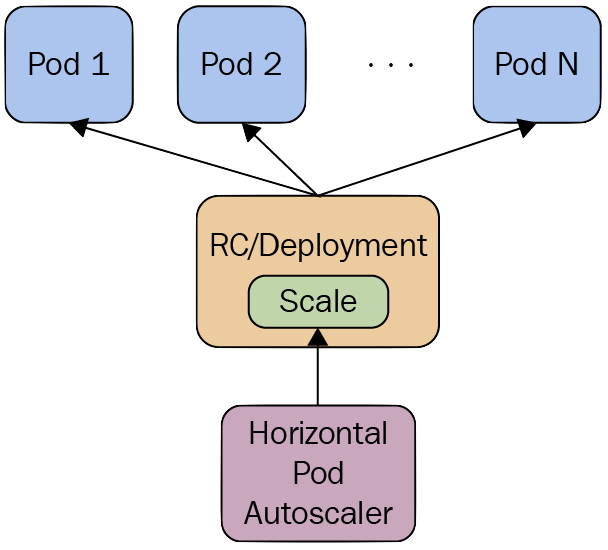
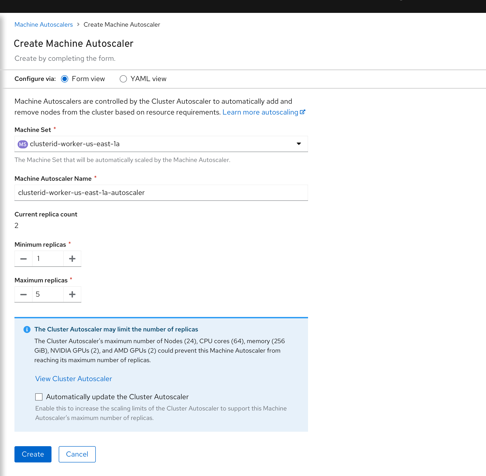

---

title: "Performance & Cost Best Practices for OpenShift on AWS"
date: 2023-06-13
author: "Nick Miethe"
tags: ["OpenShift", "Cloud", "AWS", "Performance", "Autoscaling", "Cost Optimization", "Sustainability", "FinOps", "HPA", "VPA"]
categories: ["Technical", "Guide"]
topics: ["OpenShift", "Cost Optimization", "AWS", "Autoscaling"]
description: "Uncover the secrets to optimizing the deployment of OpenShift on AWS, focusing on the best practices to achieve higher performance at a reduced cost. Discover the different types of Autoscaling available on OCP and their associated cost savings."
---

## Introduction

Welcome back to [MeatyBytes.io](https://meatybytes.io/), your go-to source for all things OpenShift, technology, and of course, a dash of eclectic hobbies. As always, it's your ever-curious guide, Nick Miethe, here to dissect another captivating topic.

Over the years, I've developed a passion for extracting maximum efficiency from my systems, whether it's meticulously tuning my audiophile setup or fine-tuning clusters in OpenShift. This obsession with optimization has led me the never-ending path of balancing performance and cost for cloud infrastructure: in this case, specifically OpenShift Container Platform (OCP) on Amazon Web Services (AWS).

Deploying OCP on cloud infrastructure like AWS brings with it the promise of flexibility, scalability, and high performance. But to unlock these benefits, you need to navigate an array of instance types, scaling options, and configuration decisions. In today's post, we'll take a deep dive into the world of autoscaling on OCP and discuss the best practices for AWS compute. We will delve into AWS instance types, various autoscaling techniques, and the best practices for each type, supplemented with example workloads and potential cost savings.

By the end, you'll have the knowledge to streamline your workloads, maximize performance, and, importantly, keep those costs down - all without compromising on your OpenShift experience.  So grab a Dew and let's get started!

### Synopsis

Throughout this post, we'll discuss how to:

* Discover autoscaling options on OCP to dynamically manage your resources.
* Learn about the best AWS compute practices to effectively handle your workloads.
* Leverage OpenShift's inbuilt features and AWS's compute resources to optimize the cost-to-performance ratio.

Remember, every *byte* (and watt) saved counts when it comes to the performance and cost of running your infrastructure. And this is all doubly-beneficial on reducing your cloud carbon footprint, which is a quickly growing trend in the modern age of infrastructure. So, read on as we delve into these intricate details that can potentially supercharge your OpenShift operations on AWS.

Now, let's roll up our sleeves and optimize even your *meatiest bytes*!

## Understanding AWS Instance Types

When deploying OpenShift on AWS, one of the primary considerations is the type of EC2 instance to use. AWS provides a diverse range of instance types, each designed to support different workloads and performance requirements. This choice directly impacts your cost and system stability.

!IMAGE-HERE! (Example image: A comparison chart of various AWS EC2 instance types)

* **General Purpose Instances (M and T series)**: They provide a balance of compute, memory, and networking resources and can be used for a variety of diverse workloads. M series can be more expensive but offer better performance, while T series are cost-effective for small to medium-sized databases.
* **Compute Optimized Instances (C series)**: They are ideal for compute-intensive workloads and can provide a performance boost to your CPU-bound applications.
* **Memory Optimized Instances (R and X series)**: They are designed for memory-intensive applications and offer the highest RAM capacity.
* **Accelerated Computing Instances (G and T series)**: They offer various GPU and other specialized accelerators for ML and other intensive workloads.

Your selection should depend on the specific needs of your workload. For example, memory-optimized instances may be beneficial for data-intensive applications, whereas compute-optimized instances might be more suited to CPU-bound workloads. Additionally, while you will want to size your instances with a reasonable expectation of resource consumption, you also shouldn't over-size the instances if you want to optimize cost.

## Autoscaling in OpenShift: The Operators and Technologies

Autoscaling in OCP can help maintain application availability and improve cost efficiency. OpenShift supports several different types of autoscaling, including HPA, VPA, Cluster Autoscaling, and Machine Autoscaler. Let's dig into each of these.

## 1. Horizontal Pod Autoscaling (HPA)

### Overview & Underlying Technologies

[**Horizontal Pod Autoscaling**](https://docs.openshift.com/container-platform/4.13/nodes/pods/nodes-pods-autoscaling.html) (HPA) in OpenShift works by adjusting the number of pod replicas in a `ReplicationController`, `Deployment`, `ReplicaSet`, or `StatefulSet` based on observed CPU utilization or other select performance metrics, including custom metrics. This is achieved using the Kubernetes **Horizontal Pod Autoscaler**, which gets metrics from a series of aggregated APIs (like the Metrics API and the Custom Metrics API).



### Best Practices

* Ensure metrics are properly set up for your cluster. Metrics Server should be running in the cluster, which is usually the case in many default installations.
* Be aware of the delay due to metric collection, which can be up to a minute. This means HPA may not react to spikes in traffic immediately.
* Set appropriate and realistic thresholds for your CPU or memory usage to prevent unnecessary scaling.
* Test the HPA setup under a variety of load conditions to ensure it behaves as expected.

### Use Case

HPA is useful when workloads have variable resource demands. For instance, a retail website might see increased traffic during a sale event. HPA could help handle the increased load by automatically scaling up the number of pods when CPU usage rises.

### Example Configuration

```yaml
apiVersion: autoscaling/v1
kind: HorizontalPodAutoscaler
metadata:
  name: image-registry
  namespace: default
spec:
  maxReplicas: 7
  minReplicas: 3
  scaleTargetRef:
    apiVersion: apps/v1
    kind: Deployment
    name: image-registry
  targetCPUUtilizationPercentage: 75
status:
  currentReplicas: 5
  desiredReplicas: 0
```

## 2. Vertical Pod Autoscaling (VPA)

### Overview & Underlying Technologies

[**Vertical Pod Autoscaling**](https://docs.openshift.com/container-platform/4.13/nodes/pods/nodes-pods-vertical-autoscaler.html#nodes-pods-vertical-autoscaler-about_nodes-pods-vertical-autoscaler) (VPA) adjusts the CPU and memory requests for the pods, which can help maintain the efficiency and stability of the workload. VPA operates on the pod level, making it a suitable tool for applications that have variable resource requirements. The Kubernetes VPA feature makes recommendations based on the consumption history of a pod and the resources available on the node.


### Best Practices

* Do not use VPA with HPA on CPU or memory for the same workload, as they may conflict with each other.
* Monitor the VPA's scaling decisions and adjust the target resource levels if necessary.
* Be aware that when VPA adjusts resources, it may cause pod evictions and recreations, which might not be suitable for all types of workloads.

### Use Case

**VPA** is beneficial for workloads that have unpredictable memory or CPU usage. For example, a data processing application may require more resources as the size of the data increases. VPA can adjust the resources allocated to the pods to prevent out-of-memory errors.

## 3. Cluster Autoscaling

### Overview & Underlying Technologies

Cluster autoscaling in OpenShift refers to the ability to automatically adjust the size of the cluster itself, i.e., the number of nodes, based on the demand. This is done using the Kubernetes [**Cluster Autoscaler**](https://docs.openshift.com/container-platform/4.13/machine_management/applying-autoscaling.html#cluster-autoscaler-about_applying-autoscaling), which increases the number of nodes when there are pods that failed to schedule on any of the current nodes due to insufficient resources, and reduces the number of nodes when some nodes in the cluster are underutilized and their pods can be easily moved to other nodes.

### Best Practices

* Set up appropriate resource requests and limits for your pods. The Cluster Autoscaler makes decisions based on these values.
* Monitor the autoscaler's decisions to ensure it's behaving as expected.
* Keep in mind that scaling operations can take a few minutes to complete.

### Use Case

Cluster autoscaling is useful for applications that can benefit from scaling out beyond the capacity of a single node. For instance, a large-scale machine learning training job could potentially use more resources than a single node can provide. Cluster autoscaling would allow the job to continue running smoothly by adding more nodes to the cluster.

### Example Configuration

```yaml
apiVersion: "autoscaling.openshift.io/v1"
kind: "ClusterAutoscaler"
metadata:
  name: "default"
spec:
  podPriorityThreshold: -10
  resourceLimits:
    maxNodesTotal: 24
    cores:
      min: 8
      max: 128
    memory:
      min: 4
      max: 256
    gpus:
      - type: nvidia.com/gpu
        min: 0
        max: 16
  logVerbosity: 4
  scaleDown:
    enabled: true
    delayAfterAdd: 10m
    delayAfterDelete: 5m
    delayAfterFailure: 30s
    unneededTime: 5m
    utilizationThreshold: "0.4"
```

## 4. Machine Autoscaler

### Overview & Underlying Technologies

[**Machine Autoscaler**](https://docs.openshift.com/container-platform/4.13/machine_management/applying-autoscaling.html#machine-autoscaler-about_applying-autoscaling) in OpenShift is a specific implementation of cluster autoscaling that works with the Machine API. It adjusts the number of Machines in the machine sets that you deploy in an OpenShift Container Platform cluster. You can scale both the default `worker` machine set and any other machine sets that you create. The machine autoscaler makes more Machines when the cluster runs out of resources to support more deployments. You must deploy a machine autoscaler for the **cluster autoscaler**, or it will never scale your cluster.



### Best Practices

* The cluster autoscaler uses the annotations on machine sets that the machine autoscaler sets to determine the resources that it can scale.
* Use different compute `MachineSets` for various workloads types to optimize instance costs.
* For workloads that support it, utilize AWS Spot instances machine sets to reduce costs.
* Use `minReplicas: 0` for `MachineSets` consisting of intermittently required machine types (XL instances, high memory, GPU, etc).

### Use Case

When workloads periodically require additional compute resources, the machine autoscaler is crucial for configuring this capability. It is especially useful for specialized workloads requiring unique resources. For example, if a cluster is used for training machine learning workloads, a machine set could be setup which includes [Accelerated Compute instances](https://docs.aws.amazon.com/AWSEC2/latest/WindowsGuide/accelerated-computing-instances.html) from AWS with GPUs. The machine autoscaler would both allow meeting the compute requirements on-demand while also minimizing cost when the specialized instances are not needed.

### Example Configuration

```yaml
apiVersion: "autoscaling.openshift.io/v1beta1"
kind: "MachineAutoscaler"
metadata:
  name: "worker-us-east-1a"
  namespace: "openshift-machine-api"
spec:
  minReplicas: 1
  maxReplicas: 12
  scaleTargetRef:
    apiVersion: machine.openshift.io/v1beta1
    kind: MachineSet
    name: worker-us-east-1a
```

## Best Practice Overview

By utilizing a combination of the above mentioned autoscaling capabilities and AWS instance types, you can create a highly-optimized platform in terms of both cost and performance. To review, and add a few extra points, here is a list of Best Practices for your OCP platform on AWS:

1. **Appropriate Instance Type Selection**: Choosing the right instance type for your workload can significantly impact costs. Select an instance type that best matches your workload requirements. Over-provisioning can lead to unnecessary expenses, while under-provisioning might impact performance. For the **Machine Autoscaler**, you can create different MachineSets backed by different instance types and let the autoscaler decide which one to scale based on the workload.
2. **Multi-AZ Deployments**: Distributing your nodes across multiple *Availability Zones* (AZs) can enhance the availability and reliability of your applications. However, be aware that data transfer costs between AZs can add up. Hence, optimize your application architecture to minimize inter-AZ data transfers.
3. **Cluster Autoscaler Settings**: The cluster autoscaler increases the size of the cluster when there are pods that failed to schedule due to insufficient resources. To optimize for cost, ensure that you set appropriate maximum and minimum limits for the nodes in your cluster. The `maxNodesTotal` value in the `ClusterAutoscaler` resource definition that you create should be large enough to account for the total possible number of machines in your cluster. Conversely, set a reasonable minimum to ensure you're not running nodes that are not needed.
4. **Machine Autoscaler Settings**: For Machine Autoscaler, set appropriate maximum and minimum limits for the number of machines in the machine sets. Any changes to the values in `MachineAutoscaler` resources are immediately applied to the machine set they target. This can help in managing the costs effectively.
5. **Spot Instances**: AWS Spot Instances let you take advantage of unused EC2 capacity in the AWS cloud at significant cost savings. Spot Instances are available at up to a 90% discount compared to On-Demand prices. You can use Spot Instances for various stateless, fault-tolerant, or flexible applications such as big data, containerized workloads, CI/CD, web servers, high-performance computing (HPC), and test & development workloads. In the context of OpenShift, consider using Spot Instances for stateless workloads to reduce costs.
6. **Use Reserved Instances or Savings Plans for Steady State Workloads**: If you have predictable and steady-state workloads, you can save costs by reserving instances or using AWS Savings Plans. Both offer significant discounts over on-demand pricing.
7. **Efficient Resource Allocation**: Make sure your applications are designed to use resources efficiently. Unnecessary CPU or memory usage can lead to more nodes than needed, which increases costs. Use Kubernetes' Quality of Service (QoS) classes and resource quotas to ensure efficient resource allocation.
8. **Properly Handle Cluster Scale-Down**: The cluster autoscaler decreases the size of the cluster when some nodes are consistently not needed for a significant period, such as when it has low resource use and all of its important pods can fit on other nodes. However, certain types of pods can prevent a node from being removed. Be aware of these conditions and set your pod disruption budgets and pod annotations appropriately.

Remember, cost optimization is a continuous process. Always monitor your AWS and OpenShift usage and adjust your settings as necessary. Utilize the cost management tools provided by AWS to gain insights into your expenditure and find opportunities for savings. Additionally, make use of Red Hat's included tooling, such as the [Hybrid Cloud Console](https://console.redhat.com/openshift/cost-management), for cost management and reporting.

## Conclusion

Deploying and managing OpenShift on AWS can be a complex task. However, with the correct understanding of AWS instance types and autoscaling techniques, you can optimize the performance and cost efficiency of your deployments. Always remember to base your instance type selection and scaling method on the needs of your specific workloads. Through diligent configuration and management, OCP on AWS can provide an effective, high-performance, and cost-efficient platform for your applications. Stay tuned for future deep dives on autoscaling and other cost/performance optimization tuning!

And that's a wrap for today! Until next time, don't forget to leave a comment on how you saved money on your ~~car insurance~~ infrastructure costs!

## References

1. [Amazon EC2 Instance Types](https://aws.amazon.com/ec2/instance-types/)
2. [OpenShift Autoscaling](https://docs.openshift.com/container-platform/4.13/nodes/nodes/nodes-cluster-autoscaling.html)
3. [Cluster Autoscaling on AWS](https://docs.openshift.com/container-platform/4.13/machine_management/applying-autoscaling.html)
4. [Vertical Pod Autoscaler](https://github.com/kubernetes/autoscaler/tree/master/vertical-pod-autoscaler)
5. [Machinesets and Auto-scaling OpenShift Cluster](https://medium.com/@wintonjkt/machinesets-and-auto-scaling-openshift-cluster-a24c458a200a)
6. [Machine and Cluster Autoscaler guidance - OpenShift Design](http://openshift.github.io/openshift-origin-design/designs/administrator/future-openshift/autoscaler-guidance/)
