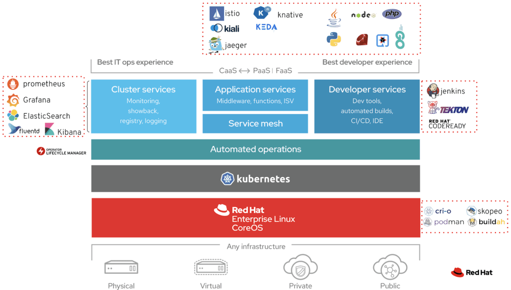

## Introduction

Welcome to another post on MeatyBytes.io. Today we're diving deep into an opinionated OpenShift cluster deployment, designed to meet all the needs of an enterprise. This includes a broad range of capabilities, such as Continuous Integration/Continuous Delivery (CI/CD) & GitOps, VMs & Serverless, Observability, Security, and more.

## The Ideal OpenShift Cluster Architecture for Enterprise Needs

An ideal OpenShift cluster architecture for enterprise needs would leverage a mix of various Operators and integrations. The following are key components of such a deployment:

### CI/CD: Jenkins Operator, Tekton Pipelines Operator

For Continuous Integration and Continuous Delivery (CI/CD), the **OpenShift Pipelines Operator**, based on Tekton, is an excellent choice. Tekton is a powerful and flexible open-source framework for creating CI/CD systems, allowing developers to build, test, and deploy across multiple cloud providers or on-premises systems by abstracting away the underlying implementation details. This allows you to then integrate any other Pipeline tools you are already using. For example, there are OpenShift Operators for GitLab, Jenkins, and more! Additionally, GitLab and [GitHub](https://operatorhub.io/operator/github-arc-operator) both have Runner Operators for OpenShift, with the latter having been written by my colleagues at BoxBoat!

Ansible is another important tool in this space, but is growing into its own platform. That said, the **Ansible Operator** is very well integrated into OpenShift and ACM, with features growing quickly!

### GitOps: Argo CD Operator

Argo CD is a declarative, GitOps continuous delivery tool for Kubernetes. It follows the GitOps principle of using Git as a 'single source of truth' for declarative infrastructure and applications. The **OpenShift GitOps Operator**, based on Argo CD, allows you to manage your applications' lifecycle using Git repositories as the source of truth.


**Progressive Rollouts** Red Hat recently announced a new Operator for OpenShift based on [Argo Rollouts](https://argo-rollouts.readthedocs.io/en/stable/), **OpenShift Progressive Delivery**. Stay tuned for more info!


### VMs: OpenShift Virtualization

KubeVirt is an add-on to Kubernetes, allowing users to run virtual machines alongside containers. The **OpenShift Virtualization** Operator, based on the upstream KubeVirt, simplifies the process of deploying and managing virtual machines on your OpenShift cluster. The Operator also now allows managing your VMs alongside containers with the same Pipelines and GitOps tools.

### Serverless: OpenShift Serverless Operator

The OpenShift Serverless Operator enables you to run serverless applications on OpenShift. It leverages Knative Serving for deploying and managing serverless workloads.

### Observability: OpenShift Logging Operator, Prometheus Operator

The **OpenShift Logging Operator** (formerly *Cluster Logging Operator*) collects and forwards log data within your OpenShift cluster. It includes Elasticsearch, Fluentd, and Kibana (the *EFK stack*). The Prometheus Operator provides easy monitoring definitions for Kubernetes services and deployment and management of Prometheus instances.

### Multi-Cluster Management: Advanced Cluster Management for Kubernetes

**Advanced Cluster Management for Kubernetes** (ACM) provides end-to-end visibility and control for managing your control planes' and applications' lifecycle across multiple clusters. While ACM is optimized for OpenShift, it has full-functionality across all Kubernetes distributions.

### Security: OpenShift Compliance Operator, OpenShift Container Security Operator

The **Compliance Operator** provides a way to scan and enforce compliance at the cluster level and per-node basis. The Container Security Operator brings image and runtime security alerts to the cluster by integrating Quay and Clair.

### Ingress/Egress Connectivity: OpenShift Ingress Operator

#### Ingress Connectivity

For ingress connectivity, the **Ingress Operator** is commonly used to manage Ingress Controllers and wildcard DNS, allowing external access to an OpenShift Container Platform cluster. An Ingress Controller is configured to accept external requests and proxy them based on the configured routes.

#### Egress Connectivity

For egress connectivity, the **egressip-ipam-operator** is a vital tool. It manages the assignment of egress IPs (IPAM) to namespaces, ensuring the necessary configuration in OpenShift and the underlying infrastructure is consistent. The egress IP feature allows for the establishment of firewall rules between namespaces and other services outside of the OpenShift cluster. This operator can automate the entire process of egress IP assignment, whether on bare metal or AWS.

### Microservice Connectivity: OpenShift Service Mesh

Microservice connectivity is critical for the communication between various workloads within a cluster, or even across multiple clusters. For this purpose, the **OpenShift Service Mesh**, based on Istio and other upstream projects, enables mTLS connectivity between microservices, as well as discoverability, whether the services be within a single cluster or across many. A Service Mesh offers numerous additional capabilities, from traffic separation for multi-tenancy, to traffic shaping, and much more! That said, it can also be a fairly complex solution, so consider your needs before deploying!

## Conclusion

I'm looking forward to continuing this journey with you into the perfect platform in my next post. Remember, every step taken in understanding and setting up your OpenShift cluster is a leap towards a more streamlined and efficient enterprise solution. Until next time!

## References

* [Configuring ingress cluster traffic using an Ingress Controller](https://docs.openshift.com/container-platform/4.13/networking/configuring_ingress_cluster_traffic/configuring-ingress-cluster-traffic-ingress-controller.html)
