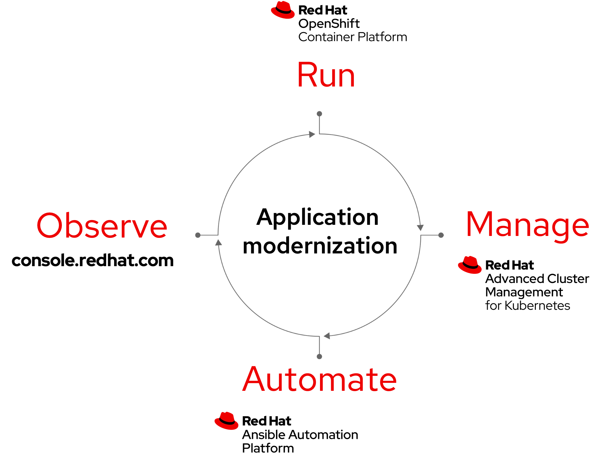
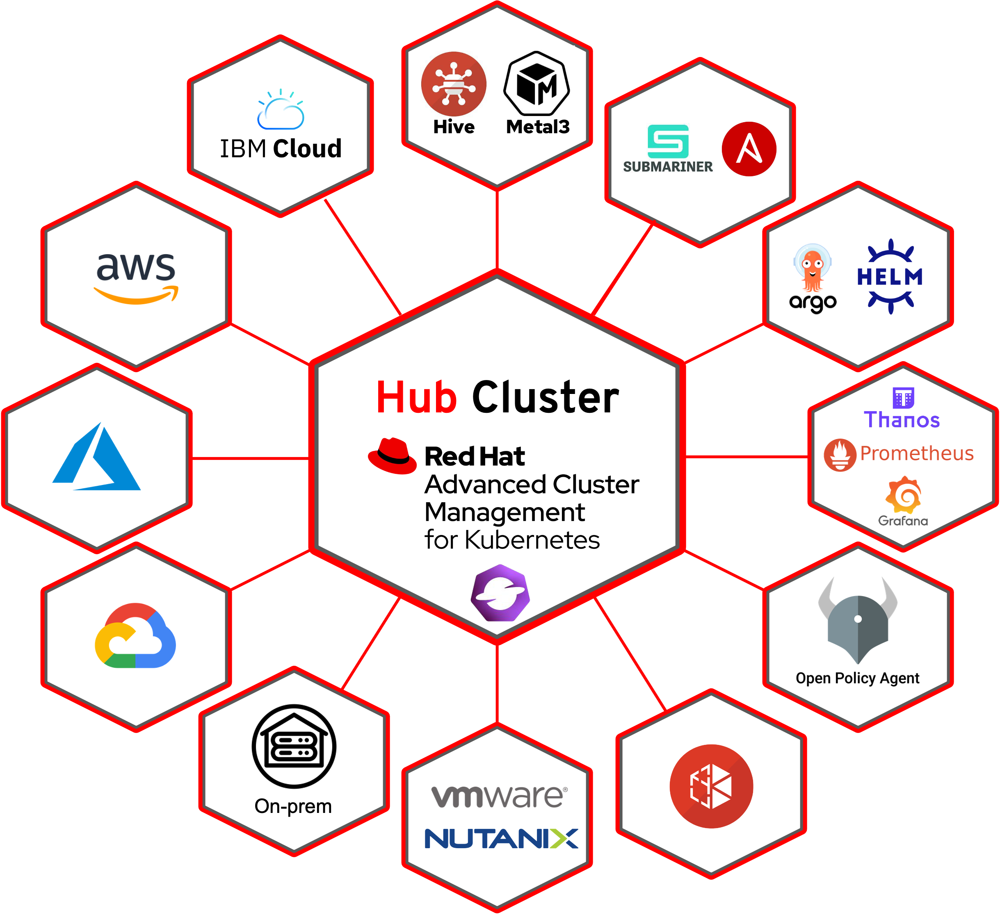
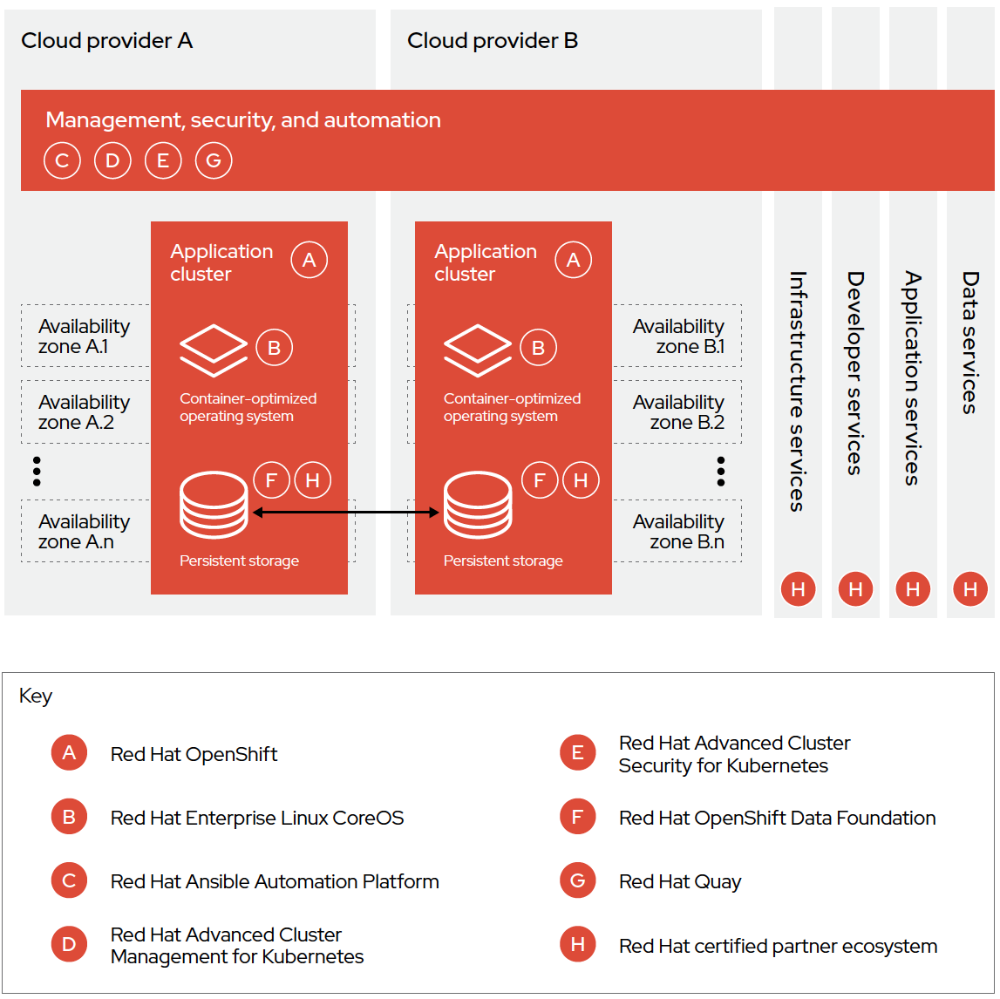
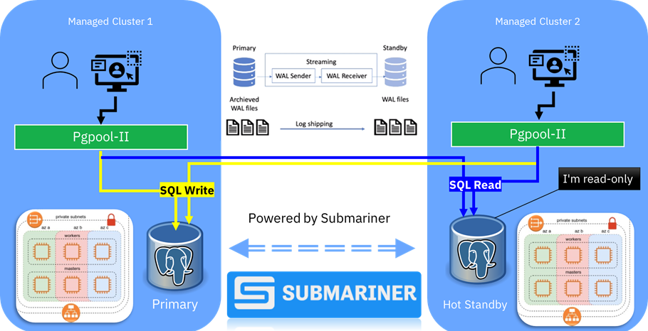
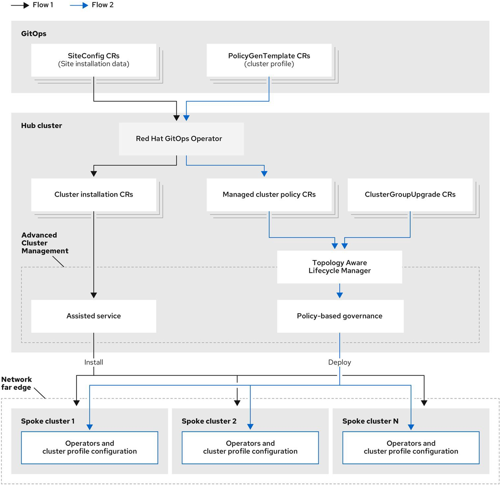
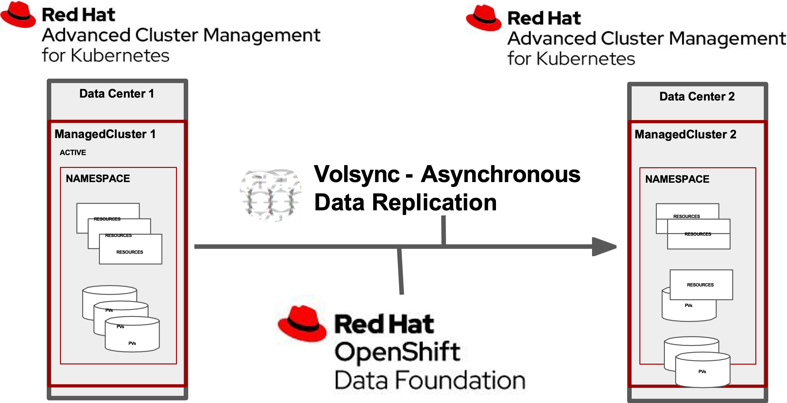
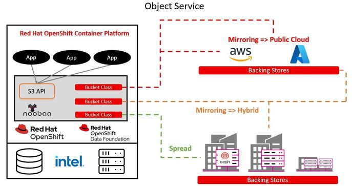

## Introduction

Welcome to another deep-dive post on [MeatyBytes.io](/). Today, we’re going to dive into the cutting-edge architectural patterns introduced to Platform Engineering by **Red Hat's Advanced Cluster Management** (ACM).

**Advanced Cluster Management** (ACM) by Red Hat is nothing short of a game-changer when it comes to multi-cluster management, whether those clusters are OpenShift or some other Kubernetes distro. In fact, ACM plays a crucial role in the modern Hybrid Cloud and cloud native platform models. 

But beyond the headlines, what architectural patterns does ACM introduce, and how do they make your cloud native ecosystem smarter, more resilient, and easier to manage?

In today's post, we'll take a deep dive into 9 of these patterns, shedding light on the technologies and integrations involved, and outlining the real-world problems they solve.

[//]: # "!IMAGE-HERE!: Diagram displaying the high-level architecture patterns in OpenShift ACM."

### What Will You Learn about ACM?

* Architectural patterns introduced by ACM to OpenShift/Kubernetes.
* How integrations like Service Mesh, Skupper/RH Interconnect, Submariner, and Ansible enhance these patterns.
* How to align these patterns with specific challenges in your cloud-native ecosystem.

### Patterns Overview

In this post, we will look at 9 distinct patterns which Advanced Cluster Management enables in your cloud native environments:

1. [**Hybrid and Multi-Cloud Clusters**](#1-hybrid-and-multi-cloud-clusters) - Focuses on deploying and managing applications across multiple environments like on-premises and various cloud providers.
2. [**Mixed Kubernetes Clusters**](#2-mixed-kubernetes-clusters) - Manages both OpenShift and Vanilla Kubernetes clusters under a single pane of glass using ACM.
3. [**High Resiliency Deployments**](#3-high-resiliency-deployments) - Minimizes downtime by leveraging redundancy, failover, and automated recovery features.
4. [**Edge Computing Clusters**](#4-edge-computing-clusters) - Distributes workloads closer to the source of data creation for real-time analytics and low-latency data processing.
5. [**Disaster Recovery**](#5-disaster-recovery) - Manages disaster recovery (DR) environments, employing technologies such as backup and restore, and geographic distribution.
6. [**Security and Compliance Standardization**](#6-security-and-compliance-standardization) - Deploys and manages secure applications and standardizes security protocols and compliance checks across all clusters.
7. [**Distributed Data**](#7-distributed-data) - Scales resources based on demand and distributes workloads across geographical regions for improved user experience.
8. [**Centralized Observability**](#8-centralized-observability) - Provides a unified platform for metrics, logging, and tracing data across all clusters managed by ACM.
9. [**On-demand Clusters**](#9-on-demand-clusters) - Rapidly provisions and decommissions OpenShift clusters as needed, leveraging a GitOps-based approach and IaC tools.

Each of these patterns serves a specific need and offers unique advantages when used in conjunction with ACM in OpenShift environments.

## ACM Architectural Patterns & Integrations

Before we explore each pattern, let's understand the role of Advanced Cluster Management (ACM) in OpenShift.

ACM is designed to manage the lifecycle, policies, and observability of multiple OpenShift or Kubernetes clusters across a hybrid environment. It pairs natively with a suite of other technologies to enable total control of your environments. ACM also opens the door to new capabilities which may not have been possible before.

Now let's get into these key architectural patterns which are amplified or introduced by ACM.


If you'd like to learn more about the inner-workings of ACM, check out [my other posts](/posts/openshift/ocp-features/multi-cluster/mgmt/acm-intro/) explaining how it works and how it compares to other options on the market.


### 1. Hybrid and Multi-Cloud Clusters

This pattern enables organizations to deploy and manage applications across multiple environments, including on-premises, public cloud, and private cloud (**Hybrid Cloud**), as well as across multiple cloud providers, such as AWS, Azure, and GCP (**Multi-Cloud**).

ACM provides a unified & consistent management platform for managing clusters and workloads in any environment, enabling organizations to take advantage of the best features of each. It allows for several sub-patterns, such as compute-optimization, vendor neutrality, phased migrations, etc.

* **Problems Solved**: Vendor lock-in, workload portability
* **Requirements Met**: Scalability, multi-region deployment
* **Enhancements**: Streamlined cluster management, cost optimization
* **NFRs**: Availability, Scalability
* **Technologies and Integrations**: OpenShift, Kubernetes, Submariner, Ansible, RH Service Mesh (Istio), RH Interconnect (Skupper)

### 2. Mixed Kubernetes Clusters

This pattern allows you to manage both OpenShift and Vanilla Kubernetes clusters under a single pane of glass using ACM. This is useful when customers have multiple Kubernetes distributions in their environments, such as during migrations, after acquisitions, or when using simple/free dev/test clusters (k3s, OKD, microk8s).

* **Problems Solved**: Fragmented management, migrations
* **Requirements Met**: Unified monitoring, logging, provisioning, administration
* **Enhancements**: Operational simplicity
* **NFRs**: Usability, Maintainability
* **Technologies and Integrations**: OpenShift, Kubernetes, Ansible

### 3. High Resiliency Deployments

High Resiliency Deployments focus on minimizing downtime by leveraging redundancy, failover, and automated recovery features. While less obvious than some other patterns, there are a couple of sub-patterns that are key in the modern *Hybrid Cloud* and *cloud native* ecosystem.

ACM also enables OpenShift's autoscaling of clusters to scale beyond a single cluster to cluster pools, utilizing `cluster pools` and `ClusterSets`.

* **Problems Solved**: Downtime, lack of redundancy
* **Requirements Met**: High Availability (HA), Disaster Recovery (DR)
* **Enhancements**: Automatic failover, recovery
* **NFRs**: Availability, Reliability
* **Technologies and Integrations**: Submariner, Ansible, RH Service Mesh (Istio), RH Interconnect (Skupper), Helm, Backstage, GitOps

#### Sub-Pattern: Stretch Deployments

Advanced Cluster Management uniquely combines with many other integrations and technologies to allow stretched and multi-cluster deployments.

This is crucial in some enterprise environments with SLAs of *5 9s* or similar, since this generally requires multi-region deployments of all dependent resources. Not only does ACM allow for multiple OpenShift clusters spanning multiple regions, it also enables deployments to span those multi-region clusters.

Paired with native OpenShift technologies, workloads and their dependencies can be deployed across multiple regions while maintaining connectivity as if local.

### 4. Edge Computing Clusters

Edge Computing enables real-time analytics and low-latency data processing by distributing workloads closer to the source of data creation.

This pattern enables organizations to deploy and manage applications at the edge of the network, such as in IoT, edge computing, and telecom environments. ACM provides a unified management platform for managing clusters at the edge, allowing for easy deployment, scaling, and management of applications.

With ACM, it is possible to manage 1000s of mixed clusters across the core and edge; Red Hat even recently announced at Summit '23 the capability for a **Global Hub**, managing groups of ACMs through a centralized "master" ACM oriented on the Hybrid Cloud Console.

ACM simplifies administration whether the clusters should be identical, follow set patterns, or be entirely unique.

It also enables the automated provisioning and scaling of mixed fleets of clusters at the edge with techniques such as **One-Touch** and **Zero-Touch Provisioning** (OTP/ZTP).

* **Problems Solved**: Latency, data processing delays
* **Requirements Met**: Real-time analytics, low-latency
* **Enhancements**: Optimized data pipelines
* **NFRs**: Performance, Scalability
* **Technologies and Integrations**: Ansible, Helm, Hive, GitOps, OTP/ZTP, RH Insights

### 5. Disaster Recovery

This pattern enables organizations to deploy and manage disaster recovery (DR) environments, employing technologies such as backup and restore, failover mechanisms, and geographic distribution.

ACM provides a unified management platform for managing clusters across different environments, enabling organizations to ensure business continuity and disaster recovery.

When paired with native tools such as OpenShift's APIs for Data Protection (OADP, based on Velero) and OpenShift Data Foundations (ODF), or 3rd party tools such as Portworx, ACM provides OpenShift with various *DR* models at the cluster and application-level.

* **Problems Solved**: Data loss, service interruptions
* **Requirements Met**: Data integrity, HA
* **Enhancements**: Geographically distributed failover
* **NFRs**: Reliability, Availability
* **Technologies and Integrations**: OADP (Velero), ODF, GitOps

### 6. Security and Compliance Standardization

This pattern enables organizations to deploy and manage secure applications, as well as standardize security protocols and compliance checks, across all clusters from a single pane-of-glass.

ACM provides a unified management platform for managing clusters with a centralized focus on security and compliance, allowing organizations to protect their applications and data.

When paired with other Red Hat products such as Advanced Cluster Security (ACS), TSSC, OpenShift Pipelines (Tekton), and others, this pattern becomes the most powerful security tool in the platform tool belt.

")

* **Problems Solved**: Security vulnerabilities, compliance issues
* **Requirements Met**: Security, Governance
* **Enhancements**: Automated compliance checks
* **NFRs**: Security, Compliance
* **Technologies and Integrations**: ACS, Quay, TSSC, RH Insights, Tekton Chains, Compliance Operator, OPA

### 7. Distributed Data

This pattern automatically scales resources based on demand and distributes workloads across geographical regions for improved user experience. When paired with ODF (Ceph, Rook, Noobaa), this pattern also allows for a standardized, distributed object storage (S3), enabling a consistent service across any Hybrid and Multi-cloud environment.

* **Problems Solved**: Manual scaling, regional latency
* **Requirements Met**: Scalability, Geo-distribution
* **Enhancements**: Automated scaling
* **NFRs**: Scalability, Performance
* **Technologies and Integrations**: OADP (Velero), ODF, RH Service Mesh (Istio)

### 8. Centralized Observability

Centralized Observability offers a unified platform for metrics, logging, and tracing data across all clusters managed by ACM. It consolidates telemetry data and enables deep insights for better decision-making.

With the inclusion of Centralized Observability, ACM becomes an even more potent force in cluster management, offering a 360-degree view of each and every environment for better operational control and enhanced performance.

When paired with technologies such as Event-Driven Ansible (EDA), this pattern also enables self-healing, automated incident reporting, and resiliency.

* **Problems Solved**: Fragmented observability, difficulty in cross-cluster analysis
* **Requirements Met**: Real-time monitoring, unified logging, and tracing
* **Enhancements**: Easier troubleshooting, root cause analysis, and trend identification
* **NFRs**: Maintainability, Usability
* **Technologies and Integrations**: Grafana, Prometheus, Thanos, Loki, EFK, Ansible

### 9. On-demand Clusters

On-demand Clusters allow organizations to rapidly provision and decommission OpenShift clusters as needed. Utilizing a GitOps-based approach and IaC (Ansible and Terraform), these clusters can be spun up for specific projects, tests, development, etc.

When ACM is paired with technologies such as Backstage, ie Red Hat's upcoming **RH Developer Hub**, On-demand cluster provisioning becomes a self-service, fully-automated process.

This allows developers to choose the exact technical specifications of their cluster as they need it, all within the pre-determined specs allowed by the infrastructure admins and security teams. Additionally, it allows for ACM to automatically provision resources in geographically appropriate locations, and optimize for live costs.

* **Problems Solved**: Resource wastage, slow provisioning
* **Requirements Met**: Resource optimization, flexible configurations, easy integration with cloud services
* **Enhancements**: Accelerated provisioning, standardizing dev/test
* **NFRs**: Efficiency, Agility, Flexibility
* **Technologies and Integrations**: Backstage, GitOps, Ansible, OTP/ZTP, Tekton

## Conclusion

Advanced Cluster Management (ACM) has pushed the boundaries of what's possible with OpenShift. From high-resiliency deployments to on-demand clusters, ACM introduces a range of advanced architectural patterns that can help you solve specific challenges, meet various requirements, and gain operational enhancements.

Are you already using any of these patterns? Or are there any additional patterns you think are crucial to your environments? We'd love to hear about your experience in the comments.

Stay tuned for more content around ACM in the future!

## References

* [Managing cluster pools](https://access.redhat.com/documentation/en-us/red_hat_advanced_cluster_management_for_kubernetes/2.3/html/clusters/managing-cluster-pools)
* [Orchestrating Multi-Region Apps with Red Hat Advanced Cluster Management and Submariner | AWS Partner Network (APN) Blog](https://aws.amazon.com/blogs/apn/orchestrating-multi-region-apps-with-red-hat-advanced-cluster-management-and-submariner/)
* [one-touch-provisioning/otp-gitops ](https://github.com/one-touch-provisioning/otp-gitops)
* [Red Hat Developer Hub Overview](https://developers.redhat.com/products/developer-hub/overview)
