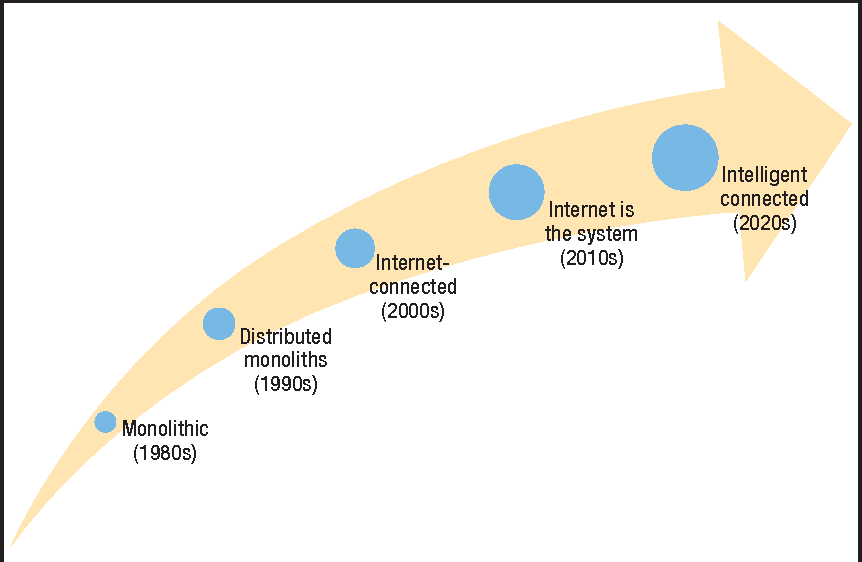
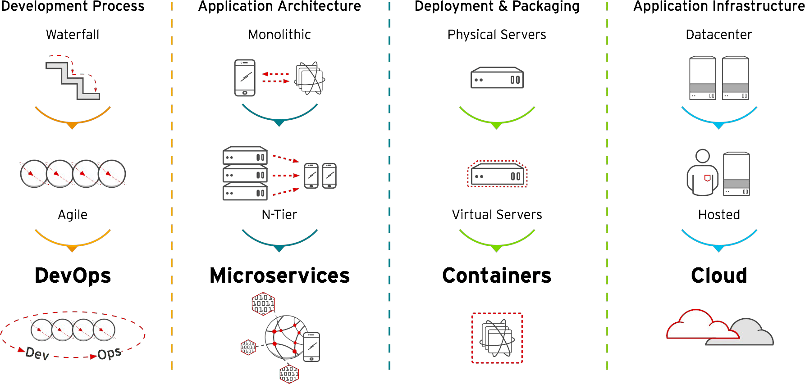
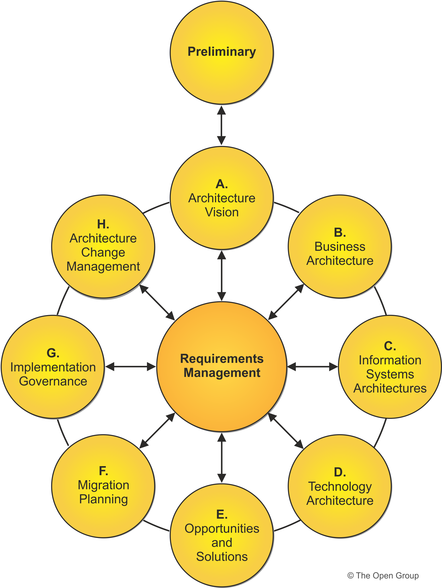

## Introduction

Welcome to [MeatyBytes.io](/), fellow tech enthusiasts! Nick Miethe here - your resident guide to the intricate landscapes of OpenShift, homelab tinkering, and everything meaty in between. As a leading expert on OpenShift, Platform Engineering, and DevOps, I'm constantly intrigued by the foundations that shape our digital world. Solution Architecture is one such foundation that's become a cornerstone in the field of IT, DevOps, and Platform Engineering. But what exactly is it? Why does it matter? And how has it evolved to play such a crucial role in our digital lives?

### Synopsis

In this post, we'll embark on a journey through the maze of solution architecture. From its historical roots to its present-day prominence, we'll explore the evolution and importance of solution architecture in modern technology. As we dissect the anatomy of popular methodologies and immerse ourselves in practical examples, you'll gain insights into the world that keeps our digital infrastructure humming.

Whether you're a seasoned developer or simply fascinated by the mechanics of technology, this exploration into solution architecture will offer a unique perspective on the underlying principles and practices that are shaping our digital age. If nothing else, the next time a family member asks you *"So what exactly do you do?"*, hopefully you will have a new answer!

Get ready to have your eyes opened. Let's dive in!

## Historical Perspective

Solution architecture as a discipline, although increasingly relevant, isn't a new concept. The origins of this profession are intertwined with the evolution of IT systems and software development, and they earmark the beginnings of modern computation.

Many consider that modern computing began sometime in the mid-19th century, whether it was the coining of the term 'digital' by Bell Labs in 1942, the increasing prevalence of IBM Mainframes in the 1960s and 70s, or the PC becoming commonplace.

However, in Paul Ceruzzi's book, [Computing: A Concise History](https://www.amazon.com/Computing-Concise-History-Essential-Knowledge/dp/0262517671?&linkCode=ll1&tag=miethe-20&linkId=8f090551fe70f3f35bfce2d8283b748e&language=en_US&ref_=as_li_ss_tl), he mentions that historians commonly denote the start of modern computing being Charles Babbage's Analytical Machine from the mid-19th century, due to it being a "convergence of operations that were previously mechanized." Essentially, computing is defined by the systems and solutions of which it consists - the Architecture.

As the workloads, and resulting target systems and solutions, grew in complexity and adoption, the role of the Architect grew accordingly.

## Computing Timeline

Over time, the role of the IT Architect has expanded and evolved from focusing on centralized systems to embracing highly distributed, flexible, and resilient architectures. As design and implementation patterns changed, traditional architecture models such as the **4-Layer Architecture** fell short of the necessary requirements, putting further onus on the Architect.

")

### Mainframe Era

**Workload Targets:** Initially, workload targets were monolithic and centralized on mainframes.

**IT Architect's Role:** Architects were responsible for designing and optimizing large centralized systems. Flexibility and scalability were not primary concerns.

### Client-Server Era

**Workload Targets:** The emergence of client-server architecture distributed computing across multiple machines.

**IT Architect's Role:** Architects had to design systems considering network latency, data consistency, and other distributed computing challenges. This required a broader understanding of both hardware and software aspects.

### Virtualization Era

**Workload Targets:** Virtualization technology, widely credited to IBM's time-sharing on Mainframes, allowed multiple virtual systems to operate on a single physical host.

**IT Architect's Role:** Architects started to consider virtual environments, optimizing resources, and ensuring isolation between workloads. It required a deep understanding of underlying hardware, OS, and virtualization technologies.

### Cloud and Microservices Era

**Workload Targets:** The rise of cloud computing and microservices introduced highly distributed, scalable, and flexible systems.

**IT Architect's Role:** Architects now had to design solutions that could scale horizontally, were fault-tolerant, and could be deployed across various cloud providers. This era brought about a shift towards designing systems that could leverage third-party services, APIs, and containers.

### DevOps and Continuous Integration

**Workload Targets:** Continuous integration, continuous deployment, and automation became essential.

**IT Architect's Role:** Architects became facilitators of collaboration between development, operations, and business. They were responsible for designing systems that could be continuously built, tested, and deployed, often leveraging containers and orchestration tools like Kubernetes.

### Serverless and Edge Computing

**Workload Targets:** Serverless computing and edge computing introduced new paradigms where computing happens near data sources or without managing underlying servers.

**IT Architect's Role:** Architects started to design systems where computing could be offloaded to the edge or run in serverless environments. This required considerations around latency, data processing, and state management close to data sources.

### Emphasis on Security and Compliance

**Workload Targets:** Modern workloads often require adherence to regulatory requirements and enhanced security measures.

**IT Architect's Role:** Architects now have to ensure that systems are designed with security and compliance as core principles. They work closely with security and legal teams.

### The Rise of WASM and Advanced Web Technologies

**Workload Targets:** With the rise of WebAssembly and sophisticated front-end technologies, client-side computing has become more robust.

**IT Architect's Role:** Architects have to consider how to leverage these client-side technologies to offload processing from the server and enhance user experience.

## Evolution of Solution Architecture

As software development methodologies evolved from the rigid waterfall model to more flexible approaches like Agile and DevOps, IT architecture adapted in kind. It evolved from designing monolithic systems to architecting modular, scalable solutions based on microservices.

This evolution also led to the inception of numerous IT Architect types, with the **Solution Architect** being key for the integration of the various new products and vendors.

")

A Solution Architect may not be the absolute expert on any specific technology area, but they must have the breadth to understand all potential solutions to solve the problem at hand, the depth to understand the problem and each technology, and the business acumen to drive success.

Today, due to their immensely valuable mix of expertise, solution architects take on a multifaceted role, considering various perspectives: strategic, tactical, and operational, and aligning them to meet organizational objectives effectively.

## The Modern Solution Architect

The modern solution architect is a technologist, a strategist, and a visionary. They understand business needs, translate them into technological requirements, and ensure the proposed solutions are scalable, reliable, and secure while aligning with the business strategy.

A solution architect often bridges the gap between various stakeholders, such as business leaders, project managers, software developers, and network engineers. They take into account the current state of an organization's technological ecosystem, the desired future state, and architect a solution that facilitates this transformation.

### Typical Responsibilities

1. **Requirements Analysis**: Understanding the business's needs and translating them into specific technological requirements.
2. **Solution Design**: Designing a solution that meets the requirements while ensuring scalability, reliability, and security.
3. **Stakeholder Communication**: Liaising with stakeholders across the organization to align the architectural vision with business objectives.
4. **Technology Selection**: Evaluating and selecting the right technologies and platforms that best suit the solution's requirements.
5. **Governance**: Ensuring that the solution adheres to established architectural principles, standards, and regulations.

### Adopting Best Practices

Solution Architects often adopt practices from other IT Architect types, such as **Domain-Driven Design** (DDD) and **Behaviour-Driven Development** (BDD) from software, or the **Well-Architected Framework** from Cloud. These methodologies help in understanding business domains, ensuring the designed solution meets requirements, and fostering collaboration from the early stages of development.

The use of standard architectural frameworks like **TOGAF** (The Open Group Architecture Framework) or the **Zachman Framework** can also provide structured approaches to designing and implementing solutions.

")

## Conclusion

IT Architecture is more than a discipline; it is an art. The role of the IT Architect is as diverse as the field for which it is responsible. As the industry has fluctuated and changed, architects have been responsible for directing it into well-designed patterns.

Within IT Architecture, **Solution Architecture** is the vision that lays the foundation for successful digital transformation. It's a bridge between the strategic and the practical, between the business and technology. The role of solution architects is pivotal in the era of rapid technological advancement, ensuring businesses stay relevant, efficient, and innovative.


If you're interested in learning more, check out some of our other Architecture series:

* [OCP Solution Architectures](/series/ocp-solution-architectures/)
* [App and System Architectures](/series/app-and-system-architectures/)


## References

* [Solutions Architect's Handbook](https://www.amazon.com/Solutions-Architects-Handbook-Kick-start-architecture/dp/1801816611?&linkCode=ll1&tag=miethe-20&linkId=4ec19cc7b7edc98f26664129282e1aa0&language=en_US&ref_=as_li_ss_tl&rel="sponsored") by Saurabh Shrivastava et al, or get the free audiobook from the (also) [free Audible trial](https://www.amazon.com/dp/B00NB86OYE/?ref_=assoc_tag_ph_1485906643682&_encoding=UTF8&camp=1789&creative=9325&linkCode=pf4&tag=miethe-20&linkId=2b49e5e8cc45e7af6489654b37506bbe)!
* [The Architect's Toolkit | opengroup.org](https://www.opengroup.org/ArchitectsToolkit)
* [The Modern History of Computing | Stanford Encyclopedia of Philosophy](https://plato.stanford.edu/entries/computing-history/)
* [Microservices vs. Monolithic Architectures](https://www.nginx.com/blog/microservices-at-netflix-architectural-best-practices/)
* [What is the Zachman Framework? A matrix for managing enterprise architecture | CIO](https://www.cio.com/article/193229/what-is-the-zachman-framework-a-matrix-for-managing-enterprise-architecture.html)
* [Introduction to Domain-Driven Design](https://martinfowler.com/bliki/DomainDrivenDesign.html)
* [IT Architects: Types, Roles, and Skill Sets | LeanIX](https://www.leanix.net/en/wiki/ea/it-architects)
* [ Enable Architect | Red Hat](https://www.redhat.com/architect/)
