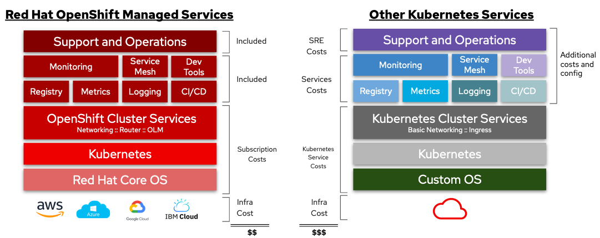

## Introduction

When it comes to selecting a Kubernetes platform, the conversation often extends beyond feature sets and technical capabilities. One crucial piece of the puzzle is the Total Cost of Ownership (TCO), a comprehensive assessment of all the costs associated with an investment. In this post, we'll explore the TCO for Red Hat OpenShift (OCP), how to create TCO models, and how these models can be utilized to compare OpenShift with managed Kubernetes services like Amazon EKS.

## Understanding Total Cost of Ownership

**Total Cost of Ownership** (TCO) is a financial estimate intended to help consumers and enterprise managers determine direct and indirect costs of a product or system. In the context of platform teams, understanding TCO is vital as it provides a clearer picture of the financial implications of their technology choices over the lifespan of the platform.

TCO accounts for not just the purchase price or subscription cost, but also ongoing costs like maintenance, upgrades, operations, and even the cost of downtime. For Kubernetes platforms, TCO may include:

* Licensing or subscription costs
* Infrastructure costs
* Personnel costs (including training)
* Support and maintenance
* Cost of future upgrades

## Building a TCO Model for OpenShift

Creating a TCO model for OpenShift involves several steps:

### 1. Calculate Direct Costs

Direct costs for OpenShift include the subscription cost for the platform, which provides access to OpenShift software, updates, and support. It also includes the infrastructure cost, which can vary depending on whether you're deploying OpenShift on-premise or on a cloud provider like AWS or Google Cloud.

### 2. Factor in Indirect Costs

Indirect costs include the personnel cost for maintaining and operating the platform. This includes the salaries of dedicated personnel, the cost of training staff to use OpenShift, and any overtime or contractor costs associated with maintenance or upgrades.

### 3. Account for Support and Maintenance

Consider the costs associated with support and maintenance, including any premium support plans, and the cost of routine maintenance tasks.

### 4. Factor in the Cost of Downtime

Downtime can be incredibly costly, especially for businesses that rely on their applications to generate revenue. Include an estimate for potential downtime costs based on industry averages or historical data.

### 5. Consider Future Costs

Future costs might include upgrades, additional staff training, scaling infrastructure to support growth, and potential costs associated with migrating to a new platform in the future.

## Comparing OpenShift and Managed Kubernetes Services

Once you have a TCO model for OpenShift, you can use a similar approach to create a TCO model for managed Kubernetes services like Amazon EKS. Here's a simplified example:

### OpenShift TCO

* Subscription: $50,000/year
* Infrastructure: $25,000/year
* Personnel: $50,000/year
* Support and Maintenance: Negligible
* Cost of Downtime: $5,000/year
* Future Costs: Negligible
* **Total: $130,000/year**


*Negligible* does not mean $0, rather it is not impactful on these models. And remember, these estimates are purely illustrative!


### Amazon EKS TCO

* EKS Costs: $35,000/year
* Infrastructure: $20,000/year
* Personnel: $80,000/year
* Support and Maintenance: $10,000/year
* Cost of Downtime: $10,000/year
* Future Costs: $20,000/year
* **Total: $175,000/year**

While this example is overly simplified, it serves to demonstrate how TCO models can be used to make cost comparisons between different Kubernetes platforms.

## Conclusion

Understanding the Total Cost of Ownership for Kubernetes platforms is a vital step in the platform selection process. It enables organizations to make informed decisions based on a comprehensive understanding of both direct and indirect costs associated with their choice. By creating TCO models for OpenShift and other Kubernetes platforms, organizations can compare costs in a meaningful way and select the platform that offers the best value for their specific needs and circumstances.

## References

1. [Understanding OpenShift Pricing](https://www.redhat.com/en/technologies/cloud-computing/openshift/pricing)
2. [Amazon EKS Pricing](https://aws.amazon.com/eks/pricing/)
3. [How to calculate TCO for your tech projects](https://www.techtarget.com/searchdatacenter/definition/TCO)
4. [Red Hat OpenShift powered by Intel® deliver Cloud-Native TCO Advantages.](https://networkbuilders.intel.com/solutionslibrary/red-hat-openshift-powered-by-intel-deliver-cloud-native-tco-advantages)
5. [How to Measure – and Minimize – Your Kubernetes Total Cost of Ownership | F5](https://www.f5.com/company/blog/how-to-measure-and-minimize-your-kubernetes-tco)
6. [Understanding AWS Total Cost of Ownership (TCO)](https://bluexp.netapp.com/blog/aws-cvo-blg-understanding-aws-total-cost-of-ownership-tco)
