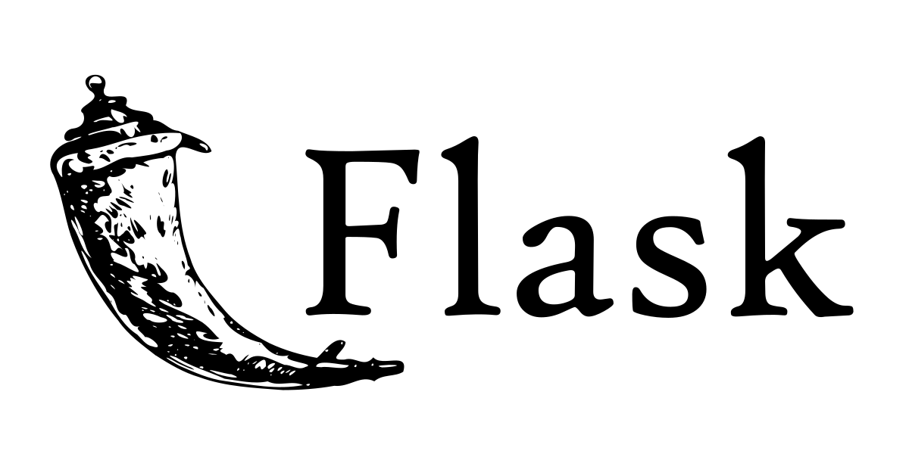

## Introduction

Greetings, fellow tech aficionados! It's your favorite multi-faceted hobbyist and OpenShift enthusiast, Nick Miethe, here again. If you've been following the [MeatyBytes.io](/) blog, you'll know that I'm a fervent fan of all things [OpenShift](/posts/openshift) and [Python](/tags/python). Today, I'm excited to share with you a comprehensive overview of Flask/FastAPI, plus a guide on implementing microservices in an OpenShift cluster.

I've been playing around with **Flask** and **FastAPI** for a while, and the more I use them, the more I appreciate their simplicity and versatility. Especially when coupled with OpenShift's robustness, they make for a mighty fine concoction. Whether you're an OpenShift newbie, a Python pro, or a microservices maestro, you'll find something to sink your teeth into in this post.

### Synopsis

In this guide, we'll start by setting up an OCP cluster, move on to implementing a tremendously-simple Flask/FastAPI microservice - MeatyAPIs, and then finish off by deploying it all onto the OpenShift platform. We'll also sprinkle in some best practices and meaty morsels of advice along the way. Get ready for a smorgasbord of knowledge that'll make your DevOps tasks a walk in the park!

As always, I've tried to make this guide as detailed and accessible as possible. But if you're feeling a bit rusty on any of the concepts here, I highly recommend checking out some of our previous content - particularly anything under the [Introduction category](/categories/introduction/)!

So grab a Dew, or your favorite beverage, get comfy, and let's dive in. Here's to another adventure in the land of Python, microservices, and OpenShift!

")

## Flask and FastAPI: Microservices Powerhouses

**Flask** and **FastAPI** are examples of Web Frameworks. Web Frameworks are essentially tools used by developers to build web applications. These frameworks provide a structure for application development, including a suite of libraries for database access, session management, templating frameworks, and often, reusable components for frequently used functionality.

In the context of Python, **Flask** and **FastAPI** are two very popular web frameworks. They solve numerous problems for developers, such as:

* **Routing:** They handle the routing of requests from the client to the appropriate function on the server.
* **Request and Response Handling:** They provide simple interfaces for parsing the requests from clients and sending responses back.
* **Middleware Services:** They provide middleware services like session management, cookie handling, etc.
* **Data Validation:** They often provide tools for validating incoming data.
* **Security:** They offer built-in protection against common web attacks.

### Flask: The Light and Flexible Framework

[**Flask**](https://flask.palletsprojects.com/) is a lightweight and flexible micro web framework for Python that is designed to make getting started quick and easy, with the ability to scale up to complex applications. For building simple to moderately complex web applications or microservices, Flask is often the weapon of choice for many Python developers.



**Technologies Used:**

Flask uses the *Werkzeug WSGI* toolkit and *Jinja2* template engine. **WSGI** is the Web Server Gateway Interface, a standard interface between web server software and web applications written in Python. **Jinja2** is a popular templating engine for Python that provides Python-like expressions while ensuring that the templates are evaluated in a sandbox.

**How Flask Works:**

Flask provides you with tools, libraries, and technologies that allow you to build a web application. This web application can be a blog, a wiki, a commercial website, or a web API. Flask has a lightweight and modular design, making it adaptable to developers' needs. It includes a built-in development server, unit test support, and it is fully Unicode-enabled with support for multi-threaded applications. Flask apps can be easily coupled with extensions to add functionalities like form validation, upload handling, various open authentication technologies, and more.

**Pros of Flask:**

* **Simplicity and Flexibility:** Flask is known for its simplicity. With Flask, you can choose the libraries and tools you want to use.
* **Easy to Learn:** Flask is a good choice for beginners, with extensive and easy-to-follow documentation.
* **Modularity and Lightweight:** The modular and lightweight design is a significant advantage of Flask. It has a very low learning curve which makes it an excellent choice for prototyping and small applications.

**Cons of Flask:**

* **Lack of Database/ORM (Object Relational Mapping):** Unlike *Django*, Flask doesn't come with an ORM, and you'll need to install it separately.
* **Not Suitable for Large Applications:** Flask might not be the best choice for large applications or for dealing with high loads and complex request processing.

**Example Workloads:**

Flask is suited for small to medium web applications or microservices where simplicity, ease of learning, and fine control over the components are important. It's also excellent for serving machine learning models or building APIs for a single page application.

### FastAPI: High-Speed and High-Performance

[**FastAPI**](https://fastapi.tiangolo.com/), on the other hand, is a relatively new kid on the block, but it has quickly gained popularity due to its speed, ease of use, and automatic generation of API docs. FastAPI's main selling point is its speed. It's incredibly fast, on par with *NodeJS*, and even outperforms **Flask** by a significant margin. This makes it an excellent choice for building high-performance microservices.


**Technologies Used:**

FastAPI is built on **Starlette** for the web parts and **Pydantic** for the data parts. Starlette is a lightweight ASGI framework/toolkit, which is ideal for building high performance asyncio services. Pydantic provides data validation by using Python type annotations, allowing you to create a schema for your data models and automatically generating the **OpenAPI** (formerly known as **Swagger**) documentation for your API.

**How FastAPI Works:**

FastAPI makes use of Python's type hints to produce API documentation, reduce code duplication, and provide data validation. When you define a route operation function, you declare the function parameters with Python's standard type hints. You can then use **Pydantic** models to declare more complex data structures, and these will be converted into JSON Schema that can be used for the OpenAPI and JSON Schema paths.

**Pros of FastAPI:**

* **Speed:** FastAPI is one of the fastest Python frameworks available, only behind *Starlette* and *Uvicorn* (which it is built on).
* **Ease of Use:** FastAPI is designed to be easy to use while also allowing new patterns to be quickly and easily created.
* **Data Validation:** FastAPI validates request and path parameters, and request bodies with Python type hints.
* **Automatic API Docs:** FastAPI automatically generates API documentation (using Swagger UI or ReDoc) from your code.


**Cons of FastAPI:**

* **Relatively New:** As a newer framework, it may not have the same amount of resources, tutorials, and stack overflow answers as Flask or Django.
* **Limited Middleware/Extensions:** FastAPI doesn't have as extensive a selection of middleware or extensions as Flask or Django.

**Example workloads:**

FastAPI is excellent for writing quick API prototypes due to its performance, ease of use, and automatic documentation. It's also suitable for data processing services where high performance is required.

## Deploying Flask and FastAPI Microservices in OpenShift

Now that we've discussed Flask and FastAPI, let's see how we can deploy our Python microservices using these frameworks on OpenShift. For this tutorial, we'll use an example microservice named "MeatyAPIs."

### Deploying Flask in OpenShift

Let's start with deploying a very simple Flask app - MeatyAPIs. Here's a step-by-step guide:

1. **Create your Flask App:**
   Your Flask microservice, `meaty-apis.py` might look something like this:

```python
from flask import Flask, render_template
app = Flask(__name__)

@app.route("/")
def hello():
    return render_template('index.html', message="Welcome to the MeatyAPIs Flask service!")

if __name__ == "__main__":
    app.run(host='0.0.0.0', port=8080)
```

With the following HTML template file, `index.html`:

```html
<!DOCTYPE html>
<html>
    <head>
        <title>MeatyAPIs on OCP</title>
    </head>
    <body>
        <h1>
            {{ message }}
        </h1>
    </body>
</html>
```

And `requirements.txt` for `pip`:

```txt
flask
gunicorn
```

2. **Create a Dockerfile:**
   Your Dockerfile should look something like this:

```dockerfile
FROM python:3-bookworm
WORKDIR /app

COPY meaty-apis.py /app
COPY templates/* /app/templates
COPY requirements.txt /app

RUN pip3 install -r requirements.txt
EXPOSE 8080
CMD ["gunicorn", "-b", "0.0.0.0:8080", "app:app"]
```

3. **Build and Push the Docker Image:**
   Use the OpenShift CLI to build the Docker image and push it to your Docker registry. <!-- Replace `docker_registry` and `docker_username` with your Docker registry URL and username respectively. -->

```bash
docker build -t docker_registry/docker_username/meatyapis-flask .
docker push docker_registry

/docker_username/meatyapis-flask
```

4. **Deploy the Flask App:**
   Now, deploy the Flask app to your OpenShift/Kubernetes cluster. Replace `docker_registry` and `docker_username` with your Docker registry URL and username respectively.

```bash
oc new-app --docker-image=docker_registry/docker_username/meatyapis-flask
```

### Deploying FastAPI in OpenShift

The process of deploying a FastAPI microservice is similar to the Flask deployment, but with a few differences in the application and Dockerfile:

1. **Create your FastAPI App:**
   Your FastAPI microservice might look something like this:

```python
from fastapi import FastAPI

app = FastAPI()

@app.get("/")
def root():
    return {"Welcome": "to the MeatyAPIs FastAPI service!"}
```

And `requirements.txt` for `pip`:

```txt
fastapi
uvicorn
```

2. **Create a Dockerfile:**
   Your Dockerfile should look something like this:

```dockerfile
FROM python:3-bookworm
WORKDIR /app

COPY . /app
COPY requirements.txt /app

RUN pip3 install -r requirements.txt
EXPOSE 8080
CMD ["uvicorn", "app:app", "--host", "0.0.0.0", "--port", "8080"]
```

3. **Build and Push the Docker Image:**
   Use the OpenShift CLI to build the Docker image and push it to your Docker registry.

```bash
docker build -t docker_registry/docker_username/meatyapis-fastapi .
docker push docker_registry/docker_username/meatyapis-fastapi
```

4. **Deploy the FastAPI App:**
   Now, deploy the FastAPI app to your OpenShift/Kubernetes cluster.

```bash
oc new-app --docker-image=docker_registry/docker_username/meatyapis-fastapi
```

## Conclusion

And there you have it! We've walked through the process of deploying **Flask** and **FastAPI** microservices on OpenShift using our hypothetical **MeatyAPIs** example. Python's Flask and FastAPI are powerful, flexible, and efficient tools for building microservices, and OpenShift's container orchestration capabilities provide a robust platform for deployment and scaling.

Remember, it's the synergy between a powerful programming language, the right frameworks, and an efficient deployment platform that allows us to create robust, scalable, and efficient microservices.

Keep exploring, keep learning, and as always, stay meaty!

## References

* [Official Flask Documentation](https://flask.palletsprojects.com/)
* [Official FastAPI Documentation](https://fastapi.tiangolo.com/)
* [Containerized Python Flask development on Red Hat OpenShift | Red Hat Developer](https://developers.redhat.com/blog/2019/02/18/containerized-python-flask-development-environment-red-hat-codeready-workspaces#)
* [Flask samples | Docker Documentation](https://docs.docker.com/samples/flask/)
* [Python base images](https://hub.docker.com/_/python)
