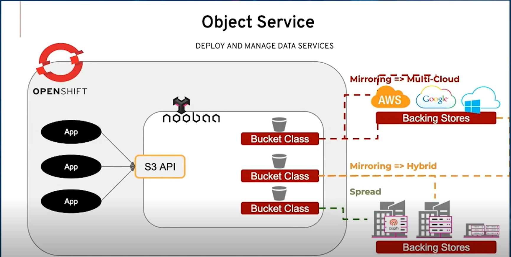

## Synopsis

Welcome to another deep dive into OpenShift's capabilities for handling AI and ML workloads. In this post, we'll focus on the OpenShift Data Foundation (ODF) and how it can serve as a robust storage solution for your AI/ML applications.



## Introduction

OpenShift Data Foundation (ODF), previously known as OpenShift Container Storage (OCS), is a software-defined storage solution designed for cloud-native applications on OpenShift. It provides a unified data platform for block, file, and object storage.

## Technical Overview of ODF

ODF leverages various open-source technologies including Ceph/Rook for persistent storage and NooBaa for multi-cloud gateway services. It's tightly integrated with OpenShift, allowing you to manage storage just like any other OpenShift resource.

With ODF, you can dynamically provision Persistent Volume Claims (PVCs) for your applications, enabling on-demand, scalable storage. This feature is particularly useful for AI/ML workloads that might require significant storage resources for model training and inference.


Learn more about ODF on my other site, [OCPedia](https://openshift.blog/docs/openshift/ops/storage/)!


## Why ODF for AI/ML?

ODF's dynamic provisioning and scalability align perfectly with the variable nature of AI/ML workloads. The ability to quickly scale up or down based on workload requirements allows for optimal resource utilization.

ODF also supports high I/O operations, essential for AI/ML model training. It's recommended to have SSDs or NVMe drives for your ODF nodes to ensure fast disk speeds. The exact hardware requirements might vary based on the size and complexity of your AI/ML workloads.

## Configuration Example: Utilizing ODF for LLM Model Training

To illustrate, let's see how to utilize a pre-deployed ODF cluster for storage when training a Large Language Model (LLM) with Kubeflow on OpenShift.

1. Create a `PersistentVolumeClaim` for your training job:

```yaml
apiVersion: v1
kind: PersistentVolumeClaim
metadata:
  name: model-training-pvc
spec:
  accessModes:
    - ReadWriteOnce
  resources:
    requests:
      storage: 100Gi
  storageClassName: ocs-storagecluster-ceph-rbd
```

2. Use this PVC in your Kubeflow `TFJob`:

```yaml
apiVersion: "kubeflow.org/v1"
kind: "TFJob"
metadata:
  name: "llm-training-job"
spec:
  tfReplicaSpecs:
    Worker:
      replicas: 4
      restartPolicy: OnFailure
      template:
        spec:
          containers:
            - name: tensorflow
              image: <your-tensorflow-image>
              volumeMounts:
              - mountPath: "/data"
                name: model-training-pvc
          volumes:
          - name: model-training-pvc
            persistentVolumeClaim:
              claimName: model-training-pvc
```

This configuration runs a distributed TensorFlow training job for the LLM, using the ODF-provided PVC for storage.

## Alternatives to ODF

While ODF is a robust solution for AI/ML workloads on OpenShift, it's not the only option. Here's a brief comparison with three alternatives:

### 1. Local Storage Operator

* **Pros:** High performance, supports raw block access.
* **Cons:** Not as scalable, doesn't support dynamic provisioning.

### 2. NFS

* **Pros:** Easy to set up, supports ReadWriteMany (RWX) access mode.
* **Cons:** Lower performance compared to other solutions, not ideal for large-scale deployments.

### 3. Cloud Storage (AWS EBS, GCE Persistent Disk, Azure Disk)

* **Pros:** Managed service, easy to use, supports dynamic provisioning.
* **Cons:** Performance and cost can vary, dependent on the cloud provider.

## Conclusion

OpenShift Data Foundation is a versatile and powerful storage solution for AI/ML workloads on OpenShift. Its dynamic provisioning, scalability, and support for high I/O operations make it ideal for such applications. However, depending on your specific requirements, other storage solutions may also be suitable.

## References

1. [OpenShift Documentation](https://docs.openshift.com/)
2. [OpenShift Data Foundation Documentation](https://access.redhat.com/documentation/en-us/red_hat_openshift_data_foundation/4.12)
3. [Kubeflow Documentation](https://www.kubeflow.org/docs/)
4. [Open Data Hub Documentation](https://opendatahub.io/docs.html)
