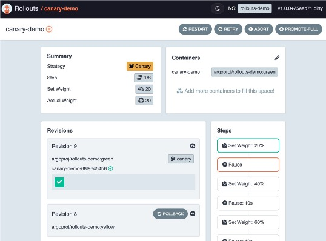

## Introduction

Hello OpenShift enthusiasts, this is Nick Miethe from MeatyBytes.io. Today, we are going to talk about a relatively new tool (but built upon an old concept) that has been making waves in the Kubernetes ecosystem - **Argo Rollouts**. We'll also touch on Red Hat's upcoming OpenShift integration in this space, **Progressive Delivery**. Let's get started!

## What is Argo Rollouts?

**Argo Rollouts** is a Kubernetes controller and a set of Custom Resource Definitions (CRDs) that offer advanced deployment capabilities such as blue/green, canary, canary analysis, experimentation, and progressive delivery features to Kubernetes. Argo Rollouts is all about controlled deployment of applications.

Why is that important? Well, when utilized appropriately, the deployment model can enable reduced downtime and other deployment risks by progressively, and/or gradually, rolling out new features to users.

## How Argo Rollouts Works

The Rollout resource provided by Argo Rollouts can replace the Kubernetes Deployment resource, making it a straightforward transition for existing deployments to leverage the additional deployment capabilities of Argo Rollouts.

Rollouts can also integrate with a variety of other Kubernetes/OCP tools. For example, it can shift traffic from an old version of a deployment to the new version, gradually, by integrating with a cluster's ingress controllers and service meshes and utilizing their traffic shaping capabilities. Argo Rollouts also utilizes metrics from various providers like Prometheus to monitor the application's health during a rollout. If any issues are detected, such as failed health checks or pod restarts, the rollout can be halted, mitigating any potential damage.

## Integration with OpenShift and GitOps

Currently, Red Hat OpenShift and OpenShift GitOps do not officially support Argo Rollouts. However, Jamie Longmuir, the Principal Product Manager for OCP (ACM), announced a number of new OpenShift integrations at Red Hat Summit '23 in Boston, which included Progressive Delivery. This will be an official OpenShift integration based on Argo Rollouts. Stay tuned for more info as it becomes available!

Regardless, Argo Rollouts is still an equally capable solution on OpenShift as it is on other Kubernetes platforms. To deploy the Argo Rollouts controller, you can use OpenShift GitOps along with a [validated pattern framework](https://github.com/hybrid-cloud-patterns/argo-rollouts). Once installed, you can manage rollouts in the cluster using an optional plugin for kubectl provided by the Argo Project.


[Here](https://www.redhat.com/architect/blue-green-canary-argo-rollouts) is an excellent deployment guide from Red Hat.


## Deployment Strategies

Argo Rollouts provides several features to enhance the deployment capabilities of any Kubernetes application, providing access to valuable deployment strategies.

### Blue/Green Deployments

Blue/green is a deployment strategy where two versions of the application run simultaneously. The blue version represents the stable, live production environment, while the green version represents the new, updated application. This strategy allows you to verify that updates are behaving as expected before making them live.

This strategy requires enough capacity to support both applications running simultaneously, which could be a potential challenge in resource-constrained environments or with applications that require licenses to operate.

### Canary Deployments

Canary deployments are a more advanced approach than blue/green deployments. Here, a new version of the application is deployed to a small subset of users, while the rest of the users continue using the original version. This strategy allows you to test a new feature and gather metrics from live traffic. You have probably experienced this yourself as a user, with many major tech companies utilizing similar strategies for their applications.

In the event of an issue with the new version, only the subset of users using the new version is affected. With Argo Rollouts, you can specify the percentage of traffic allocated to the new application release and a timer for the time between steps.

### Rolling Update

Rolling update is the default deployment strategy in Kubernetes. It incrementally updates Pods instances with new ones. The main advantage of this strategy is that it allows updates to be released gradually while maintaining application availability.

In the context of Argo Rollouts, a rolling update can be controlled by setting the maximum unavailable and maximum surge parameters. This gives more control over the rate of update and the number of extra Pods that can be created during the update.

### Recreate

Recreate is a strategy where all existing Pods are killed before new ones are created. It generally causes downtime and should only be used when the application does not support running multiple versions of itself in parallel.

## Conclusion

*Argo Rollouts* brings a new level of control and sophistication to Kubernetes deployments through a set of powerful strategies for workloads. Depending on the requirements of your application and the resources available, you can choose the strategy that best fits your needs. As Red Hat moves towards integrating Argo Rollouts into OpenShift with *Progressive Delivery*, the possibilities for refined, metrics-driven deployments will expand significantly.

Remember, deploying applications is not just about releasing new features; it's about doing so reliably and with minimal impact on your users. With tools like Argo Rollouts and the strategies we've discussed today, you can take a big step towards making your deployments more robust and reliable.

Stay tuned for more exciting updates from the world of OpenShift!

## Additional Reading

1. [How to do blue/green and canary deployments with Argo Rollouts | Enable Architect](https://www.redhat.com/architect/blue-green-canary-argo-rollouts)
2. [Learn about Progressive Application Delivery with GitOps](https://cloud.redhat.com/blog/learn-about-progressive-application-delivery-with-gitops)
3. [Chapter 16 - Canarying Releases, Google SRE Book](https://sre.google/workbook/canarying-releases/) - Read my full review of this book [here](/posts/careers-and-education/books-and-podcasts/reviews/sre/)!
4. [Argo Rollouts Official Documentation](https://argoproj.github.io/argo-rollouts/)


