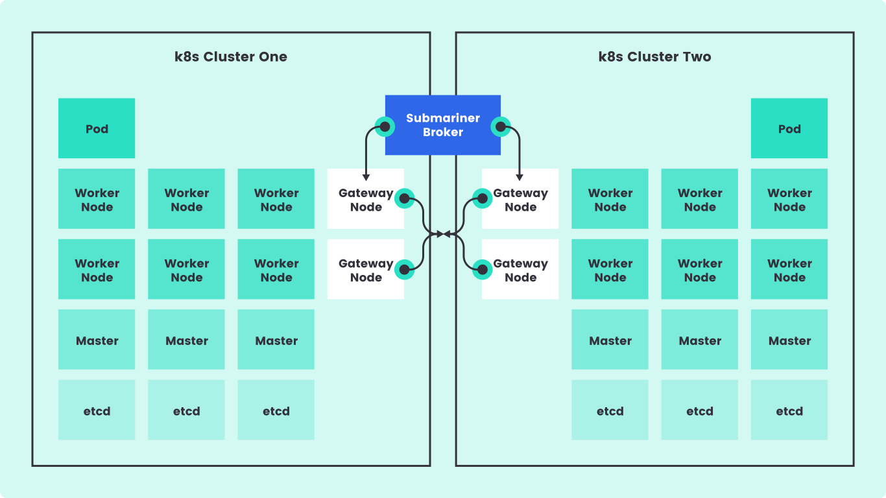
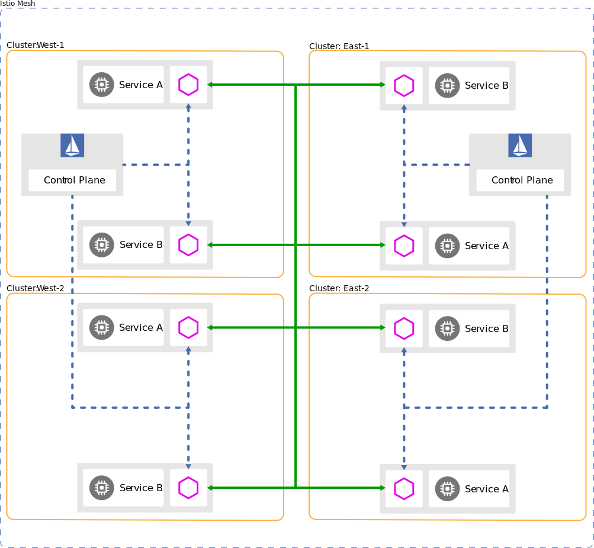

## Introduction

In the realm of cloud computing, the dynamic and distributed nature of workloads often necessitates deployment across multiple clusters. This presents a unique set of challenges, particularly when it comes to managing connectivity and communication between these workloads. In the OpenShift ecosystem, several technologies offer solutions to this problem, including Red Hat's Advanced Cluster Management (ACM), Submariner, OpenShift Service Mesh, and Skupper.

In this post, we'll delve into each of these technologies, explain how they function, and how they can help connect workloads deployed across multiple OpenShift clusters. We'll also discuss their limitations, and give an overview of a workload deployed across clusters using each solution.

!IMAGE-HERE! - Diagram showing multiple OpenShift clusters interconnected by ACM, Submariner, Service Mesh, and Skupper

## Why is it Necessary?

Before we get into the technologies that allow this solution, let's talk about why they are even necessary. Naturally, Kubernetes provides networking between the containers it orchestrates and to the outside world, both with its own components like `kube-proxy`, as well as with the CNI and other integrations. OpenShift has even more native functionality in this space with `Routes` and other controllers.

So, then, why is an additional networking technology necessary? There are numerous features that the below projects provide, some of which enhance container-to-container networking with features like mTLS, and others which enable and stabilize cross-cluster communication. The latter can be crucial when a workload is deployed across multiple clusters, like can be necessary to optimize Disaster Recovery (DR) and High-Availability (HA) and reach optimal SLAs.

With that said, now we can review some of the core technologies utilized with OpenShift for cross-cluster communication.

## Red Hat's Advanced Cluster Management (ACM)

**Red Hat's Advanced Cluster Management** (ACM) is a comprehensive solution from Red Hat that offers end-to-end management for Kubernetes/OpenShift clusters. It provides a unified control plane that enables you to manage, observe, and automate your clusters in a consistent and efficient manner.

ACM's application lifecycle management capability makes it easy to define, deploy and manage applications across multiple clusters. Through the use of subscription, placement rules, and channels, applications can be deployed on selected clusters and can communicate with each other.

However, ACM does not directly handle network communication between workloads across clusters - it needs to be combined with other solutions like Submariner, Service Mesh, or Skupper for that purpose. And while ACM provides a unified control plane, it's essential to consider the additional overhead and complexity it brings, especially for smaller deployments. ACM might not always be necessary for these situations, but it can greatly simplify larger scale deployments, and enable considerable new capabilities across your ecosystem.

## Submariner

**Submariner** is a CNCF Sandbox project that enables direct networking between pods and services in different Kubernetes clusters, even across different network implementations. It creates a network tunnel between the clusters, enabling full connectivity and supporting cross-cluster service discovery.

Submariner complements ACM by providing the network connectivity that ACM's application management requires. It achieves this by setting up L3 connectivity cross-cluster for encrypted or unencrypted connections. Submariner also provides **service discovery** across clusters by combining with [Lighthouse](https://submariner.io/operations/discovery/).

Submariner is straightforward to set up, especially when paired with ACM, and can be combined with [Lighthouse](https://submariner.io/operations/discovery/) for **service discovery** across clusters. However, Submariner requires additional network resources to create and maintain the tunnel, and its compatibility with various network plugins and cloud providers should be verified before implementation.


For a deeper dive and guide on deploying Submariner w/ ACM, I recommend this blog from RH's [Enable Architect](https://www.redhat.com/architect/submariner-acm-add-on).


## OpenShift Service Mesh

**OpenShift Service Mesh**, built on Istio, Envoy, Jaeger, and Kiali, provides a way to connect, manage, and observe microservices in a distributed architecture. It uses a sidecar pattern, where each service gets a proxy sidecar that intercepts and controls all network communication. Primarily, service meshes were utilized to provide networking between services within a cluster, operating at the service layer (part of L7). This allows it to provide a number of capabilities, including mTLS encryption, in addition to obtaining numerous metrics ranging from network observability to application traces. However, modern implementations, such as Istio, are able to provide the same features *across* clusters.

Istio enables service-to-service communication across clusters by implementing a multi-cluster service mesh. It provides robust features like traffic control, security, and observability, as mentioned above. However, setting up a multi-cluster service mesh can be complex, and it can introduce additional latency due to the sidecar proxies. That said, this overhead has been continuously reduced as the technologies have evolved. It's best suited for microservices architectures where the advantages of service mesh outweigh the added complexity, such as when multi-cluster or multi-region deployments are necessary for SLA requirements.

## Skupper

Skupper, another project from Red Hat, enables secure communication across Kubernetes clusters with no VPNs or special firewall rules. It uses a Virtual Application Network (VAN) to interconnect applications across different clusters.

Skupper automatically creates a VAN and deploys proxies for your services, allowing them to communicate as if they were in the same cluster. Unlike Service Mesh, Skupper doesn't require a sidecar for each service - the proxy is deployed at the application level.

While Skupper is easy to set up and use, it doesn't provide the same level of control and observability as Service Mesh. It's ideal for simpler scenarios where you want to quickly connect services across clusters without much configuration. It is also an excellent solution for connecting with cloud services and other such endpoints running *outside* of your Kubernetes/OCP clusters.


Red Hat recently announced their new product based on Skupper, Red Hat Interconnect. Stay tuned for more info as it comes available!


## Combinations

While there are times that the above technologies would be used on their own, there are many occasions that 2 or more can be combined for additional capabilities. ACM + any of the others is something of a given, considering ACM's capabilities with managing clusters and workloads. However, you might also find Service Mesh + Submariner to bew a requirement. For example, when Istio is deployed in a Multi-Primary Multi-cluster model, it can utilize Submariner for a tunnel between clusters for the Istio control Plane.

 - Multi-Primary Multi-cluster Service Mesh w/ Submariner")

It's important to consider a combination of options when designing your final multi-cluster solution. Often you'll find that the end result is much more capable than even the sum of its parts.

## Conclusion

Connecting workloads across multiple OpenShift clusters is a complex problem that can be solved in several ways. The choice between ACM, Submariner, Service Mesh, and Skupper depends on your specific needs, the complexity of your applications, and your network environment.

While ACM provides a comprehensive solution for managing applications across clusters, it needs to be paired with solutions like Submariner, Service Mesh, or Skupper for network connectivity. Submariner is great for direct L3 networking between clusters, while Service Mesh provides a robust solution for managing and observing microservices at L7. Skupper, on the other hand, is a simple and quick solution for connecting services across clusters and beyond!

Hopefully, this post has provided you with a deeper understanding of these technologies and how they can be used to connect workloads across OpenShift clusters. Stay tuned for the next post in the series where we will dive deeper into the *why* for multi-cluster deployments. And as always, don't hesitate to reach out if you have any questions or comments!

## References

1. [Red Hat Advanced Cluster Management](https://www.redhat.com/en/technologies/management/advanced-cluster-management)
2. [Submariner](https://submariner.io/)
3. [OpenShift Service Mesh](https://www.openshift.com/learn/topics/service-mesh)
4. [Skupper](https://skupper.io/)
