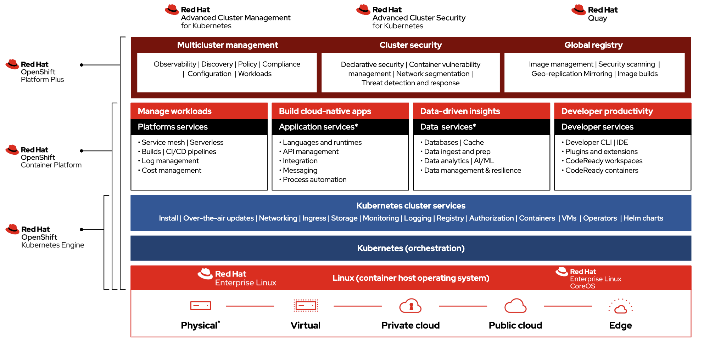

## Introduction

In the realm of container orchestration, Kubernetes has become the de facto standard, providing a powerful platform for managing containerized applications at scale. With a vibrant ecosystem of Kubernetes offerings, choosing the right platform can be challenging. In this post, we'll delve into an in-depth comparison of Red Hat OpenShift (OCP) and other Kubernetes platforms, exploring the unique advantages, scenarios of use, and an overview of the history of these technologies.



## History of OpenShift and Kubernetes

OpenShift and Kubernetes have their roots intertwined. Kubernetes, originally developed by Google, was designed to automate deployment, scaling, and management of containerized applications. It was made open-source in 2014, giving birth to a thriving ecosystem of Kubernetes-based platforms.

Red Hat's involvement with Kubernetes started early on. Recognizing the potential of the project, Red Hat became one of the first companies to start contributing to the Kubernetes codebase. Today, Red Hat is one of the top contributors to the Kubernetes project, bringing enterprise-grade features, security, and stability to the platform.

OpenShift, Red Hat's container orchestration platform based on Kubernetes,n , launched in 2011 initially as a Platform as a Service (PaaS) solution. With the rise of Kubernetes, OpenShift evolved into a fully-featured enterprise Kubernetes platform, incorporating Docker and Kubernetes alongside DevOps tools for developers and operations teams.

## OpenShift vs. Other Kubernetes Platforms

### Scenario 1: Security and Compliance

OpenShift shines in environments where security and compliance are paramount. It includes several security features out-of-the-box such as Security-Enhanced Linux (SELinux), role-based access control (RBAC), and Security Context Constraints (SCC) that go beyond what vanilla Kubernetes offers.

Here is an example configuration in OpenShift:

```yaml
apiVersion: v1
kind: SecurityContextConstraints
metadata:
  name: restricted
allowPrivilegedContainer: false
runAsUser:
  type: MustRunAsRange
seLinuxContext:
  type: MustRunAs
fsGroup:
  type: MustRunAs
```

In contrast, other Kubernetes platforms might require additional tools or configurations to achieve the same level of security.

### Scenario 2: Developer Productivity

OpenShift also provides an edge when it comes to developer productivity. It includes an integrated development environment, OpenShift Do (odo), and a web-based console that streamlines application deployment.


The below configuration deploys a Node.js application:

```bash
odo project create myproject
odo create nodejs
odo push
```

This level of simplicity might not be available in other Kubernetes platforms, making OpenShift a great choice for teams prioritizing developer experience.

### Scenario 3: Managed Services

When it comes to managed Kubernetes services, options like Google Kubernetes Engine (GKE) or Amazon Elastic Kubernetes Service (EKS) could be more cost-effective, especially for smaller organizations or those just starting with Kubernetes.

However, OpenShift Dedicated and OpenShift on Azure provide a managed OpenShift experience, combining the ease of use of managed services with the robust feature set of OpenShift.

## OpenShift's Future in a Platform-First World

As more organizations move away from building their own platforms to adopting ready-made platforms, OpenShift's future looks promising, with its robust feature set reflecting these trends. The OpenShift team is continually working on enhancing the platform, taking into account the evolving needs of Kubernetes and cloud-native developers, administrators, and architects. The sharing of successes and best practices within the OpenShift community is a testament to the platform's adaptability and commitment to meeting business challenges.

## Conclusion

Choosing the right Kubernetes platform depends on numerous factors, including security requirements, developer productivity needs, cost considerations, and future trends. Red Hat OpenShift stands out with its robust security features, developer-friendly environment, and the backing of Red Hat's commitment to the open-source Kubernetes project. However, other Kubernetes platforms might be more cost-effective, especially for smaller organizations or those just beginning their Kubernetes journey. That said, cost involves more than a single variable. Read our posts on [TCO]() for more information!

By understanding the unique strengths of each platform, you can make an informed decision that aligns with your organizational needs and goals.

## References

1. [What is Kubernetes? - K8s](https://kubernetes.io/docs/concepts/overview/what-is-kubernetes/)
2. [What is Kubernetes? - Red Hat](https://www.redhat.com/en/topics/containers/what-is-kubernetes)
3. [OpenShift Future and Roadmap](https://cloud.redhat.com/blog/openshift-roadmap-briefing-from-openshift-commons-gathering-amsterdam-2023)
