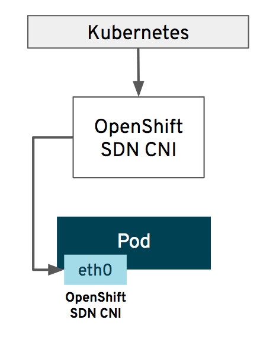
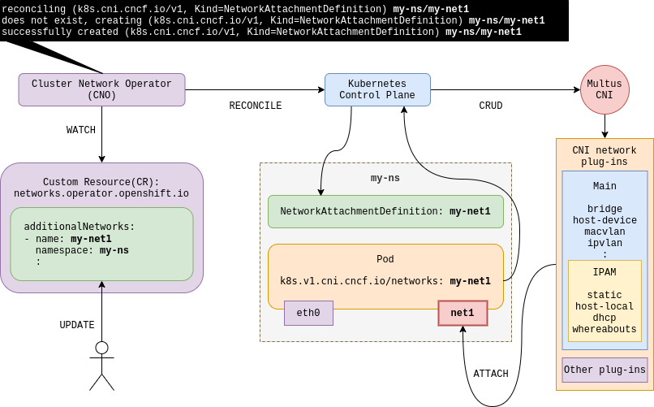

## Introduction

OpenShift, a leading enterprise Kubernetes platform, has evolved significantly over the years, and one area that has seen a great deal of change is networking. With the shift from Software-Defined Networking (SDN) to Open Virtual Network (OVN), the introduction of Multus and the Cluster Network Operator, and the support for various Container Network Interface (CNI) plugins, OpenShift's networking capabilities have become robust and versatile.

In this post, we will dive deep into the realm of OpenShift networking, exploring the progression of native CNIs, the reasons behind the shift from SDN to OVN, and the roles of various technologies in OpenShift Container Platform (OCP) networking. This deep dive is perfect for those looking to enhance their understanding of the OpenShift networking landscape, or even those wanting another perspective on networking in Kubernetes. So grab a cup of your favorite brew, get comfortable, and let's jump right in.

## The Evolution of Native CNIs: SDN to OVN

### Software Defined Network (SDN)

**SDN** was the first native CNI used in OpenShift. SDN made it possible for pods to communicate with each other, even across different nodes, by creating a virtual network on top of the existing physical network. It provided a decent level of functionality, including support for network isolation between projects. However, SDN had limitations in terms of performance and scalability.

### Open Virtual Network (OVN)

To overcome the limitations of SDN, OpenShift moved to **OVN** with [v4.12](https://www.redhat.com/en/whats-new-red-hat-openshift), marking a significant evolution in OpenShift networking. Rather than using the **VXLAN** protocol like SDN, OVN utilizes **Geneve** - Generic Network Virtualization Encapsulation. It also doesn't require kube-proxy, unlike SDN. OVN offers improves performance and more features, while improving security and supporting more complex network topologies.

OVN provides native support for network policies, thereby improving security, and supporting more advances network functionality like Network Address Translation (NAT), load balancing, and distributed gateway. These features make OVN a more scalable and flexible solution, aligning better with modern application and microservices architectures.

### SDN vs OVN

| **Feature**                    | **OpenShift SDN** | **OVN-Kubernetes** |
|--------------------------------|-------------------|--------------------|
| Egress IPs                     | Supported         | Supported          |
| Egress firewall [1]            | Supported         | Supported          |
| Egress router                  | Supported         | Supported [2]      |
| Hybrid networking              | Not supported     | Supported          |
| IPsec encryption               | Not supported     | Supported          |
| IPv6                           | Not supported     | Supported [3]      |
| Kubernetes network policy      | Supported         | Supported          |
| Kubernetes network policy logs | Not supported     | Supported          |
| Multicast                      | Supported         | Supported          |
| Hardware offloading            | Not supported     | Supported          |


[Source](https://access.redhat.com/documentation/en-us/openshift_container_platform/4.12/html/networking/openshift-sdn-network-plugin)


1. Egress firewall is also known as egress network policy in OpenShift SDN. This is not the same as network policy egress.
2. Egress router for OVN-Kubernetes supports only redirect mode.
3. IPv6 is supported only on bare metal, IBM Power, and IBM zSystems clusters.

## Understanding OpenShift Networking Technologies

### Multus

**Multus** plays a crucial role in the OpenShift networking ecosystem. It's a meta-plugin that allows you to use multiple network interfaces within a single pod. This is particularly useful in applications that require network separation for data, control, and management traffic. Multus adds a lot of flexibility to pod networking and can use any CNI plugin to provide these additional network interfaces.

### Cluster Network Operator

The **Cluster Network Operator** (CNO) is responsible for configuring the cluster network. It manages the deployment of Multus, the default network (which can be SDN, OVN-Kubernetes, or even a third-party solution), and additional networks. The CNO ensures that the entire cluster network is up and running, making it a critical component of OpenShift networking.

The below diagram provides an overview of how CNO and Multus work together to managed OpenShift's network configurations. However, container networking is a fairly complex topic, and introducing multiple networks and their management only increases that complexity. So, it is worth diving deeper if you would like to have a better understanding of how it works!

## Supported CNIs in OCP

OpenShift Container Platform (OCP) supports a range of CNIs, each with its unique strengths. Here is a list of supported CNIs:

OpenShift also supports several *special* CNI plugins, each providing unique capabilities. Some of the notable ones include:

- **Host-device:** This plugin moves a selected device into a pod’s network namespace, providing network connectivity directly connected to the physical network.
- **SR-IOV:** This plugin allows you to partition a network device into multiple virtual devices, which can then be directly allocated to pods. It's particularly useful in high-performance computing scenarios.


You can find the full list of 3rd party CNI Plugins supported by OCP here: [Certified OpenShift CNI Plug-ins](https://access.redhat.com/articles/5436171).
Red Hat also provide a [full list](https://access.redhat.com/articles/4763741) of supported/tested Integrations for OCP, but it requires a customer login.


## How Does CNI Work in Kubernetes?

The **CNI** in Kubernetes, and thus OpenShift, works as a bridge between the Kubernetes orchestration layer and the underlying host network by coordinating the allocation of network interfaces to containers and managing network resources. A CNI plugin is responsible for inserting a network interface into the container network namespace (like one end of a virtual ethernet pair) and making necessary changes on the host (like attaching the other end of the veth into a bridge).

The **kubelet**, the primary node agent in Kubernetes, is enlisted by the CNI when it expects to perform network operations on a container. The kubelet calls the CNI plugin with the desired command, such as `ADD, DEL, CHECK`, and provides related network configuration and container-specific data to the plugin. The CNI plugin then performs the required operations and reports the result.

### Pod Networking

When a pod is created, the Kubernetes master sends a request to the CNI, passing along a set of network configurations. The CNI then creates a network namespace for the pod and sets up the necessary network interfaces, routing, and IP address management.

The CNI ensures that the pod has the necessary network connectivity to communicate with other pods and services within the cluster. It also ensures network isolation, so that traffic from different pods does not interfere with each other.

## Why Does OpenShift Support Multiple CNIs?

Networking is a complex topic with a variety of user needs. Hence, OpenShift supports multiple CNI plugins that do things differently to satisfy various use cases. Whether you need to provision a network device directly to a pod for high-performance computing, or you want to make use of **OVN-Kubernetes** for advanced network functionality and security, OpenShift offers a CNI plugin to fit the bill.

## Conclusion

OpenShift networking is a vast and dynamic space, constantly evolving to meet the demands of modern application architectures. The shift from SDN to OVN, the introduction of technologies like Multus and the Cluster Network Operator, and the support for various CNIs are testament to OpenShift's commitment to providing a robust, flexible, and secure networking solution for your applications.

Whether you're a network engineer, a developer, or an enthusiast, understanding OpenShift networking is critical in today's cloud-native world. We hope this deep dive has provided you with a clearer picture of the OpenShift networking landscape and has piqued your interest to explore further.

## References

1. [OVN-Kubernetes network plugin OpenShift Container Platform 4.12](https://access.redhat.com/documentation/en-us/openshift_container_platform/4.12/html/networking/ovn-kubernetes-network-plugin)
2. [Multiple networks OpenShift Container Platform 4.12](https://access.redhat.com/documentation/en-us/openshift_container_platform/4.12/html/networking/multiple-networks)
3. [openshift/ovn-kubernetes: Kubernetes integration for OVN](https://github.com/openshift/ovn-kubernetes)
