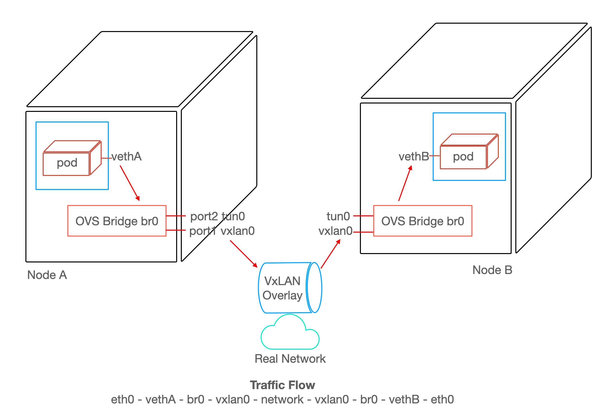

## Introduction

Welcome back to [MeatyBytes.io](/), where the technical juices are always flowing! I'm Nick Miethe, your resident OpenShift enthusiast and [homelab](/topics/homelab) hobbyist. When I'm not nerding out over the intricacies of [Platform Engineering](/topics/platform-engineering), I can be found setting up servers, 3D printing, or capturing the world through a camera lens. But today, we're diving back into the world of OpenShift, more specifically, the intricate labyrinth that is container networking.

### Synopsis

Networking is the lifeblood of modern cloud applications, yet it is often either overlooked, or seen as a complex and even daunting facet of OpenShift and Kubernetes. Its significance, however, is indisputable. It underpins every communication, every service interaction, and every data transfer within your cluster. That's why understanding it thoroughly can give you unprecedented control and efficiency in your cluster management.

In this post, we'll dissect the fundamentals of container networking, both in **OpenShift** and **Kubernetes**. Starting with an *overview of primary concepts* for container and Kubernetes networking, we'll then build into *OpenShift-specific networking* topics. Finally, we'll finish off with *multiple OCP networking design patterns* to understand how they fit into the bigger picture.

This comprehensive exploration is aimed to arm you with the knowledge you need to optimize your networking architecture, troubleshoot with greater effectiveness, and leverage the full power of your OpenShift and Kubernetes deployments. Join me as we lift the lid off this critical component of our containerized world and explore what lies beneath.

We've got a journey ahead of us, so let's dive in!

## Container Networking: The Basics

Containers are lightweight and isolated runtime environments. To interact with other containers and the external world, they need to network. Each container gets its own network namespace, meaning it has its own IP address, subnet, and routing table.

The *Container Network Interface* (**CNI**) is a key player here. It's a specification and a set of libraries for configuring network interfaces in Linux containers. The CNI allows containers to get an IP address and be reachable, without knowing the details of the networking environment.

At an even lower level, *Open vSwitch*, or **OVS**, provides a programmable virtual switch at the OS layer, allowing tools such as the CNI to provide networking capabilities for pods in Kubernetes. You can read more on the implementation of CNIs in our prior post [deep diving CNIs](), and stay tuned for a deep dive on the physical layer of container networking!



## Kubernetes Networking Overview

In Kubernetes, networking is a vast topic that involves several concepts:

### Pods

A **Pod** is the smallest deployable unit of computing in Kubernetes, which can contain one or more containers. All containers in a Pod share the same network namespace, meaning they can communicate using `localhost` and share the same IP address and port space.

### Services

**Services** are an abstraction that defines a logical set of Pods and enables external network access to them via policies. It provides a single IP address and DNS name by which Pods can access each other.

### NetworkPolicy

Kubernetes uses the `NetworkPolicy` object to provide detailed network traffic control. It determines which Pods can communicate with each other and other network endpoints.


### Ingress and Egress

**Ingress** is the process of managing incoming network connections to expose HTTP and HTTPS routes from outside the cluster to services within the cluster.

On the other hand, **Egress** is about outgoing network connections from Pods. **Network policies** in Kubernetes allow you to control which Pods can communicate with each other and other network endpoints.

### CNI Plugins

Kubernetes relies on CNI plugins for networking. These plugins allow different networking solutions to be plugged into Kubernetes — examples include Calico, Flannel, and Weave.


## OpenShift Networking: A Closer Look

**OpenShift**, a distribution of Kubernetes by **Red Hat**, brings along its additional networking features, focusing on security and ease of use. For more information, see the table at the end of the post on many more [OCP Networking Components](#openshift-networking-components).

### OCP Ingress and Egress

OpenShift uses an **Ingress Controller** to manage inbound connections and routes them to the appropriate services.

Egress is controlled using `Egress Network Policies` and **Egress Routers**.

### OCP Routes

OpenShift introduces the concept of **Routes**, an abstraction over Kubernetes Ingress. An OpenShift **Route** is essentially a method to expose a service by assigning it an externally reachable hostname, such as [MeatyBytes.io](/).

Each route is made up of a route name, service selector, host, and port. Routes also provide additional optional features, such as a security configuration for SSL. The route and the endpoints determined by its service can be utilized by a router to establish named connectivity, thereby allowing external clients to reach your applications. See below for a simple example Route configuration:

```yaml
apiVersion: route.openshift.io/v1
kind: Route
metadata:
  name: hello-meatybytes
spec:
  host: hello-meatybytes-hello.meatybytes.io
  port:
    targetPort: 8080
  to:
    kind: Service
    name: hello-meatybytes
```


While Routes are now considered an abstraction over Ingress, they in fact pre-date the upstream Ingress! Read more in our post on the history between, and deep dive into, Routes and Ingress!


### OCP Multitenancy

OpenShift supports **multitenancy**, allowing many users or teams to safely coexist on a single cluster without stepping on each other's toes. This involves network isolation using a *software-defined networking* (**SDN**) solution, which ensures network traffic is segmented for different projects.

## Networking Design Patterns in OpenShift

Let's explore 4 networking design patterns in OpenShift for various scenarios:

* **Simple Cluster**
* **Multitenancy**
* **Private Networking**
* **Hybrid Cloud**

### Simple Cluster

**What:** A *simple cluster* design is the most basic form of a Kubernetes/OpenShift cluster. It involves a single network within which all pods can communicate with each other.

**When:** This pattern is suitable for small to medium-sized projects with a single team managing all applications, where isolation between different parts of the system is not a significant concern.

**Features:** With this design, simplicity is the key. All pods can reach each other, and there is no need for complex `network policies` or additional layers of isolation.

**Technologies and Configurations:** The standard networking model in OpenShift is **SDN** (Software Defined Networking), and the default SDN plugin is **OpenShift SDN** in *NetworkPolicy* mode. This mode allows all pods to communicate with each other by default. OpenShift moved to **OVN** in *v4.12*, but that doesn't change much for this scenario. See our [deep dive on OCP CNIs]() for more info.

### Multitenancy

**What:** *Multitenancy* is a design pattern where multiple teams, projects, or customers share the same OpenShift cluster but work in isolation from each other.

**When:** This pattern is suitable when multiple teams or projects need to share resources but also need to maintain isolation for security or organizational reasons.

**Features:** The key feature of this design is the isolation provided by Network Policies and Namespaces. Each tenant operates within their namespace and can only interact with other pods as defined by network policies.

**Technologies and Configurations:** OpenShift SDN in *NetworkPolicy* mode is used, but with additional Network Policies in place. These policies are used to control the flow of traffic between pods in different namespaces, providing isolation between tenants.

### Private Networking

**What:** *Private networking* is a design pattern where specific rules isolate the cluster’s internal network from being accessible from from the public internet, while still allowing communication within the cluster.

**When:** This pattern is suitable when running sensitive workloads that should not be accessible from the public internet, or when strict control over network traffic is required for compliance reasons.

**Features:** In a private network, all communication with the outside world is strictly controlled through specific ingress and egress points.

**Technologies and Configurations:** This design pattern involves setting up a private subnet for the OpenShift cluster and using *NAT Gateways* or *VPN connections* for any required communication with the outside world. *Ingress* and *Egress Network Policies* are used to control the flow of traffic to and from the cluster.

### Hybrid Cloud

**What:** A *hybrid cloud* design incorporates cloud-native services with on-premise infrastructure.

**When:** This pattern is suitable when an organization wants to take advantage of the scalability and flexibility of public cloud services, while also maintaining some workloads on their own infrastructure for control, compliance, or cost reasons.

**Features:** This design provides the best of both worlds, allowing workloads to run wherever they are most suited. It also allows for seamless communication between on-premises and cloud resources.

**Technologies and Configurations:** OpenShift supports hybrid cloud designs by running on a variety of infrastructure platforms. Network connectivity between on-premises and cloud resources can be achieved through VPNs, Direct Connect (AWS), or ExpressRoute (Azure). Routing and network policies need to be carefully managed to ensure seamless communication.

### Patterns Review

OpenShift provides a highly flexible and robust networking model that supports a wide range of scenarios. From a simple cluster setup to complex multi-tenant, private networking, or hybrid cloud designs, OpenShift provides the tools and technologies needed to build a secure, scalable, and efficient networking environment.

As with any architectural decisions, the choice of design pattern depends on the specific requirements and constraints of the project at hand. It's also important to remember that these design patterns are not mutually exclusive, and can be combined in various ways to meet the unique needs of your organization.

## Conclusion

Networking in OpenShift and Kubernetes can seem daunting with its numerous components and concepts. But once you understand the fundamental principles and design patterns, you can construct powerful, efficient, and secure applications. Remember, the best design pattern depends on your specific use case, so make sure to choose the one that fits your requirements best.

I hope this overview gives you a good starting point to explore the possibilities of networking in OpenShift. In future posts, we'll delve deeper into each of these patterns, examining more complex scenarios and exploring advanced networking features.

## Additional Reading

1. [Understanding networking | OpenShift Container Platform 4.13](https://docs.openshift.com/container-platform/4.13/networking/understanding-networking.html)
2. [Networking Insights - OCP](https://www.youtube.com/watch?v=n1K0QsfnDPs)
3. [OpenShift SDN](https://network-insight.net/2022/07/18/openshift-sdn/)

## OpenShift Networking Components

| Component | Type | OpenShift-native | Description |
|---|---|---|---|---|
| Service types | Foundational | No | Node ports or load balancers, and API resources such as `Ingress` and `Route` |
| OpenShift Container Platform DNS | Foundational | Yes | Built-in DNS so that the services can be reached by the service DNS as well as the service IP/port |
| OpenShift Container Platform Ingress Operator | Operator | Yes | Implements the `IngressController` API and is responsible for enabling external access to OpenShift Container Platform cluster services |
| Ingress and Route | Foundational | No | Implements the Ingress Controller with a shared router service that runs as a pod inside the cluster. Routes provide advanced features that might not be supported by standard Kubernetes Ingress Controllers |
| Cluster Network Operator | Operator | Yes | Deploys and manages the cluster network components in an OpenShift Container Platform cluster |
| DNS Operator | Operator | Yes | Deploys and manages CoreDNS to provide a name resolution service to pods. This enables DNS-based Kubernetes Service discovery in OpenShift Container Platform |
| AWS Load Balancer Operator | Operator | Yes | Deploys and manages an instance of the `aws-load-balancer-controller` |
| External DNS Operator | Operator | Yes | Deploys and manages ExternalDNS to provide the name resolution for services and routes from the external DNS provider to OpenShift Container Platform |
| Kubernetes NMState Operator | Operator | No | Provides a Kubernetes API for performing state-driven network configuration across the OpenShift Container Platform cluster’s nodes with NMState |
| kube-proxy | Foundational | No | A proxy service which runs on each node and helps in making services available to the external host |
| load balancers | Foundational | No | Used for communicating from outside the cluster with services running in the cluster |
| MetalLB Operator | Operator | No | When a service of type `LoadBalancer` is added to the cluster, MetalLB can add an external IP address for the service |
| PTP Operator | Operator | Yes | Creates and manages the `linuxptp` services |
