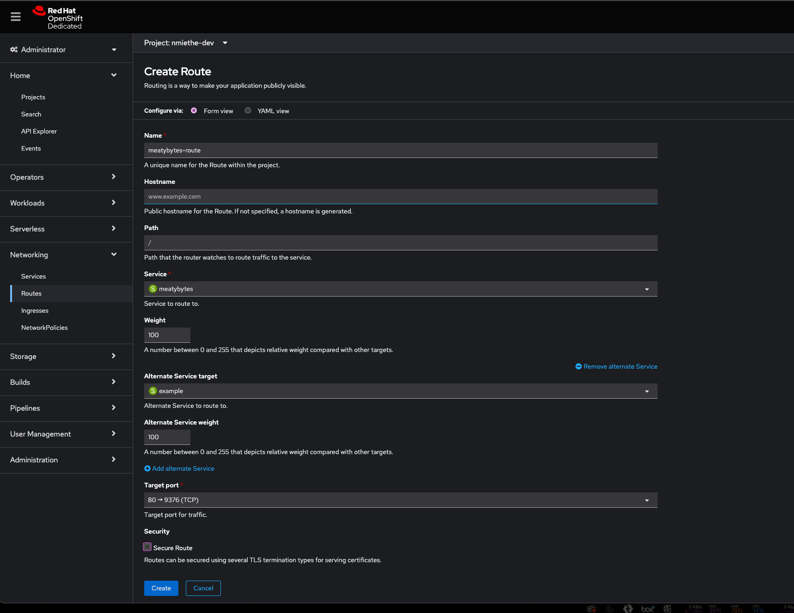
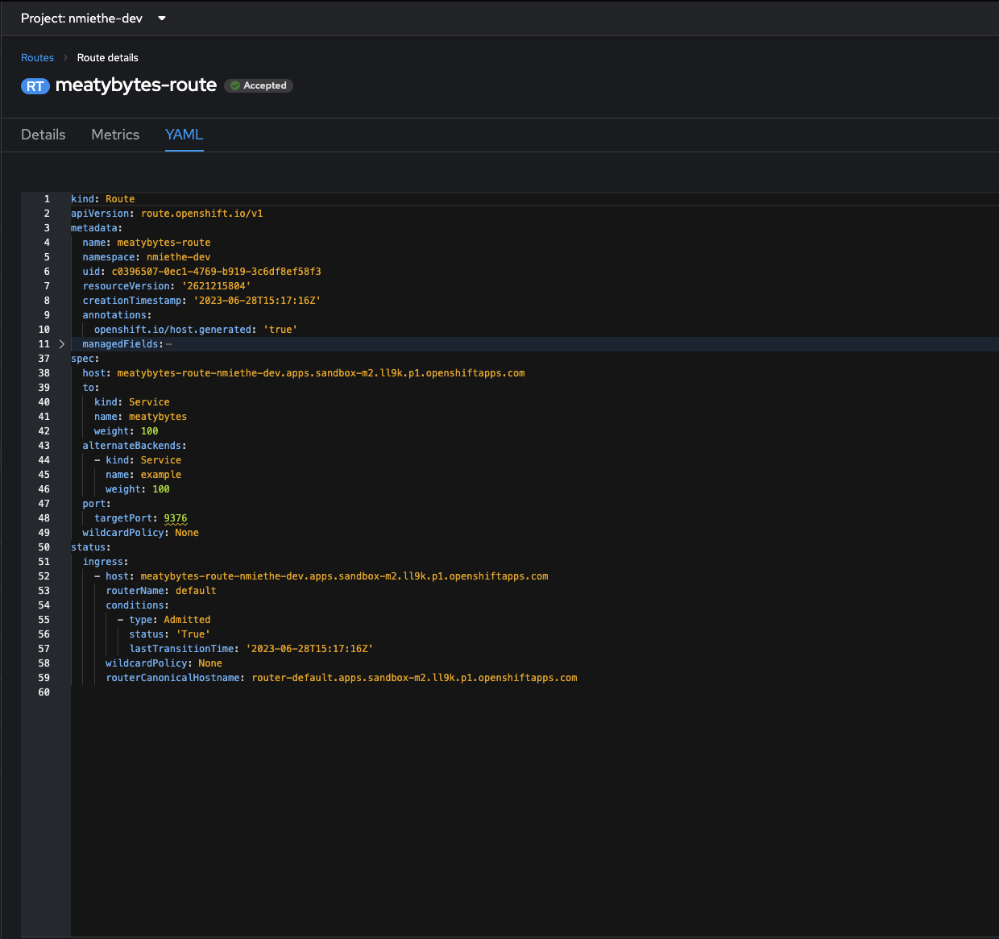

## Introduction

Hello, fellow tech enthusiasts! Nick Miethe here from [MeatyBytes.io](/), your go-to source for juicy tech insights. When I'm not fiddling with my homelab or immersed in a woodworking project, I dive headfirst into the world of OpenShift, Platform Engineering, and DevSecOps, exploring the exciting crossroads of these domains.

### Synopsis

Today, we're going to embark on a captivating journey through the realm of OpenShift networking, honing in on two key players that regulate traffic flow into our clusters – OpenShift Routes and Ingress. Both have unique historical backgrounds and carry significant weight within Kubernetes-based systems like OpenShift. Whether you're an OpenShift newbie or a seasoned pro, understanding these critical components is essential for mastering application traffic management.

OpenShift Routes and Ingress each have a history that mirrors the evolution of cloud-native technologies. Born out of necessity as systems scaled and became more complex, they were designed to offer secure and efficient traffic routing options. And much like most other cloud-native tech, they are similar solutions developed alongside each other to solve the same problem. We'll take a look back at their genesis and explore how each has evolved to meet the needs of modern Platforms, and why they both still exist in OCP.

After that, we'll delve into their interaction with other OpenShift components and provide examples of their usage in different scenarios. Aided by a detailed analysis, you'll gain a thorough understanding of these critical elements, equipping you to make informed decisions for your OpenShift environment.

Ultimately, we want to answer the question: Why do 2 distinct solutions exist in OCP, and when might you opt for **Ingress** over **OpenShift Routes**? There's no one-size-fits-all answer, but with a solid understanding of their strengths and limitations, you'll be poised to make the best choice for your projects.

Buckle up and get ready to deep dive into the exciting world of OpenShift networking!

## A Brief History of Routes and Ingress

Although pods and services have their own IP addresses on Kubernetes, these IP addresses are only reachable within the Kubernetes cluster and not accessible to outside clients. This led to the creation of 2 functionally similar, but foundationally different, solutions that enable services within the cluster to be exposed to traffic coming from outside the cluster: **OpenShift Routes** and **Kubernetes Ingress** objects.

### OpenShift Routes

**Routes** were introduced as a part of OpenShift's architecture from its very inception. They provide a way to expose a service at a host name, like [MeatyBytes.io](/), so that external clients can reach it by name. The route and the endpoints determined by its service can be utilized by a router to establish named connectivity, thereby allowing external clients to reach your applications.

Routes offer additional capabilities, such as *splitting traffic* between multiple backends, *sticky sessions*, etc. When a Route object is created on OpenShift, it gets picked up by the built-in `HAProxy load balancer`, enabling it to manage the external access to services within the cluster.

**Red Hat** , as one of the top contributors to the Kubernetes community, contributed the design principles behind Routes, which heavily influenced the Ingress design. **Clayton Coleman** discusses some of this in his 2020 guest appearance on the [Kubernetes Podcast](https://kubernetespodcast.com/episode/085-openshift-and-kubernetes/).

### Kubernetes Ingress Objects

**Ingress**, on the other hand, is a Kubernetes native resource that was introduced in Kubernetes 1.1 as a beta feature, based on the functionality that the OpenShift team had developed in **Routes**. The **Kubernetes Ingress** object was designed to signal that a certain service needs to be accessible to the outside world, and it contains the necessary configuration to do so securely, including an externally-reachable URL, SSL, and more.

However, the creation of an Ingress object doesn't have any effects on its own. It requires an Ingress controller on the Kubernetes platform to fulfill the configurations defined by the Ingress object.

Initially, the concept of Ingress in Kubernetes and Routes in OpenShift served similar purposes. However, Ingress in Kubernetes did not offer as many features as Routes in OpenShift.

## Routes and Ingress in OpenShift Today

Since the adoption of Kubernetes as the container orchestration framework for OpenShift, Red Hat has maintained **Routes** as a key part of its platform. With Kubernetes' introduction of **Ingress**, it was initially unclear how it would be integrated into OpenShift. Red Hat decided to treat Ingress as a distinct resource within OpenShift.

The reason behind this is simple - Routes offer a *broader set of features*, including TLS re-encryption, multiple weighted backends (to split traffic), generated pattern-based hostnames, and support for wildcard domains, among others.

Hence, you can now use either Ingress or Routes in an OpenShift environment, based on your specific use case. OCP implements Ingress via the Ingress Controller, and generally uses **HAProxy** as the router service. It functions very similar to Routes for Ingress traffic, but only allows HTTP/2, TLS w/ Cert, etc.

### Which to Use

While both Routes and Ingress serve the purpose of exposing services, the decision of which one to use should be based on your specific needs. For instance, if your services require advanced routing strategies, like *weighted routing* or *A/B testing*, then OpenShift **Routes** would be your best bet.

On the other hand, if you intend to deploy your application on *multiple Kubernetes distributions* at the same time, using Kubernetes **Ingress** could be a better option. Similarly, if you are deploying an application originally written for another Kubernetes distribution, you can rest easy that it will deploy to OCP without issue, utilizing the Ingress Controller to manage its ingress traffic.

At the end of the day, with Routes being the native integration into OpenShift, the easiest route (pun intended) to Ingress traffic happens to also be the most performant and the default - OpenShift Routes.


**Note:** Ingress resources automatically create OpenShift routes via the Ingress Controller.


## How Routes and Ingress Interact with Other OpenShift Components

In OpenShift, Routes and Ingress work closely with other components to facilitate networking. They interact with services, which in turn are linked to pods running the application. When an external client makes a request to a host name exposed by a Route or an Ingress, the request gets forwarded to the service, and then to the pods.

Routes and Ingress are typically managed and configured through OpenShift's built-in Router component, which is built upon **HAProxy**. This Router component is responsible for managing the network traffic between the outside world and the services and pods within the OpenShift cluster.

## Working with Routes in OpenShift 4

There are several ways to configure and manage **Routes** in OpenShift 4. You can utilize either the `oc cmdline` tool, or the web console. Here are several examples:

* **Simple Expose:** The simplest method for deploying a service and route for a given pod is via the `oc expose` command. See below for example commands to deploy an sample app, create a service, and an unsecured route:

```bash
oc new-project hello-meatybytes
oc create -f https://raw.githubusercontent.com/openshift/origin/master/examples/hello-meatybytes/hello-pod.json
oc expose pod/hello-meatybytes
oc expose svc hello-meatybytes

oc get routes -o yaml hello-meatybytes
```

* **Configuring route timeouts**: If you have services that require either a low or a high timeout, you can configure the default timeouts for an existing route using the `oc annotate` command.
* **Enforcing HTTP Strict Transport Security (HSTS)**: *HSTS* is a security enhancement that signals to the browser client that only HTTPS traffic is allowed on the route host. It optimizes web traffic by signaling that HTTPS transport is required, eliminating the need for HTTP redirects. HSTS works only with secure routes, either *edge-terminated* or *re-encrypt*, and the configuration is ineffective on HTTP or passthrough routes.
* **Web Console:** Create a `service` in your project for your app, then create a Route attached to the `service`. You can also choose alternate services to enable *A/B traffic*, secure your routes, etc.





## Conclusion

Routes and Ingress play an essential role in OpenShift networking, allowing services within a cluster to be exposed and accessible from outside the cluster. Although they serve a similar purpose, the decision to continue maintaining Routes as a separate project is understandable, considering the additional features it provides. Understanding how these components work and interact with others will help you design and implement more efficient and robust networking for your OpenShift applications.

That's all for now, but see you next time!

## References

* [Route configuration | OpenShift Container Platform](https://docs.openshift.com/container-platform/4.13/networking/routes/route-configuration.html)
* [Kubernetes Podcast from Google: Episode 85 - OpenShift and Kubernetes, with Clayton Coleman](https://kubernetespodcast.com/episode/085-openshift-and-kubernetes/)
* [Developer Sandbox for Red Hat OpenShift | Red Hat Developer](https://developers.redhat.com/developer-sandbox) - Awesome free resource from Red Hat to try out much of what you learn here!
