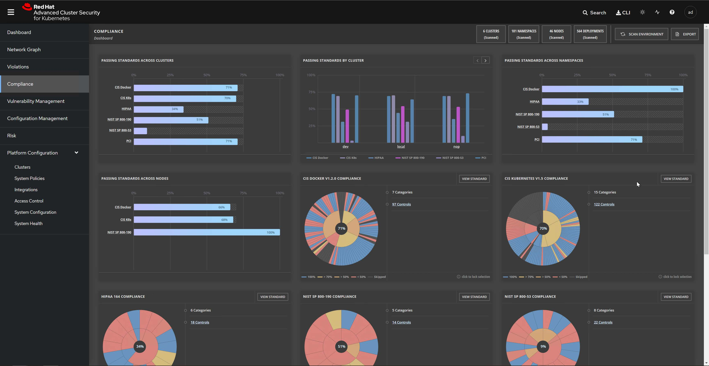
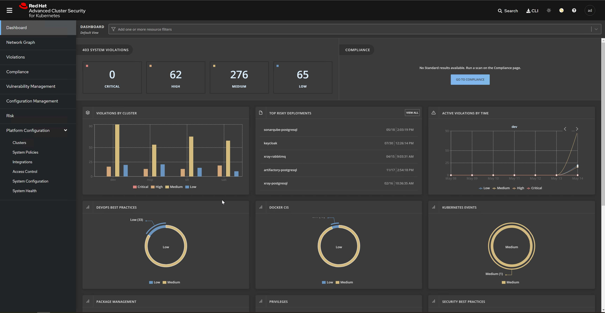

+++
title = "Deep Dive into Red Hat Advanced Cluster Security (RHACS) for OpenShift"
date = 2023-03-15
description = '''
Learn the basics of Red Hat's Advanced Cluster Security (ACS) and how it secures your OpenShift clusters.
'''
categories = ["Technical", "Introduction"]
topics = ["OpenShift", "Security", "ACS", "DevSecOps"]
tags = ["RHACS", "Trivy", "DAST", "SAST", "IAST", "StackRox", "eBPF", "OPA", "SCA", "DevOps"]
author = "Nick Miethe"
series = ["Advanced Cluster Security"]
series_order = 1
+++

## Introduction

*Red Hat Advanced Cluster Security* (RHACS) is an enterprise-grade security solution designed to provide comprehensive threat detection, policy enforcement, and compliance management for OpenShift clusters. In this post, we'll delve into the specific technologies that underpin each component of RHACS, what each component does, and why it's essential. Prepare to shift left!

## Advanced Cluster Security (ACS) Background

In 2021, Red Hat acquired an Open Source, innovative container security platform - **StackRox**. **StackRox** moved beyond the typical Container Vulnerability and Compliance Scanning to overall Kubernetes and Host Configurations. As the first Kubernetes-native security platform, ‘rox was an excellent choice for OpenShift integration, allowing the platform to truly "shift left".

Enter **Red Hat Advanced Cluster Security**, or *RHACS*: RH’s proprietary distribution of **StackRox** (StackRox has since been re-released as the Open Source Upstream source for **RHACS**). Paired with *OpenShift Container Platform* (OCP), **RHACS** plays multiple roles in cluster security, from discovering cluster-wide vulnerabilities to individual container image dependencies, as well as image scanning within **OpenShift Pipelines** (*Tekton*).

## RHACS Components


  
  
  


RHACS comprises several key components:

* **Central**: This is the primary component of RHACS. It provides a unified interface for managing and monitoring the security posture of all your clusters. `Central` uses a *PostgreSQL* database for storage, which can be deployed as a container within the cluster or externalized for scalability and resilience.
* **Scanner**: This component scans images for vulnerabilities using data from multiple sources, including Red Hat security feeds and other CVE databases. `Scanner` uses the **Trivy** open-source vulnerability scanner under the hood.
* **Sensor**: Deployed as a `DaemonSet` on each node in your cluster, the `Sensor` monitors network traffic and system calls in real-time to detect and alert on any suspicious activity. It uses **eBPF** (*Extended Berkeley Packet Filter)* technology for efficient and safe system-level tracing.
* **Compliance Operator**: This component monitors your cluster for compliance with a range of industry and regulatory standards. The `Compliance Operator` uses **Open Policy Agent (OPA)**, a policy-as-code tool, to define and enforce policies.
* **Admission Controller**: This optional component integrates with Kubernetes' native *admission control* mechanism to enforce policies at deploy time. The `Admission Controller` prevents the creation of workloads that violate your security policies.

## Why RHACS is Important

**Advanced Cluster Security** brings several key benefits to OpenShift environments which all together allow customers to shift left:

* **Enhanced Visibility**: By consolidating security data from across your clusters into a single interface, RHACS makes it easy to monitor and manage your security posture.
* **Proactive Security**: With its built-in vulnerability scanning and real-time threat detection capabilities, RHACS enables you to detect and respond to security threats before they can impact your environment.
* **Policy Enforcement**: RHACS's policy-driven approach ensures that your security and compliance policies are consistently enforced across your environment.
* **DevSecOps Enablement**: By integrating with your CI/CD pipeline, RHACS enables you to shift security left and catch potential issues early in the development process.

## Conclusion

**RHACS** is a powerful and flexible security solution that leverages a range of technologies to secure OpenShift environments. Whether you're operating a single cluster or managing a fleet of clusters, RHACS provides the tools you need to maintain a secure and compliant environment.

## References

* [Red Hat Advanced Cluster Security for Kubernetes 4.0](https://docs.openshift.com/acs/4.0/welcome/index.html) - Current version as of time of writing
* [eBPF](https://ebpf.io/)
* [Open Policy Agent](https://www.openpolicyagent.org/)
* [Trivy Vulnerability Scanner](https://github.com/aquasecurity/trivy)
* [Implementing DevSecOps CI/CD pipelines with RHACS and OpenShift – Rcarrata's Blog](https://rcarrata.com/openshift/devsecops-1/)
