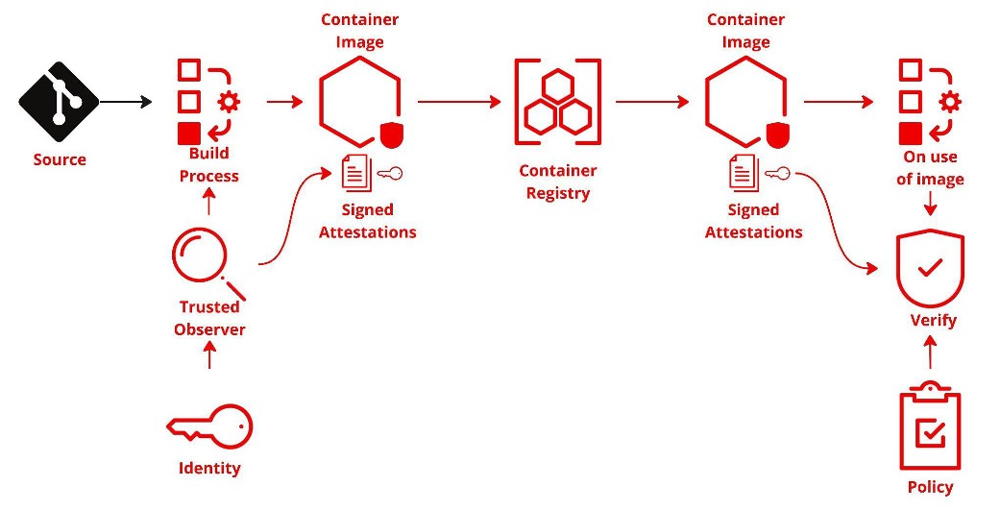
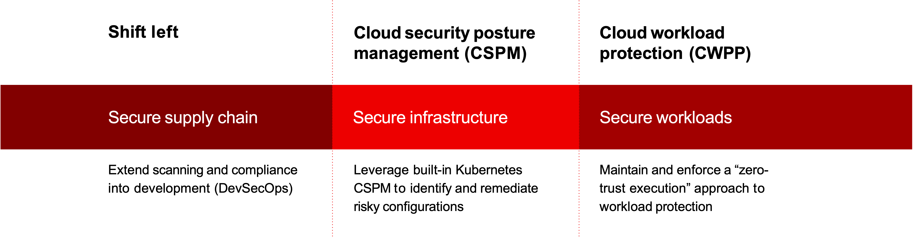
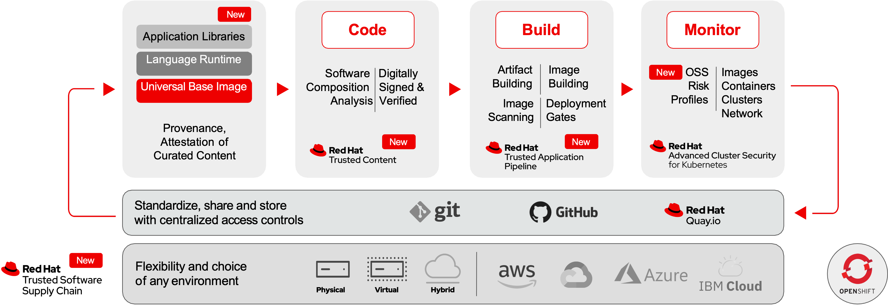

[//]: # "Thumbnail Image Description: A chain crafted from binary code signifying the digital software supply chain, with a lock symbolizing security in the center."

## Introduction

Hello, fellow tech aficionados! This is Nick Miethe from [MeatyBytes.io](/). If you're familiar with my posts, you'll know I'm not only a staunch supporter of OpenShift, but also a fervent advocate for robust security in our increasingly connected world.

In today's post, we delve into the subject of **software supply chain security**, the convergence point for Development, Security, and Operations (**DevSecOps**). The state of global cybersecurity is precarious at best, and understanding the origins of your software supply chain is no longer optional - it's a crucial part of your security framework.

A compromised software supply chain can be a significant liability, often leading to severe security breaches. Yet, with the right foundations in place, you can not only detect and rectify vulnerabilities but also prevent future exploits. By understanding and implementing concepts like *Software Supply Chain Level of Assurance* (**SLSA**), *Software Bill of Materials* (**SBOM**), and *Secure Production Identity Framework For Everyone* **(SPIFFE)/SPIRE**, you can strengthen your supply chain's defenses.

This post aims to shed light on the concept of software supply chain security, discussing its history, the industry's response, and explaining key terminology and concepts.



So, whether you're a seasoned software supply chain manager or new to the game, this post promises to be a meaty byte of knowledge you wouldn't want to miss.

Stay tuned and let's secure your software supply chain together!

## The Rise of Software Supply Chain Security

Software supply chain security has been an under-the-radar concern for many organizations until high-profile attacks made it impossible to ignore. According to the most recent [State of the Software Supply Chain](https://www.sonatype.com/state-of-the-software-supply-chain/introduction), attacks on the supply chain have experienced a **742% average annual increase** over the past 3 years.

The **2020 SolarWinds** attack, which compromised the software maker SolarWinds’ *Orion* software, among other targets, led to an urgent reassessment of software supply chain risk. This attack, coupled with the recent **Log4j** vulnerability and similar incidents, spotlighted the need for enhanced software supply chain security measures. According to the [above report](https://www.sonatype.com/state-of-the-software-supply-chain/introduction), "96% of known-vulnerable open source downloads are avoidable", introducing major low-hanging fruit in the journey of security.

## Industry's Response to Software Supply Chain Attacks

The industry has responded to these threats by investing in software supply chain defenses. For instance, platform operators like **GitLab** and **GitHub** have introduced automated vulnerability scanning for code and made secrets scanning and detection features available for free to public repositories. Many vendors have tightened account security and integrated AI technologies like **OpenAI's ChatGPT** and **IBM's watsonx** together with [**GitHub Copilot**](https://github.com/features/copilot) and the newly announced [Ansible Lightspeed](https://www.redhat.com/en/engage/project-wisdom) and [Watson Code Assistant](https://www.ibm.com/products/watson-code-assistant?utm_content=SRCWW&p1=Search&p4=43700076335928533&p5=e&gclid=EAIaIQobChMI0ZKZzfn-_gIV8u_jBx1h3godEAAYASAAEgLotPD_BwE&gclsrc=aw.ds), respectively, to help developers avoid common coding mistakes. Similarly, the Federal Government has been working to regulate software quality, pushing software publishers to improve the security of their wares through mandates and regulations.

Additionally, development teams are becoming more aware of the risks lurking in their code and the broader software supply chain. They're bolstering their defenses and skills to counter threats from sophisticated cyber-criminals and nation-state groups. One of the primary methods of moving security to the forefront and putting more of the onus on developers is termed "*shift left*".

> The term “shift left” refers to the efforts of a DevOps team to guarantee application security at the earliest stages in the development lifecycle, as part of an organizational pattern known as DevSecOps (collaboration between development, security, and operations). - [aquasec](https://www.aquasec.com/cloud-native-academy/devsecops/shift-left-devops/#:~:text=The%20term%20%E2%80%9Cshift%20left%E2%80%9D%20refers,%2C%20security%2C%20and%20operations)

Red Hat's OpenShift Container Platform was already well-positioned for this change of responsibility, as developers are empowered by design to build secure applications. However, there are many new and upcoming technologies and offerings which enhance these capabilities further. We will discuss one such solution later in this post.



## Key Terminology

Below are some of the key terms you will find when working with Software Supply Chain Security. For more information specific to SLSA, check out their own [terminologies](https://slsa.dev/spec/v1.0/terminology).

### SLSA


**Software Supply Chain Levels for Software Artifacts (SLSA)** is a framework aimed at improving the security of software supply chains. It provides a measurable and scalable path towards improving the integrity of software artifacts. Specifically, SLSA helps to meet *NIST* **SSDF** requirements via CI/CD solutions.

> "It’s a security framework, a checklist of standards and controls to prevent tampering, improve integrity, and secure packages and infrastructure. It’s how you get from "safe enough" to being as resilient as possible, at any link in the chain." - [slsa.dev](https://slsa.dev/)

**SLSA** consists of 4 "levels" to describe the security state of a system, with level 4 being the "ideal" state. These 4 levels are as [follows](https://slsa.dev/spec/v0.1/levels):

**Level** | **Description** | **Example**
---------|----------|---------
 0 | No degree of defined supply chain security | N/A
 1 | Documentation of the build process | Unsigned provenance
 2 | Tamper resistance of the build service | Hosted source/build, signed provenance
 3 | Extra resistance to specific threats | Security controls on host, non-falsifiable provenance
 4 | Highest levels of confidence and trust | Two-party review + hermetic builds

### SBOM

A *Software Bill of Materials* (**SBOM**) is a detailed list or document that includes the details about the inputs, parts, or components and their versions that make up a software product. It's like an ingredients list for software that provides transparency about what's inside a software product or service.

**SBOMs** play a crucial role in a *Secure Software Supply Chain* and **SLSA** by improving transparency and traceability. They allow you to understand what components are in your software and can help you identify any components with known vulnerabilities, licensing issues, or other concerns. The **Cybersecurity and Infrastructure Security Agency** (CISA) has been actively working on common guidance and structure for the global **SBOM** community.

An **SBOM** can include but isn't limited to:

* **Open-source packages**: Name, version, and other details of the open-source components used.
* **Libraries**: Details about the in-built and third-party libraries employed in the software.
* **Other components**: All other elements like OS, databases, servers, etc., that the software depends upon.

### Provenance

**Provenance** in the context of a *Secure Software Supply Chain* and **SLSA** refers to the origin or source of something and the successive steps that describe its entire history, such as its ownership or location. Provenance can refer to the lifecycle of a piece of software, from its initial creation, through its development and testing, to its final deployment.

When discussing software, *provenance* often includes metadata that describes who wrote the code, what tools were used to build it, where and when it was built, and any other relevant data points that provide context and traceability. Keeping detailed provenance records is important in a software supply chain, as it can help detect unauthorized changes, ensure compliance with licensing, and provide valuable context for debugging and incident response.

### Attestation

**Attestation**, in the context of *Secure Software Supply Chain* and **SLSA**, refers to the process where a system or service confirms or validates that certain conditions have been met. Typically, this involves generating a signed statement that confirms the *authenticity, integrity, or correctness* of a given software component.

For instance, in a software supply chain, a build system might attest that it has correctly built a piece of software from a specific set of source files under a specific environment. This attestation is then passed along the supply chain, providing assurance to downstream consumers about the security of their software components. Such attestations are typically digitally signed, allowing anyone who trusts the signer to also trust the attestation. Attestations follow strict formats and specifications, such as is defined by the [**in-toto Attestation Framework**](https://github.com/in-toto/attestation).

Here is an example attestation for a **Tekton Chains** `TaskRun`:

```yaml
{
  "_type": "https://in-toto.io/Statement/v0.1",
  "predicateType": "https://in-toto.io/Provenance/v0.1",
  "subject": [
    {
      "name": "file-SNAPSHOT.jar",
      "digest": {
        "sha256": "3f1017b520fe358d7b3796879232cd36259066ccd5bab5466cbedb444064dfed"
      }
    }
  ],
  "predicate": {
    "builder": {
      "id": "https://configured.builder@v1"
    },
```

### Image Signing

**Image signing** refers to the practice of attaching a cryptographic signature to a software image as a form of **attestation**. The goal of image signing is to ensure the authenticity and integrity of a software image.

In the context of a containerized software supply chain, a software image (like a Docker image) is often used to bundle an application and its dependencies for deployment. By signing this image, a developer or build system attests that the image was built in a specific manner and hasn't been tampered with since it was created.

Typically, when a signed image is deployed, the system deploying it will verify the image's signature against a public key that it trusts. If the signature verifies correctly, the system knows that the image is exactly as it was when it was signed, and that it was signed by the owner of the private key. If the verification fails, the system knows that the image has been altered since it was signed or was signed by an untrusted entity, and can reject it.

#### SBOMs with Image Signing

**SBOMs** are particularly useful for **Image Signing** because they provides a comprehensive list of all the components within a container image. When an image is created, an SBOM can be generated that lists all the components in the image. This SBOM can then be used as part of the image signing process. When the image is signed, the SBOM can also be signed, creating an attestation that includes not only the image itself but also a detailed breakdown of its contents.

This allows anyone using or verifying the image to also verify its contents against the signed SBOM. They can check if any known vulnerable or outdated components are present, ensure compliance with licensing requirements, and trace the origins of all components. This process helps enhance the security, transparency, and trustworthiness of the software supply chain.

### All Together

Both provenance and image signing are key components of a *secure software supply chain*. **Provenance** provides valuable context and history for a piece of software, helping to track its journey through the supply chain, while **image signing** provides a way to *attest* to the integrity and authenticity of software images, ensuring that they haven't been tampered with before deployment.

* **Provenance** - the origin of each piece of code and the path it took from development to deployment
* **Image signing** - signs a container image, attesting to it authenticity and integrity

## Tools and Technologies: SPIFFE/SPIRE

The *Secure Production Identity Framework For Everyone *(**SPIFFE**) and the *SPIFFE Runtime Environment* (**SPIRE**) are open-source projects that provide a secure identity framework for production workloads. They're useful tools for enhancing software supply chain security.

### SPIFFE

**SPIFFE**, the *Secure Production Identity Framework for Everyone*, is an open-source standard for securely identifying software systems in dynamic and heterogeneous environments. SPIFFE standardizes how services identify and authenticate each other in microservices architectures, regardless of the underlying infrastructure.

It is built on the idea of assigning a unique identity to every service in the form of a SPIFFE ID (a structured string identifying the workload), which is backed by a short-lived cryptographic document called a SPIFFE Verifiable Identity Document (SVID). SVIDs can be verified by other systems in the network, thus proving the service's identity and ensuring secure communication.

### SPIRE

**SPIRE**, the *SPIFFE Runtime Environment*, is a reference implementation of **SPIFFE**, which provides a set of APIs and processes to manage and issue **SPIFFE** identities in a wide variety of environments.

It is comprised of two main components: the `SPIRE Server`, which manages and issues SVIDs, and the `SPIRE Agent`, which runs on individual machines, nodes, or clusters, and requests SVIDs from the `SPIRE Server` on behalf of local workloads. By deploying SPIRE across your environment, you can establish a robust infrastructure for service identity and authentication, enhancing the security of your software supply chain.

Together, SLSA, SPIFFE, and SPIRE provide a powerful set of tools and standards for securing your software supply chain; plus, there's a ton of S's! **SLSA** offers a mechanism for verifying that each step in the supply chain has been properly executed, while **SPIFFE** and **SPIRE** provide a robust framework for service identity and secure communication, even in complex, dynamic, and heterogeneous environments.

## OpenShift and Red Hat's Trusted Software Supply Chain

**OpenShift** and **Red Hat's Trusted Software Supply Chain** are powerful tools that can help organizations secure their software supply chains. OpenShift is a container application platform that brings Docker and Kubernetes to the enterprise, while Red Hat's *Trusted Software Supply Chain* provides a comprehensive set of security features designed to protect the entire software supply chain, combining both new and existing technologies (such as **Tekton Chains**, **in-toto**, etc) into a single managed solution.


Read more on [RHSSC]() in our deep dive!




## Conclusion

**Software supply chain security** is a complex, but increasingly important, area of focus. The landscape is evolving rapidly, and organizations need to stay informed and proactive to protect their software supply chains. Understanding key concepts, adopting relevant tools and technologies, and investing in robust security measures are crucial steps towards achieving a secure software supply chain. Don't let yourself, or your company, get caught up in a (relatively) easily avoidable situation, such as a [Dependency confusion attack](https://medium.com/@alex.birsan/dependency-confusion-4a5d60fec610), especially when there are so many strong options on the market ready for integration into your environment.

That's all for now, but stay tuned for more deep dives into all aspects of the Sec in **DevSecOps**, and much, much more!

## References

* [in-toto and SLSA](https://slsa.dev/blog/2023/05/in-toto-and-slsa)
* [Dependency Confusion: How I Hacked Into Apple, Microsoft and Dozens of Other Companies](https://medium.com/@alex.birsan/dependency-confusion-4a5d60fec610)
* [Send SBOMs to Dependency-Track | Chainloop documentation](https://docs.chainloop.dev/guides/dependency-track/)
* [SLSA specification](https://slsa.dev/spec/v1.0/)
* [Supply Chain Security | Tekton](https://tekton.dev/docs/chains/)
* [8th Annual State of the Software Supply Chain Report | Sonatype](https://www.sonatype.com/state-of-the-software-supply-chain/introduction)
