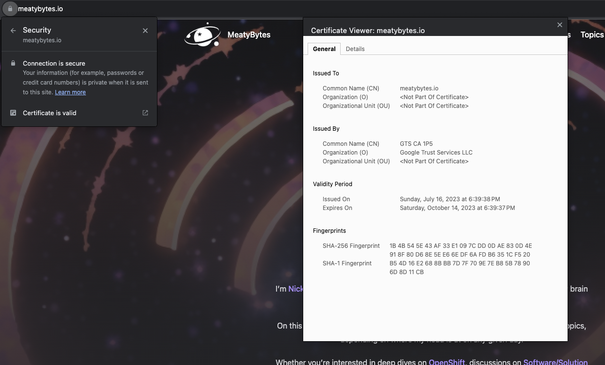
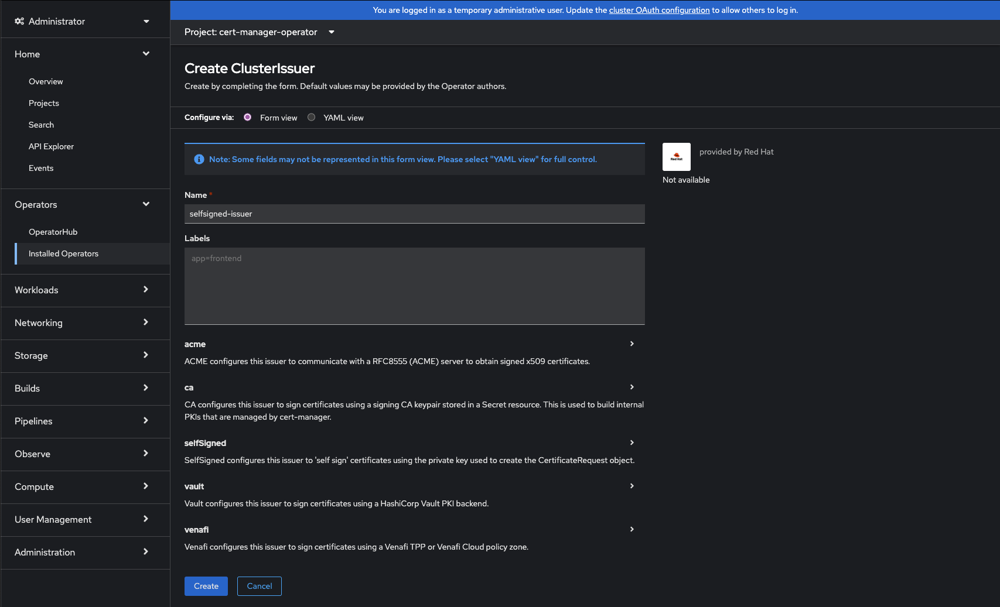
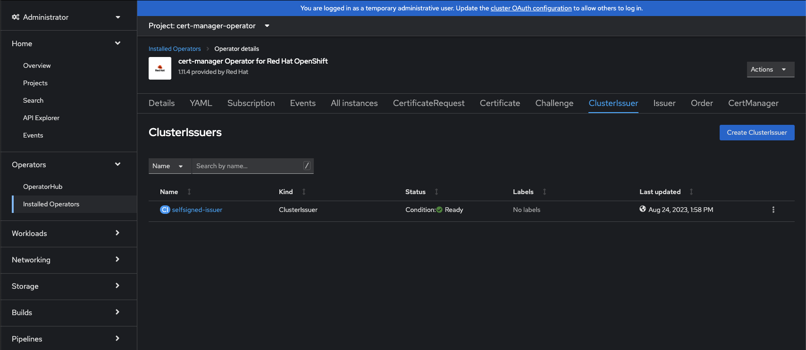

## Introduction

Welcome to another edition of [MeatyBytes.io](/)! Nick Miethe here, your go-to guide in the world of OpenShift, and all things tech.

In today's cloud-driven landscape, managing **TLS** certificates and securing communications have become central concerns for any scalable platform. **TLS/SSL certificates** are a critical component of **TLS** *(Transport Layer Security)*, a cryptographic protocol used to provide end-to-end security over a network, whether it be public (the internet) or private (LAN).

Each time you access a website using `HTTPS` (such as this site!), the server responds with its (TLS/SSL) certificate and key to be used for encrypting all communication. The certificate is verified via its root cert, provided by a certificate authority such as **Let's Encrypt**. This provides assurance that the owner of the site is the only entity with the private key to decrypt your traffic.



### TLS Management

Managing a single TLS certificate for a website is simple enough, often being managed by your hosting provider. However, managing TLS certificates at scale, such as in Kubernetes/OpenShift, can be a complex and time-consuming task, especially with autoscaling or serverless workloads.

Fortunately, [**cert-manager**](https://cert-manager.io/) provides a powerful solution to simplify TLS certificate management.

### Synopsis

This blog post aims to unravel the role `cert-manager` in Kubernetes and explain what the OpenShift **cert-manager Operator** offers over other deployments. Specifically, we'll explore:

* **The Purpose:** Why **cert-manager** is essential and what problems it solves in Kubernetes/OpenShift.
* **The Features:** What makes the OCP **cert-manager Operator** unique, the resources it adds, and how to make the right selections.
* **The Guide:** A comprehensive guide to deploying the operator and implementing TLS certs, complete with tips, tricks, and best practices.

Get ready for a meaty dive into OpenShift's certificate manager!

## Purpose of cert-manager in Kubernetes

[ **cert-manager**](https://github.com/cert-manager/cert-manager/tree/master) is a Kubernetes add-on that automates the management, issuance, and renewal of TLS certificates, and can be used with various Kubernetes resources, such as pods, services, and ingresses.

**cert-manager** adds several Kubernetes resources (*CRDs*), including `Certificate` and `Issuer`, which supports various certificate authorities (CAs), including **Let's Encrypt**. With it, developers can ensure that applications are always serving trusted certificates without manual intervention.

")

## The OpenShift cert-manager Operator Advantage

The **cert-manager Operator**, which was [recently released to GA](https://cloud.redhat.com/blog/the-cert-manager-operator-is-now-generally-available-in-openshift), takes the power of cert-manager to the next level by providing an easy-to-use operator that simplifies the deployment and management of TLS certificates. What makes it so powerful? Let's find out!


Community **cert-manager** Operators have been available in OpenShift & general Kubernetes for years, but were disjointed and still involved manual intervention. Red Hat's newly released Operator solves these prior shortcomings.


### Simplified Deployment

The **cert-manager Operator** provides a single, easy-to-use deployment manifest that includes all the necessary components for cert-manager. This eliminates the need to create and manage multiple manifests for cert-manager and its dependencies.

The Operator can be deployed via CLI or Web Console, and can be included in your other Day 2 automation deployments along with Observability, GitOps, etc (stay tuned for future posts on OpenShift Day 2 Ops!).

### Automated Certificate Management

The **cert-manager Operator** automates the process of creating, renewing, and revoking TLS certificates for multiple deployments. The TLS cert assignment to new *Ingresses* can be fully automated by the **cert-manager's** *ingress-shim* using *Annotations* on Ingress resources:

```yaml
apiVersion: networking.k8s.io/v1
kind: Ingress
metadata:
  name: ingress-meaty
  annotations:
    cert-manager.io/cluster-issuer: letsencrypt-issuer
...
```

This saves time and reduces the risk of errors that can occur when managing certificates manually.

### Namespace Isolation

The **cert-manager Operator** enables the deployment of a `Certificate` resource from a given **CA** cluster-wide via the `ClusterIssuer`, as well as limited per namespace using `Issuer`, or a mix of both.

These **CRDs** provide admins granular control of TLS cert usage and allows isolated certificate management per namespace as needed, while still providing centralized management of other certs.

### Customizable Certificate Configurations

The **cert-manager Operator** allows for customizing certificate configurations, such as choosing the certificate authority, setting up certificate renewal, and configuring certificate secrets.

The Operator can also be configured for cluster-wide egress proxies as needed, by injecting specific env variables into the Operator subscription. See more on the [RH Blog post](https://cloud.redhat.com/blog/the-cert-manager-operator-is-now-generally-available-in-openshift).

### Additional Integration

The OpenShift cert-manager Operator takes automation to the next level by integrating seamlessly with the Kubernetes API and existing applications. It leverages existing Kubernetes functionality while allowing extensive customization.

For example, the Operator can be integrated with the OpenShift **Prometheus Operator** via a `ServiceMonitor` to scrape controller metrics, even monitoring user-defined projects via setting `enableUserWorkload: true` in the cluster monitoring `ConfigMap`.

## Guide: Deploying OpenShift cert-manager Operator

Now, let's roll up our sleeves and explore how to deploy the cert-manager Operator and TLS certs to two different deployments in two different namespaces.

### Operator Resources Overview

The **cert-manager Operator** consists of several custom Kubernetes resources.

#### Issuer Types: Resource

If you need to use a CA across multiple namespaces and aren't concerned with isolation of the management of the CA issuer, you should use `ClusterIssuer` which is cluster-wide. Alternatively, you could deploy an `Issuer` per namespace.

---

 **Note**: While `Issuer`'s are localized to a single namespace, and thus are all secrets, `ClusterIssuer` is cluster-wide. Therefore, it is important to remember *which namespace* to use when referencing resources, such as with `secretName`.

The default **Cluster Resource Namespace** is `cert-manager`, but it can be changed via the `cert-manager-controller` as follows:

```bash
--cluster-resource-namespace=custom-cluster-namespace
```

---

#### Issuer Types: CA

There are [several](https://cert-manager.io/docs/configuration/selfsigned/) types of certificate authorities (**CAs**) which your cert-manager issuers can represent: *SelfSigned, CA, Vault, Venafi, and ACME*. You can also choose an *External* issuer type, using a non-listed issuer.

Generally, people tend to use *SelfSigned* for testing or lab situations, as it is the simplest to deploy since it doesn't require a CA cert bundle. The *CA* type allows for storing your TLS cert and private key bundle as a Kubernetes `secret`, whereas the *Vault* type uses CA bundles stored within a [HashiCorp Vault](https://www.vaultproject.io/).

The most commonly used issuer type in production environments is *ACME*, providing direct access to CAs such as LetsEncrypt and Cloudflare. When a client requests a `Certificate` resource via an *ACME* issuer, they must complete a "Challenge" - HTTP01 or DNS01. DNS challenges can be useful for situations such as wildcard certs, where you want to list the specific DNS names to match to.

### Step 1: Install the cert-manager Operator

First, make sure your OpenShift environment is up and running. Then install the cert-manager Operator via the OperatorHub using 1 of 2 options:

#### Step 1a: CLI

```bash
oc apply -f https://github.com/jetstack/cert-manager/releases/download/v1.3.1/cert-manager.yaml
```

#### Step 1b: Web Console

Use the OCP Web Console to install the Operator. Make sure it is the correct one!


{{< carousel images="{cert-mgr-oh-*}" interval="0" >}}
> Install flow of **cert-mgr Operator** from OperatorHub. Click to view larger: [1](cert-mgr-oh-1.png), [2](cert-mgr-oh-2.png), [3](cert-mgr-oh-3.png)

### Step 2: Deploy Issuer Resource

Once the operator is installed, you can configure it with certificate authorities (**CAs**) to issue and sign your TLS certs. As mentioned above, you have [2 options](https://cert-manager.io/docs/configuration/) here: `ClusterIssuer` and `Issuer`.

Choose your issuer type from above based on your needs and deploy it. We will be deploying a `ClusterIssuer` using a *SelfSigned* type:



If deploying via yaml directly, it should look like this:

```yaml
apiVersion: cert-manager.io/v1
kind: ClusterIssuer
metadata:
  name: selfsigned-issuer
spec:
  selfSigned: {}
```



If you were deploying an issuer type such as *CA*, you would also need to create a `Secret` with your CA bundle:

```yaml
apiVersion: v1
kind: Secret
metadata:
  name: ca-key-pair
  namespace: cert-manager
data:
  tls.crt: {insert-your-tls-crt}
  tls.key: {insert-your-tls-key}
```

Remember to change your `namespace` if not using `ClusterIssuer`, or if you've changed your default namespace.

### Step 3: Deploy TLS Certificates

There are a couple of routes to deploy a TLS Certificate via the **cert-manager Operator**. The standard method is via a `CertificateRequest` resource. This requests a cert from the chosen issuer, creating a `Certificate` resource in response.

However, the OpenShift Operator provides another, more automated method via *Annotations*. This allows a deployment to request a `Certificate` be issued simply by including an `annotation` in its `Ingress` resource. This would look as follows in our cluster:

```yaml
apiVersion: networking.k8s.io/v1
kind: Ingress
metadata:
  name: ingress-selfsigned-test
  annotations:
    cert-manager.io/cluster-issuer: selfsigned-issuer
spec:
  ...
  tls:
  - hosts:
    - <hostname>
    secretName: ingress-secret-selfsigned-test
```

You can find all supported *Annotations* in the cert-manager [documentation](https://cert-manager.io/docs/usage/ingress/#supported-annotations).

### Step 4: Validate Certificate

You can then verify that you TLS cert exists associated with your `Ingress` resource.

```bash
$ oc get cert -o wide
NAME             READY   SECRET                          ISSUER              STATUS     AGE
ingress-secret   True    ingress-secret-selfsigned-test  selfsigned-issuer   Certificate is up to date
```

## Conclusion

The OpenShift cert-manager Operator is more than just a convenient tool; it's an essential aspect of modern and secure application deployment. Through automation, scalability, and seamless integration, it brings robust certificate management to your fingertips.

By following our step-by-step guide, you have learned how to deploy the operator and TLS certificates across your cluster, ensuring that your applications are always serving trusted certificates. Now go out and use your own certs, whether it be for your workloads or even [customizing the web console](/posts/openshift/ocp-features/security/tls/customizing-console) for your OCP cluster!

### References

1. [cert-manager ](https://github.com/cert-manager/cert-manager)
2. [cert-manager Operator GA Announcement | ](https://cloud.redhat.com/blog/the-cert-manager-operator-is-now-generally-available-in-openshift)
3. [How to issue Let's Encrypt Wildcard certificate with acme.sh - nixCraft](https://www.cyberciti.biz/faq/issue-lets-encrypt-wildcard-certificate-with-acme-sh-and-cloudflare-dns/)
4. [Configure LE certificates with Cert Manager](https://gist.github.com/timroster/732acbc2c75a544bb0ab133da7e78f6f) - using prior community operators
