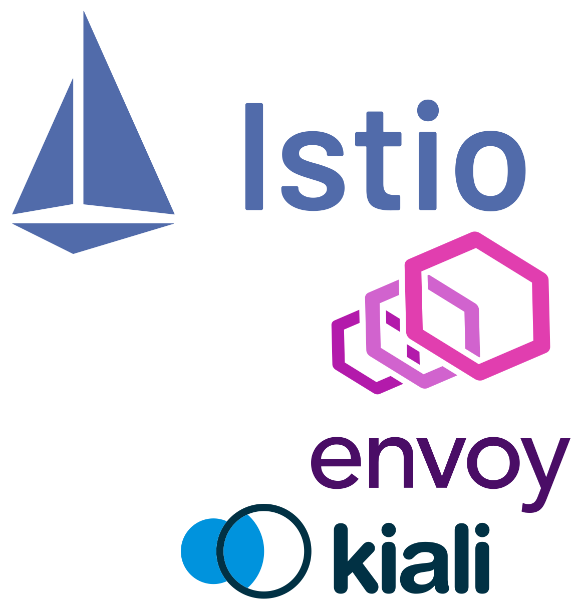
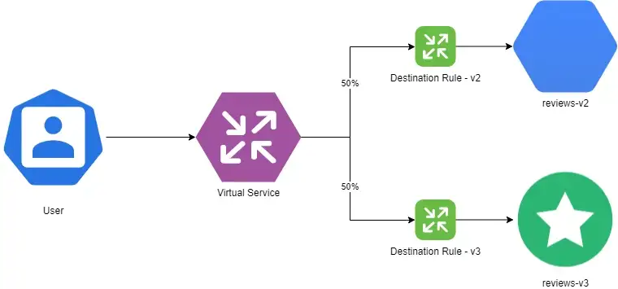
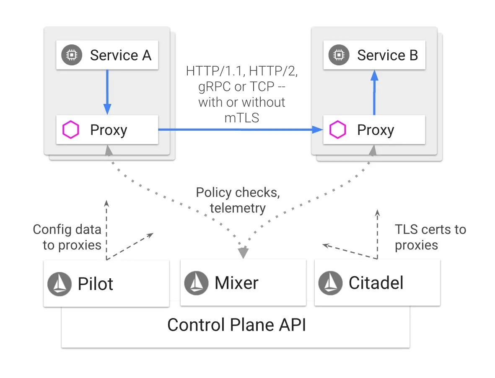
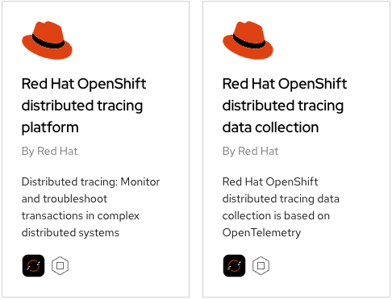
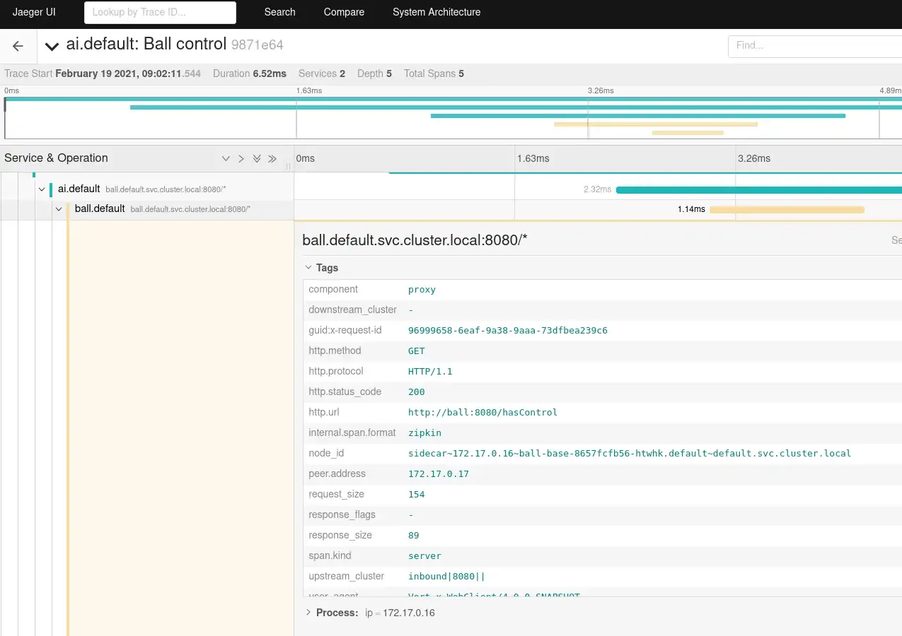
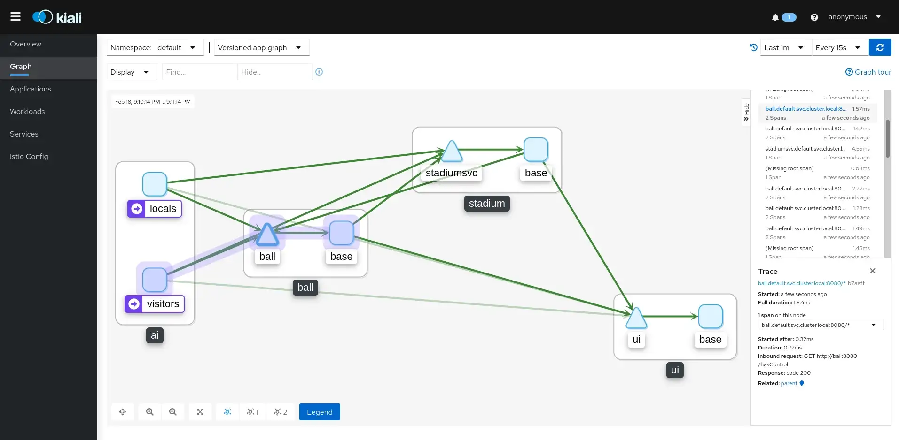

## Introduction

Navigating the labyrinthine world of microservices often means grappling with complex orchestration, load-balancing, and an intricate tapestry of inter-service communication. Enter the Service Mesh - simplifying and streamlining these complexities while improving functionality (nearly) across the board, all at the Application Layer.

However, service meshes are notoriously complex to understand, let alone configure and manage. This is in part due to the extreme degree of heavy-lifting which a typical service mesh performs to enable its suite of capabilities. Does it sound like a service mesh would be more trouble than it's worth? Sometimes that might be the case!

Fortunately, Red Hat again stepped in with a solution for your OpenShift clusters. While still not exactly simple, this package of Istio, Envoy, and other popular open source technologies brings the value of a service mesh to a cluster near you with minimal headaches!

### Synopsis

Today on [MeatyBytes.io](/), we'll delve deep into **Red Hat OpenShift Service Mesh's** capabilities, its nuances in comparison to upstream projects, and the optional yet powerful features it offers, like tracing and visualization. For those who thrive on details, we'll also dissect the technical intricacies that empower these functionalities. Let's connect those dots!

## What is a Service Mesh?

Service Meshes were originally designed as a dedicated Layer 7 infrastructure layer to facilitate a very specific need in Microservices-oriented Architectures (MOA) - service-to-service communication, or *proxying*.

> the service mesh is ultimately a repackaging of functionality; a shift in where, not what<cite>[^1]</cite>

[^1]: William Morgan, [The New Stack](https://thenewstack.io/history-service-mesh/#:~:text=Instead%2C%20the%20service%20mesh%20is,not%20what.)


Over time, the functionality of service meshes have continued to evolve, while still maintaining that base functionality. Some of these capabilities were even incidental, such as tracing, due to the insights into all inter-service communications provided by the proxies.

Today, the typical service mesh provides capabilities such as:

* **Traffic management** - Intelligent routing, failovers, A/B testing, etc.
* **Observability** - Metrics, tracing, visualization of service-to-service calls.
* **Security** - mTLS authentication and authorization between services.
* **Resiliency** - Retries, timeouts, circuit breaking, etc.

Announced at *GlueCon 2017* as a collaboration between Google, IBM, and Lyft, **Istio** was an early entrant to the market, enabling service proxying in an early Kubernetes.<cite>[^2]</cite>



[^2]: [Managing microservices with the Istio service mesh | Kubernetes](https://kubernetes.io/blog/2017/05/managing-microservices-with-istio-service-mesh/)

To this day, **Istio** is still one of the most popular and powerful open source service mesh projects. It provides these capabilities by deploying a control plane alongside application services, which configures **Envoy** proxy sidecars to mediate and control all network communication between services.

There are numerous other options available, however, including *Consul*, *Linkerd*, and *Kuma*, each with its own solution for the same problems.

### How OpenShift Service Mesh Compares to Upstream Istio

**Red Hat OpenShift Service Mesh** (RH OSSM) is a distribution of **Istio** which combines other technologies such as **Envoy** and **Kiali** and integrates Red Hat's enterprise-grade support and other value-added features.



*OSSM* offers:

* **OpenShift Integration:** Tighter integration and certification for Red Hat OpenShift.
* **Advanced Security:** Additional security hardening not found in upstream Istio.
* **Enterprise Support:** Red Hat's enterprise-grade customer support is unparalleled, extending to all components of the service mesh, all via OCP licenses (no additional charge!). Additionally, longer support lifespan compared to fast-moving open source projects.


**Misconception Alert:** Unlike other platform-specific meshes, **OpenShift Service Mesh** is an included (free) offering for usage within your OpenShift environments. It is designed to be the best possible service mesh solution for OpenShift, NOT yet another profit-generator.


While **OpenShift Service Mesh** has lagged behind the upstream Istio project due to hardening, integration, etc, *Jamie Longmuir* (Principal Product Manager for RH Service Mesh) announced at Red Hat Summit '23 that it would be converging with the upstream Istio in **OSSM v3**, with ETA in early '24.

This convergence will enable a more seamless experience and bring a host of additional capabilities, including **Ambient Mesh** and *mixed-Kubernetes distro deployments* (service meshes across OCP AND K8s clusters). Additionally, Red Hat is a major contributor to Istio, and, like with other OSS projects, pushes enhancements upstream, and the convergence will enable this further.



## Capabilities of OpenShift Service Mesh

As mentioned above, service meshes offer several capabilities in addition to the base functionality of service-to-service proxying. **OpenShift Service Mesh** is no exception, offering several key capabilities as explored below.

While less complex to manage than a community-sourced mesh, including the upstream Istio, I still generally only recommend clients utilize **OpenShift Service Mesh** when their needs bridge multiple of the below categories. This is because there is typically a simpler solution for each individual capability a mesh offers.

### Traffic Management

OpenShift Service Mesh lets you control the flow of traffic and API calls between services. For example, you can route traffic based on weights, HTTP headers, etc. This is useful for advanced traffic routing like canary deployments, blue-green deployments, A/B testing, etc. This is a crucial aspect of a service mesh, and can be an absolute necessity for certain applications or deployments.

This is achieved through Envoy's configurable proxying functionality, which can be controlled using `Destination Rules` and other configuration options.

#### Resilience

The advanced traffic routing features from above provides considerable resilience capabilities, forming the foundation of many highly-available (HA) deployment patterns. For example, `Virtual Services` can be configured to *load balance* traffic between multiple services based on various parameters, such as geographic origination, utilization, or even pre-determined ratios. Other options, such as **Circuit Breakers**, provide additional capabilities for resilient deployments.



OpenShift Service Meshes can also stretch across clusters, providing HA options for the cluster and mesh control planes as well. This is further expanded in OpenShift when paired with other integrations, such as **Advanced Cluster Management** and **Submariner**, which allow for individual deployments being stretched across multiple clusters. See our recent [post on ACM](/posts/openshift/architecture/hybrid-cloud/acm-patterns/) for more information!

#### Migrations & Updates

Features such as A/B and Canary deployments, using similar configurations in OpenShift Service Mesh as above, enable the updating or migration of services or entire clusters, all without downtime.

For example, if Service A is being updated, Service B can be deployed alongside it, slowly moving traffic to the new service over time with `Destination Rules`.

#### Chaos Testing

In addition to enabling seamless migrations and updates, the same features can also be used to test new features or services. Additionally, Envoy enables **fault injection**, allowing resilience and recovery features to be tested live via the same technologies protecting your services. This can even be automated for additional chaos engineering.

### Observability

OpenShift Service Mesh integrates with tools like Kiali, Jaeger, and Prometheus to give observability into your service mesh.

**Kiali** provides graphical network topology visualization of services, and metrics on RPCs between them. **Jaeger** enables distributed tracing and **Prometheus** offers metrics collection and querying. All of the above integrate into OpenShift's native observability stack as well for a seamless experience. Additionally, **OpenTelemetry** (OTel) is supported, greatly expanding this capability.

These capabilities are hugely valuable for understanding and debugging complex microservices architectures.

#### Tracing

While already mentioned above, Tracing is such a critical, yet incidental, capability of a service mesh that many companies will deploy one purely for this purpose. In addition to the default support for **Jaeger** and **OTel**, OpenShift Service Mesh also supports other options such as **Zipkin**.

Specifically, the mesh enables distributed tracing of requests as they propagate through a system, providing insights into service communication patterns and performance.

### Security & Access

OpenShift Service Mesh secures service-to-service communication via *mutual TLS*, or **mTLS**. It can also enforce fine-grained access control policies between services using the **SPIFFE** identity standard, as well as integration with OpenShift's security features, such as network policies and role-based access control (RBAC).

For example, you can require that Service A is only accessible to Service B but not Service C. This increases security in modern dynamic microservices environments through isolation.

#### AAA Proxying

In addition to the inherent security capabilities mentioned above, a service mesh can enable mesh-wide authentication and authorization of traffic to or between services, all via central configuration and administration.

For example, SSO could be applied at the service mesh-level, requiring users to authenticate upon accessing any service within the mesh, all without any configuration changes at the service-level.

### Service Proxying

OpenShift Service Mesh, or specifically **Envoy**, acts as a proxy between services, allowing for efficient communication and reducing the need for direct client-to-client communication. While being necessary for many of the capabilities listed above, it also enables direct service proxying.

SSO proxying is one example of this as mentioned above. However, the same idea can extend to any other platform service your deployments require, such as a backend DB. By controlling the connection at the mesh layer, it enables further abstraction between development teams and platform teams, separating logic and platform at the deployment level, vs the container.

### The Details: Istio and Envoy

At its core, **OpenShift Service Mesh** leans heavily on Istio's control plane and Envoy's data plane. **Istio** provides the rules, logs, and policies that govern the interactions, while **Envoy** acts as the smart proxy deployed alongside your services.



#### Technical Specifics

For example, OpenShift Service Mesh employs a similar Envoy-based sidecar container pattern for each pod in your OpenShift or Kubernetes cluster. These sidecars intercept traffic to and from microservices, thus enabling functionalities like load balancing, circuit breaking, and timeout handling.

```yaml
apiVersion: networking.istio.io/v1alpha3
kind: VirtualService
metadata:
  name: meatybytes
spec:
  hosts:
  - meatybytes.io
  http:
  - match:
    - uri:
        prefix: /posts
    route:
    - destination:
        host: posts
  - match:
    - uri:
        prefix: /series
    route:
    - destination:
        host: series
```

This YAML manifest showcases a simple `VirtualService` custom resource for Istio, which you can similarly use in **OpenShift Service Mesh**.

## Additional Capabilities and Enabling Integrations

**Kiali** and **Distributed Tracing** (Jaeger) are both integrated into **OpenShift Service Mesh** by default, making installation simple. Both should be installed into the same default namespace as the Service Mesh control plane, `ServiceMeshControlPlane` Additionally, both have native UI integrations into the OpenShift Web Console, along with Grafana dashboards and a Prometheus console.

### Prerequisite Operators

Because **OpenShift Service Mesh** relies on the additional capabilities from its native integrations, installation must follow a set order of operations. The installation steps for the **Red Hat OpenShift Service Mesh Operator** must follow this order of Operator installation:

1. **OpenShift Elasticsearch** (Optional)
2. **Red Hat OpenShift distributed tracing**
3. **Kiali**
4. **Red Hat OpenShift Service Mesh**


It is important to only install the above Operators **from Red Hat**, *NOT* Community Operators!


The **OpenShift Elasticsearch Operator** is optional for development or test, as Jaeger is configured to use local storage, but is *required* for deployment in Production. However, it is possible to utilize the Elasticsearch instance from the **OpenShift Logging Operator**, if desired.



While **OpenShift Service Mesh** can NOT be installed without these dependent Operators, each can be installed independently if there is a need. See more on the core differences between the Red Hat and Community Operators [here](https://docs.openshift.com/container-platform/4.13/service_mesh/v2x/ossm-vs-community.html#ossm-kiali-service-mesh_ossm-vs-istio).

### Tracing with Jaeger

Understanding how your services communicate is vital for efficient troubleshooting. OpenShift Service Mesh supports distributed tracing through its Jaeger integration.



#### How It Works

Jaeger collects timing data from your application and stores it, allowing you to visualize timelines of requests as they propagate through various services.

### Visualization through Kiali

Knowing is half the battle; the other half is being able to visualize that knowledge. Kiali is an observability console for Istio, fully integrated into OpenShift Service Mesh.



#### What You Can Do

With Kiali, you can:

* Visualize your service mesh topology.
* Inspect mTLS configurations.
* Validate Istio configurations.

## Conclusion

**Red Hat OpenShift Service Mesh** is not just an enterprise-friendly adaptation of upstream projects like Istio and Envoy; it's the total package. From robust tracing capabilities with Jaeger to insightful visualizations through Kiali, the platform brings a host of functionalities that are indispensable for anyone dealing with complex microservice architectures. It thrives in synergy with OpenShift and provides a safety net of enterprise support, making it a leading choice for modern DevOps environments.

While no service mesh is particularly easy to deploy or manage, OpenShift Service Mesh is leaps and bounds simpler than even its upstream counterparts. Sure, some of the newest features from upstream will consistently be several releases behind in the OpenShift Service Mesh due to hardening requirements, but even this will be minimized w/ the upcoming convergence in *OSSM v3*!

If you're running OpenShift, or are considering it, and could utilize some of the capabilities which a service mesh offers, certainly consider checking out the included OpenShift Service Mesh! Stay tuned for next time where we will dive into more example configurations for deploying OpenShift Service Mesh and integrating with some example deployments.

## Further Reading

* [4 steps to run an application under OpenShift Service Mesh | Red Hat Developer](https://developers.redhat.com/articles/2023/01/30/run-app-under-openshift-service-mesh)
* [Networks, Openness, Istio (The Future of Networks Part 4) – Data Gravitas](https://datagravitas.com/2017/05/25/networks-openness-istio-the-future-of-networks-part-4/)
* [Red Hat OpenShift Service Mesh - Red Hat Ecosystem Catalog](https://catalog.redhat.com/software/container-stacks/detail/5ec53e8c110f56bd24f2ddc4)
* [Service Mesh 2.x | OpenShift Container Platform 4.13](https://access.redhat.com/documentation/en-us/openshift_container_platform/4.13/html-single/service_mesh/index)
* [Istio Fundamentals](https://istio.io/latest/about/service-mesh/)
* [Envoy Proxy](https://www.envoyproxy.io/)
* [Jaeger Tracing](https://www.jaegertracing.io/)
* [Kiali](https://kiali.io/)
* [Design Considerations at the Edge of the ServiceMesh](https://cloud.redhat.com/blog/design-considerations-at-the-edge-of-the-servicemesh)
