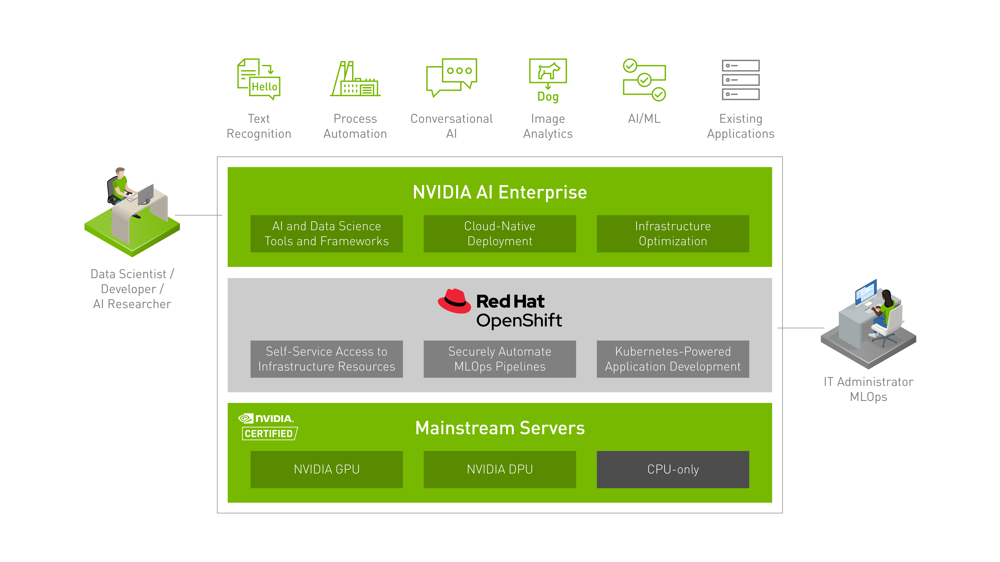

## Introduction

Hello, tech enthusiasts! Nick Miethe here from MeatyBytes.io. In our previous post, we explored **OpenShift Virtualization** in detail. Today, we're taking it a step further by discussing how to deploy virtual machines (VMs) in OpenShift Virtualization with NVIDIA GPUs enabled.

This setup is particularly useful for machine learning (ML) model training, graphics display, and other GPU-intensive tasks. If you haven't already, I recommend you check out our [AI/ML](/series/ai/ml-ocp-tooling/) and [OpenAI on OCP](/series/openai-on-openshift/) series as well. So, let's dive in!



## Hardware Requirements

To enable NVIDIA GPUs in OpenShift Virtualization, you'll need the following hardware:

* A server with one or more NVIDIA GPUs installed. The specific GPU model will depend on your workload requirements.
* A CPU that supports virtualization. This is necessary for running VMs in OpenShift.

## GPU Passthrough Technology

The technology that allows GPU passthrough to KubeVirt VMs is the [Kubernetes Device Plugin framework](https://kubernetes.io/docs/concepts/extend-kubernetes/compute-storage-net/device-plugins/). This framework allows resources like GPUs to be managed and allocated to Pods and VMs in a Kubernetes cluster.

For NVIDIA GPUs, the [NVIDIA](https://github.com/NVIDIA/k8s-device-plugin) Kubernetes Device Plugin is used. This plugin discovers the GPUs on each node in the cluster and advertises them to the Kubernetes scheduler. When a Pod or VM is scheduled to run on a node, the scheduler can allocate one or more GPUs to it.

")

## Deploying VMs with NVIDIA GPUs

Now, let's look at how to deploy a VM with NVIDIA GPUs in OpenShift Virtualization.

### Step 1: Install the NVIDIA GPU Operator

The **NVIDIA GPU Operator** manages the GPU resources in your OpenShift cluster. To install it, you can use the OperatorHub in the OpenShift web console:

1. Navigate to the OperatorHub and search for "NVIDIA GPU Operator".
2. Click on the NVIDIA GPU Operator and then click "Install".
3. Follow the prompts to complete the installation.

### Step 2: Enable GPU Passthrough

Next, you need to enable GPU passthrough for KubeVirt. This can be done by creating a `KubeVirt` custom resource with the `spec.configuration.developerConfiguration.featureGates` field set to `GPU`:

```yaml
apiVersion: kubevirt.io/v1
kind: KubeVirt
metadata:
  name: kubevirt
  namespace: kubevirt
spec:
  configuration:
    developerConfiguration:
      featureGates:
      - GPU
```

### Step 3: Create a VM with a GPU

Finally, you can create a VM with a GPU. In the VM's YAML definition, you need to add a `gpus` field under `spec.domain.devices` and specify the number of GPUs and the GPU vendor:

```yaml
apiVersion: kubevirt.io/v1
kind: VirtualMachine
metadata:
  name: meatyvm
spec:
  running: false
  template:
    metadata:
      labels:
        kubevirt.io/domain: meatyvm
    spec:
      domain:
        devices:
          disks:
          - disk:
              bus: virtio
            name: containerdisk
          gpus:
          - deviceName: nvidia.com/GPU
            name: gpu1
        resources:
          requests:
            memory: 1G
      volumes:
      - name: containerdisk
        containerDisk:
          image: kubevirt/cirros-container-disk-demo
      - name: gpu1
        hostDisk:
          path: "/dev/nvidia0"
          type: Disk
```

This configuration will allocate one NVIDIA GPU to the VM.

## Conclusion

Leveraging NVIDIA GPUs in OpenShift Virtualization opens up a world of possibilities for GPU-intensive tasks like ML model training. By following the steps outlined in this post, you can set up your own GPU-enabled VMs in no time.

Remember, the specific hardware and GPU model you choose will depend on your workload requirements. So, take the time to evaluate your needs carefully. Also, this example provisions an entire GPU to a single VM. To split up a supported GPU and use its vGPUs requires quite a bit of additional configuration. Look out for a post on this in the future, and in the meantime see below for a RH blog post addressing the issue.

That's all for now, folks!

## References

1. [OpenShift Virtualization Documentation](https://docs.openshift.com/container-platform/4.13/virt/about-virt.html)
2. [Enabling vGPU in a Single Node using OpenShift Virtualization](https://cloud.redhat.com/blog/enabling-vgpu-in-a-single-node-using-openshift-virtualization)
3. [NVIDIA GPU Operator](https://docs.nvidia.com/datacenter/cloud-native/gpu-operator/getting-started.html)
4. [KubeVirt Documentation](https://kubevirt.io/user-guide/)
5. [Powering GeForce NOW with KubeVirt, from OpenShift Commons Gathering, Amsterdam 2023](https://cloud.redhat.com/blog/powering-geforce-now-with-kubevirt-from-openshift-commons-gathering-amsterdam-2023)
6. [NVIDIA GPU Operator: Simplifying GPU Management in Kubernetes | NVIDIA Technical Blog](https://developer.nvidia.com/blog/nvidia-gpu-operator-simplifying-gpu-management-in-kubernetes/)
