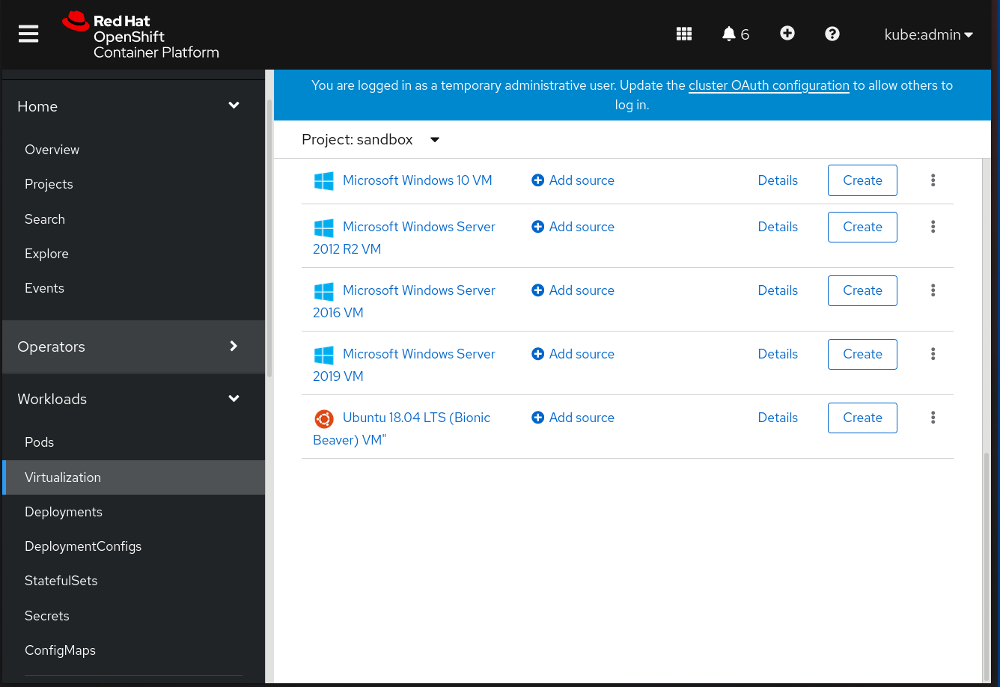

## Introduction

Greetings, tech enthusiasts! Nick Miethe here from [MeatyBytes.io](https://meatybytes.io). Today, we're going to explore various purpose-built virtual machines (VMs) that you can host on **OpenShift Virtualization**. In the post we'll cover:

* VS Code development environment
* Kali Linux security testing machine
* Windows 10 gaming machine with GPU pass-through
* a smart home VM with Zigbee USB pass-through

We'll also touch on how OpenShift Pipelines (Tekton) and GitOps (ArgoCD) could be used for the deployments, with deeper dives coming soon. So, let's get started!



## Development Environment: VS Code Server

A VM running VS Code Server provides a cloud-based development environment that you can access from anywhere. Here's an example configuration:

```yaml
apiVersion: kubevirt.io/v1
kind: VirtualMachine
metadata:
  name: vscode-server
spec:
  running: false
  template:
    metadata:
      labels:
        kubevirt.io/domain: vscode-server
    spec:
      domain:
        devices:
          disks:
          - disk:
              bus: virtio
            name: containerdisk
        resources:
          requests:
            memory: 2G
            cpu: 2
      volumes:
      - name: containerdisk
        containerDisk:
          image: codercom/code-server
```

You can use Tekton to automate the deployment of this VM. Create a Tekton Pipeline that applies this YAML configuration using `kubectl`, and use OpenShift GitOps to trigger the pipeline whenever changes are pushed to your Git repository.

## Security Testing Machine: Kali Linux

A VM running Kali Linux provides a dedicated environment for security testing. Here's an example configuration:

```yaml
apiVersion: kubevirt.io/v1
kind: VirtualMachine
metadata:
  name: kali-linux
spec:
  running: false
  template:
    metadata:
      labels:
        kubevirt.io/domain: kali-linux
    spec:
      domain:
        devices:
          disks:
          - disk:
              bus: virtio
            name: containerdisk
        resources:
          requests:
            memory: 4G
            cpu: 4
      volumes:
      - name: containerdisk
        containerDisk:
          image: kalilinux/kali-rolling
```

Again, you can use Tekton and OpenShift GitOps to automate the deployment of this VM.

## Gaming Machine: Windows 10 with GPU Pass-Through

A VM running Windows 10 with GPU pass-through provides a high-performance gaming environment. Here's an example configuration:

```yaml
apiVersion: kubevirt.io/v1
kind: VirtualMachine
metadata:
  name: windows-gaming
spec:
  running: false
  template:
    metadata:
      labels:
        kubevirt.io/domain: windows-gaming
    spec:
      domain:
        devices:
          disks:
          - disk:
              bus: virtio
            name: containerdisk
          gpus:
          - deviceName: nvidia.com/GPU
            name: gpu1
        resources:
          requests:
            memory: 16G
            cpu: 8
      volumes:
      - name: containerdisk
        containerDisk:
          image: windows/servercore
      - name: gpu1
        hostDisk:
          path: "/dev/nvidia0"
          type: Disk
```

This configuration requires the NVIDIA GPU Operator to be installed and GPU passthrough to be enabled, as discussed in our [previous post](nvidia vms).

## Smart Home VM: Zigbee USB Pass-Through

A VM with Zigbee USB pass-through can serve as a hub for your smart home devices. I personally have used a similar configuration for a [Home Assistant](https://www.home-assistant.io/) deployment. Here's an example configuration:

```yaml
apiVersion: kubevirt.io/v1
kind: VirtualMachine
metadata:
  name: smart-home
spec:
  running: false
  template:
    metadata:
      labels:
        kubevirt.io/domain: smart-home
    spec:
      domain:
        devices:
          disks:
          - disk:
              bus: virtio
            name: containerdisk
          hostDevices:
          - deviceName: zigbee-usb
            name: usb1
        resources:
          requests:
            memory: 1G
            cpu: 1
      volumes:
      - name: containerdisk
        containerDisk:
          image: homeassistant/home-assistant
      - name: usb1
        hostDisk:
          path: "/dev/ttyUSB0"
          type: Disk
```

This configuration requires the USB device to be available on the host at the specified path (`/dev/ttyUSB0`).

## Conclusion

OpenShift Virtualization offers a flexible platform for hosting a wide range of VMs, from development environments to gaming machines. The true beauty of OCP-V is that you can use all of the same tooling for your VMs as you do for your containers. For example, by leveraging Tekton and OpenShift GitOps, you can automate the deployment of these VMs and ensure they're always up-to-date with your latest configurations.

## References

1. [OpenShift Virtualization Documentation](https://docs.openshift.com/container-platform/4.13/virt/about-virt.html)
2. [Example of Deploying a Windows VM from a Template Using Openshift Virtualization](https://myopenshiftblog.com/example-of-deploying-a-windows-vm-from-a-template-using-openshift-virtualization/)
3. [Creating a VM Using the OpenShift Web Console](https://cloud.redhat.com/blog/creating-a-vm-using-the-openshift-web-console)
4. [kubevirt/examples ](https://github.com/kubevirt/kubevirt/tree/main/examples)
5. [OpenShift Virtualization (CNV/KubeVirt) - OpenShift Examples](https://examples.openshift.pub/kubevirt/)
6. [NVIDIA/gpu-operator ](https://github.com/NVIDIA/gpu-operator)
7. [How to install the NVIDIA GPU Operator with OpenShift](https://access.redhat.com/solutions/4908611)
8. [Killercoda Interactive Environments](https://killercoda.com/kubevirt/scenario/kubevirt-101)
