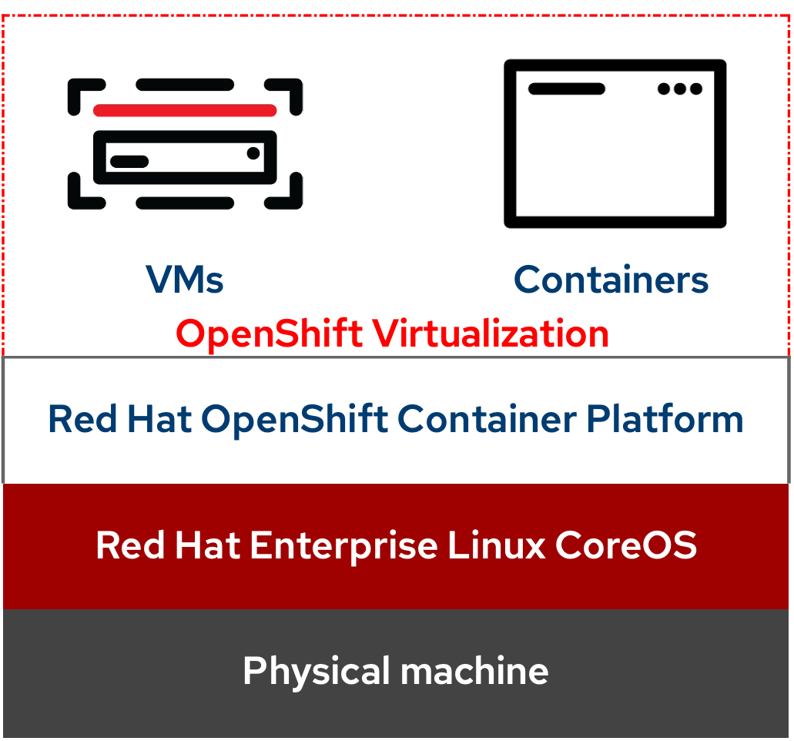
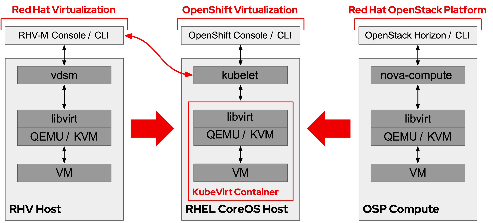
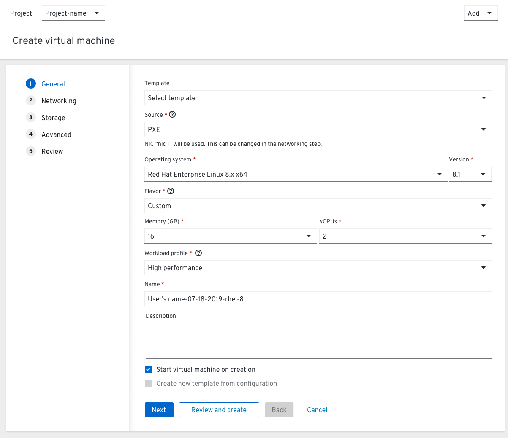

## Introduction

Hello, tech enthusiasts! Today, we're diving into the world of **OpenShift Virtualization** (OCP-V). We'll explore what it is, the technologies it consists of, and when it should be used. We'll also compare it to **Red Hat Virtualization** and **OpenStack**, providing example configurations for deploying a workload on each platform. So, whether you're a seasoned pro or a curious newbie, this post is for you. Let's get started!

## What is OpenShift Virtualization?

**OpenShift Virtualization** is a native and included feature of Red Hat OpenShift that allows you to run and manage virtual machine workloads alongside container workloads. It's built on the KubeVirt project, which extends Kubernetes by adding additional virtualization resource types through Kubernetes’ Custom Resource Definitions (CRDs).

OpenShift Virtualization brings traditional virtualization capabilities alongside containers in the cloud-native environment of OpenShift, allowing developers to modernize existing applications or create new, cloud-native applications that incorporate virtual machines.



## Technologies in OpenShift Virtualization

OpenShift Virtualization leverages several technologies:

* [**KubeVirt**](https://kubevirt.io/): This is the core technology that enables virtualization in Kubernetes. It allows the definition and management of virtual machines using standard Kubernetes APIs.
* **Containerized Data Importer (CDI)**: This is used for importing, uploading, and cloning Virtual Machine Disks (VMDKs).
* **Hostpath Provisioner**: HPP allows configuring local storage for utilization by VMs.
* **Kubernetes Device Plugins**: These are used for GPU and other hardware resources to be accessed by virtual machines. We will talk more about NVIDIA's GPU plugin in [a future post]().
* **Multus**: This is a CNI plugin that allows a Pod to have multiple network interfaces.

## When to Use OpenShift Virtualization

OpenShift Virtualization is ideal when you want to:

* Modernize legacy applications by migrating them to a cloud-native platform without the need for refactoring.
* Develop new applications that require the combination of both virtual machines and containers.
* Consolidate your infrastructure by running both VM-based and container-based workloads on a single platform.

## OpenShift Virtualization vs. Red Hat Virtualization vs. OpenStack

Now, let's compare OpenShift Virtualization with Red Hat Virtualization and OpenStack.



### OpenShift Virtualization

OpenShift Virtualization is a Kubernetes-native virtualization solution. It's integrated into OpenShift, allowing you to manage both VMs and containers from a single platform. It's ideal for modernizing legacy applications and developing new cloud-native applications that require VMs.

### Red Hat Virtualization

Red Hat Virtualization is a traditional virtualization solution for managing virtual machines in a data center environment. It's a good choice if you have a large number of VMs and need a robust, mature platform for managing them.

### OpenStack

OpenStack is an open-source cloud computing platform. It provides Infrastructure-as-a-Service (IaaS) and can manage both VMs and containers, but it's more complex to set up and manage than OpenShift Virtualization.

## Example Configurations

Let's look at how you might deploy a workload on each of these platforms, with an example configuration for OCP-V.

### Configuring OpenShift Virtualization

In OpenShift Virtualization, you would define a VirtualMachine (VM) object using a YAML file. This file would specify the VM's resources, such as CPU, memory, and storage, as well as the VM's image.

```yaml
apiVersion: kubevirt.io/v1
kind: VirtualMachine
metadata:
  name: meaty-vm
spec:
  running: false
  template:
    metadata:
      labels:
        kubevirt.io/domain: meaty-vm
    spec:
      domain:
        devices:
          disks:
          - disk:
              bus: virtio
            name: containerdisk
        resources:
          requests:
            memory: 1G
      volumes:
      - name: containerdisk
        containerDisk:
          image: kubevirt/cirros-container-disk-demo
```



### Configuring Red Hat Virtualization

In Red Hat Virtualization, you would use the web-based Administration Portal or the REST API to create a new VM. You would specify the VM's resources and select a template that defines the operating system and applications to be installed on the VM.

### Configuring OpenStack

In OpenStack, you would use the OpenStack command-line client or the Horizon web interface to launch a new instance. You would specify the instance's resources and select an image or snapshot to use as the basis for the instance.

## Conclusion

OpenShift Virtualization, Red Hat Virtualization, and OpenStack each offer unique capabilities for managing virtual machines. OpenShift Virtualization is a great choice for modernizing applications and developing new cloud-native applications that require VMs. Red Hat Virtualization is a robust solution for managing a large number of VMs, while OpenStack offers a comprehensive cloud computing platform.


I should mention, the typical strategy in IBM and RH has been to move towards OCP-V vs RHV.


Remember, the best choice depends on your specific needs and the nature of your workloads. So, take the time to evaluate each option carefully.

## References

1. [OpenShift Virtualization Documentation](https://docs.openshift.com/container-platform/4.13/virt/about-virt.html)
2. [Virtualization with Red Hat OpenShift](https://www.redhat.com/en/technologies/cloud-computing/openshift/virtualization)
3. [OpenShift virtualization: What's new with virtualization from Red Hat](https://cloud.redhat.com/blog/blog-openshift-virtualization-whats-new-with-virtualization-from-red-hat)
4. [kubevirt/examples ](https://github.com/kubevirt/kubevirt/tree/main/examples)
5. [Creating a VM Using the OpenShift Web Console](https://cloud.redhat.com/blog/creating-a-vm-using-the-openshift-web-console)
6. [OpenStack Documentation](https://docs.openstack.org/)
7. [KubeVirt Documentation](https://kubevirt.io/user-guide/)

That's all for today, folks! Stay tuned for more exciting posts in this series, plus many other topics on [MeatyBytes.io](https://meatybytes.io). And remember, if you or your company are considering a move to OpenShift Virtualization, whether it be a totally new deployment or a mass migration, then please reach out to schedule an assessment with my architects!
