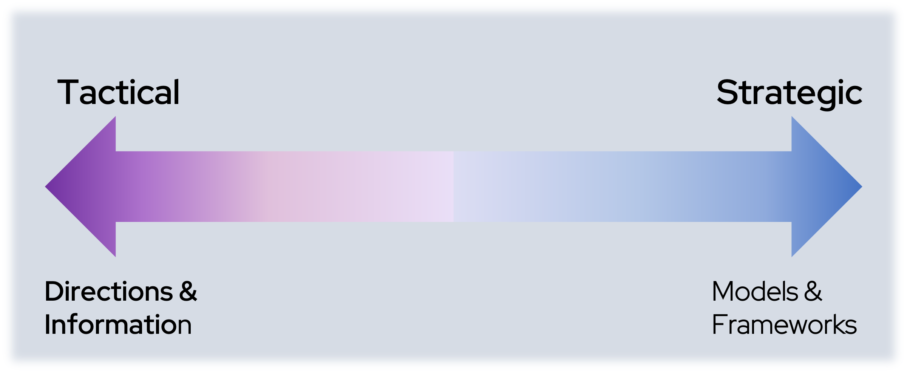

## Introduction

Hello, fellow tech enthusiasts! I'm **Nick Miethe**, your go-to guide in the vibrant world of Platform Engineering and DevSecOps, armed with insights gathered from a decade of helping enterprises undergo total business transformation. If you're into OpenShift, servers, networking, or just love getting your hands dirty with cool tech, you've found the right place. Welcome back to [MeatyBytes.io](/).

Today, we're stepping into the realm of an often-underestimated powerhouse of knowledge and persuasion — **technical whitepapers**. Whether you're a Platform Engineer, a Sales Engineer, or a key decision-maker in the world of DevOps, the whitepaper is an indispensable tool in your toolkit.

But why are whitepapers so crucial?

### Synopsis

In the fast-paced world of Platform Engineering and DevOps, staying on top of the latest trends and advancements is paramount. One of the key resources professionals turn to for in-depth knowledge are Whitepapers. **Technical whitepapers** are a cornerstone of effective thought leadership and business strategy behind successful products, platforms, and protocols. They provide the why and how of solutions, directly influencing strategies and decision-making processes. They are the crystal balls that offer glimpses into future tech trends and the potential impacts of emerging technologies. This understanding is crucial, especially in the rapidly evolving fields of Platform Engineering and DevOps.

But whitepapers are not only a pivotal tool for **platform engineers** and **sales engineers**; they should also be accessible to **decision-makers** striving to keep their businesses on the cutting edge of technology. This post provides a comprehensive overview of technical whitepapers within the Platform Engineering and DevOps industry, their role, and what makes a good whitepaper.

*In this post*, we'll dissect the art of whitepapers in platform engineering. We'll look at their role, their structure, and how to craft or read one for maximum impact. Along the way, we'll also unravel some of the mystique around whitepapers, transforming them from formidable tomes into accessible, practical resources that can empower you to make informed decisions and advance your career.

The journey ahead promises to be insightful, offering a new perspective on this classic tool of technical communication. So, sit tight, and let's dive in!

## Understanding Technical Whitepapers

Technical whitepapers are comprehensive, authoritative reports or guides designed to inform readers about a complex issue and present the author's philosophy or interpretation of the facts. In the realm of Platform Engineering and DevOps, these whitepapers often delve into topics such as AI integrations, OpenShift implementation, hybrid cloud strategies, and more.

They serve as an invaluable resource for sales engineers to articulate their company's technology offerings in a structured, understandable, and convincing manner. Similarly, platform engineers use these whitepapers to understand different approaches to problem-solving, learn about new tools and techniques, and keep themselves updated with the current state of technology.

It is important to note that not all whitepapers are purely technical. While many papers authored by trustworthy technical organizations, and even businesses for B2B purposes, can be technically-rich and a great introduction to a product or concept, they are also equally beneficial for marketing purposes. Therefore, be aware of both the whitepapers you write and those you read, to ensure the message isn't overstated.

## The Role of Whitepapers

The value of a good whitepaper extends far beyond simply being an informative document. They are used as marketing tools, as noted above, helping to generate leads and demonstrating thought leadership in the respective industry. Whitepapers also aid business transformation, helping decision-makers understand complex technologies such as hybrid cloud environments or AI, thereby enabling them to make informed decisions about adopting these technologies.

That said, a more technical whitepaper isn't inherently *better* than a marketing or sales focus; rather, they simply serve different purposes and are targeted at different audiences. What is important, instead, is that no matter which direction your whitepaper goes, you add some *color* from the other side to help broaden the audience.

### Whitepaper Examples

For example, this recent whitepaper from **Red Hat's Emerging Technologies Office** on [Optimizing development with the time to merge tool](https://next.redhat.com/2023/03/21/optimizing-development-with-the-time-to-merge-tool/) is a highly-technical paper, including code snippets and links to source code.

Similarly, this whitepaper from the **CNCF** - [CNCF Operator White Paper](https://tag-app-delivery.cncf.io/whitepapers/operator/) - provides both a technical overview and a higher-level explanation of the concepts, aimed at multiple personas.

Meanwhile, you'll find reports/whitepapers from **Forrester** or **Gartner** to be targeted more directly at the business side, though can still be quite technical, such as this [Forrester Wave: Infrastructure Automation Q123](https://reprints2.forrester.com/#/assets/2/431/RES178460/report).

### Alternative Personas

While this framework focuses on the difference between technical and non-technical, or business-oriented, audiences, other frameworks instead often consider the target persona's role in decision-making. In fact, Jimmy Daly wrote an [entire article](https://www.animalz.co/blog/content-marketing-personas/) on writing for "pay scales" instead of personas. I personally find personas to fit appropriately into technical whitepapers, but still agree with many of his thoughts!

## What Makes a Good Whitepaper?

The effectiveness of a whitepaper relies on its structure, content, and presentation. Crafting a technical whitepaper requires a specific approach to ensure it resonates with the persona(s) of its intended audience. Let's look at a detailed framework to write an effective technical whitepaper, using the topic "The Value Proposition of Platform Engineering in 2023" as an example.

### Writing Framework for Technical Whitepapers

Writing a technical whitepaper requires a well-defined framework. This guide uses a five-section model, which can be adapted to suit different topics and target audiences. These sections are:

1. Executive Summary
2. Problem Statement
3. Solution Overview
4. Detailed Technical Content
5. Real-World Applications and Case Studies

Let's dig in!

### 1. Executive Summary

Start with a compelling executive summary that provides a high-level overview of the whitepaper. This section should immediately engage the reader and entice them to continue reading.

***Example:***

> "The field of platform engineering has undergone significant evolution in recent years, promising substantial business advantages. This whitepaper explores the current value proposition of platform engineering and its potential impact on businesses in 2023."

If your target audience is more technical, use this section to outline the technological advancements that you will discuss in your paper. However, if your audience includes business and salespeople, focus on the potential business benefits and transformations that these advancements can bring about.

### 2. Problem Statement

The next section should clearly define a problem that is relevant to the topic at hand. The problem should resonate with your audience, driving them to seek a solution. In DevOps and Platform Engineering, this may range from [measuring DevOps performance](), complexities in managing [hybrid cloud environments](/tags/hybrid-cloud), to the pursuit for [improved DevEx]().

**Example:**

> "As businesses continue to expand their digital footprints, they face numerous challenges in managing and optimizing their tech platforms. The lack of efficient platform engineering strategies has led to a decline in productivity, increased costs, and subpar software delivery."

For a technical audience, this section can delve deeper into specific technical challenges. For a business audience, the problems should be framed in terms of business impact, such as costs, efficiency, and competitive edge.

### 3. Solution Overview

After stating the problem, introduce the solution. Provide an overview that explains how the solution tackles the problem at hand. It should present the logic and rationale behind the solution, backed by data, studies, or relevant examples.

**Example:**

> "Platform engineering presents a solution to these challenges. By embracing the latest trends and advancements in platform engineering, businesses can streamline their operations, reduce costs, and stay competitive in the digital age."

For technical readers, this section can delve into the intricacies of the solution, including its technical specifications and how it integrates with existing systems. For business-oriented readers, it's essential to communicate how the solution addresses the previously stated business challenges.

### 4. Detailed Technical Content

Next, dive deep into the technical details of the solution. The amount of technical detail will depend on the target audience. This section should be filled with the meaty details, whether it be code, architectural diagrams, statistics, etc.

**Example:**

> "Platform engineering leverages the power of cloud-native technologies, automation tools, and DevOps practices to construct a robust software delivery platform. Here are the top tools we tend to use in 2023:..."

A good whitepaper is rich in technical content, detailing the solution's workings, its implementation, and its benefits. This section should be comprehensive, yet easy to understand, enabling readers to grasp the solution's essence without being overwhelmed by jargon.

### 5. Real-World Applications and Case Studies

Conclude the main body of your whitepaper with real-world applications or [case studies](). This not only provides a practical perspective to your whitepaper but also adds credibility.

**Example:**

> "We implemented these platform engineering principles at MeatyMedia, resulting in a 40% decrease in software delivery times and a 30% reduction in costs."

If your audience is technically focused, include detailed case studies that demonstrate the use and effectiveness of the solution in a real-world context. For business-focused readers, emphasize the bottom-line impacts such as ROI, cost savings, and efficiency improvements.

### Additional Resources and Call to Action

The conclusion should succinctly summarize the key points made in the whitepaper. This is often followed by a **call to action** (CTA), encouraging the reader to take a next step, such as contacting the company for more information, downloading a product demo, or even purchasing a product or service.

Additionally, remember the importance of relevant graphics in your whitepaper.

## Conclusion

Technical whitepapers are an invaluable resource within the field of Platform Engineering and DevOps. They can serve as detailed guides on complex technological issues as well as powerful marketing tools that can influence the decision-making process within a business. However, writing an effective technical whitepaper requires careful consideration of the target audience and the whitepaper's goals.

But when well-structured, informative, and engaging, a technical whitepaper can help sales engineers **convince their clients**, platform engineers **expand their knowledge**, and decision-makers **drive business transformation**. I hope that by following this framework, you can ensure that your whitepaper effectively communicates the problem, the solution, and its practical applications, regardless of the audience's technical or business background.

That's it for today on MeatyBytes! Check out some of our other posts on [Platform Architecture](/posts/openshift/architecture/) if you need an idea on your next whitepaper, and be sure you share your favorite topics with us here!

### Further Reading

For more insights into the world of whitepapers and their role within the tech industry, I recommend the following resources:

* [Whitepapers | CNCF TAG App Delivery](https://tag-app-delivery.cncf.io/whitepapers/)
* [Red Hat Emerging Technologies](https://next.redhat.com/category/openshift/)
* [Whitepapers | Cloud Native Computing Foundation](https://www.cncf.io/reports/?_sft_lf-report-type=whitepaper)
* [Content Marketing Personas: How to Reach Your Target Audience](https://www.animalz.co/blog/content-marketing-personas/)
* [How to Write White Papers Customers Want [Templates + Examples]](https://coschedule.com/blog/how-to-write-white-papers-templates-examples)
